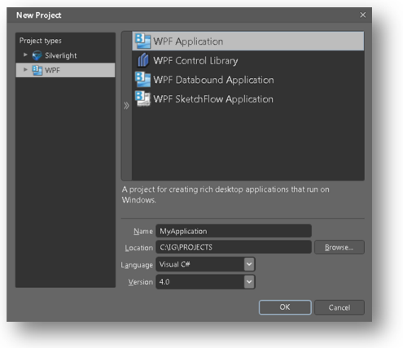

////
|metadata|
{
    "name": "adding-an-assembly-to-an-expression-blend-project",
    "controlName": [],
    "tags": ["Getting Started","How Do I"],
    "guid": "{58D97CF1-7E87-4F59-B7E2-74120B44287F}",
    "buildFlags": [],
    "createdOn": "2012-01-31T16:16:07.8353347Z"
}
|metadata|
////

= Adding an Assembly to an Expression Blend Project

This release of the {ProductName} product offers support for the Microsoft® Expression® Blend design surface.

*To add the {ProductName} assemblies to an Expression Blend project:*

[start=1]
. Open Expression Blend.

[start=2]
. From the File menu, select *New Project* menu item.

[start=3]
. Select *{PlatformName} Application* as the project type.

[start=4]
. Enter a name for your project.

[start=5]
. Select either *Visual C#* (Default) or *Visual Basic* from the drop-down list. Click the *OK* button. +

[start=6]
. From the Project pane, right-click the *References* folder, select the *Add References...* menu item. +

[start=7]
. Browse to your {ProductName} assemblies you want to use in your project.

[start=8]
. From the Toolbox, select the *Asset Library* item.

[start=9]
. From the Asset Library list, select the *Categories* item and then *Infragistics* item. All controls available in the {ProductName} product will be displayed here. +
