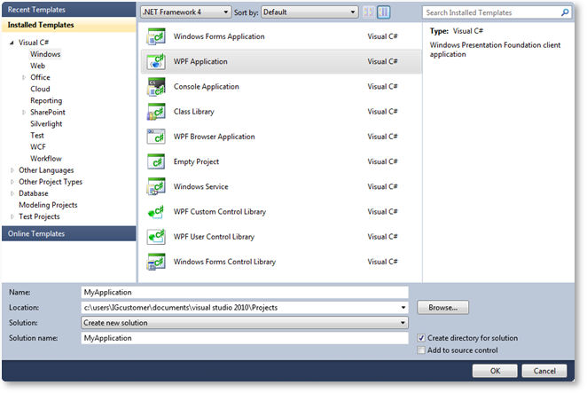

////
|metadata|
{
    "name": "adding-assembly-to-a-visual-studio-project",
    "controlName": [],
    "tags": ["Getting Started","How Do I"],
    "guid": "{80EE1BC5-37C1-4CC1-9F98-07DE3739EA55}",
    "buildFlags": [],
    "createdOn": "2012-01-31T16:16:07.8383347Z"
}
|metadata|
////

= Adding an Assembly to a Visual Studio Project

The {ProductName} product offers full support for Microsoft® Visual Studio®. To use the controls in Visual Studio, you simply need to add the assemblies as references to your Microsoft® {PlatformName} project and add assembly references to your XAML file.

*To add the assemblies to your project and reference them in your XAML file:*

[start=1]
. Create a {PlatformName} project in Visual Studio. +

[start=2]
. From the Solution Explorer pane, right-click the *References* folder, select *Add Reference...* menu item. +

[start=3]
. Browse to the {ProductName} assemblies you want to use in your project.

[start=4]
. Open the XAML file to which you want to add Infragistics controls.

[start=5]
. Add the Infragistics XML schema declaration to the UserControl's opening tag. +
*In XAML:* +
[source,xaml]
----
<UserControl
  xmlns:ig="http://schemas.infragistics.com/xaml">
</UserControl>
----