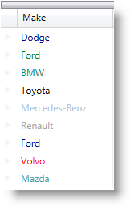

////
|metadata|
{
    "name": "binding-cell-settings-data-item-properties",
    "controlName": [],
    "tags": [],
    "guid": "8d08373e-9e40-477a-a821-3a7185d7d0af",
    "buildFlags": [],
    "createdOn": "2014-06-26T13:31:23.8017039Z"
}
|metadata|
////

== Topic Overview

=== Purpose

This topic describes how to bind cell settings to data item properties using the CellBindings collection property in the  _xamDataPresenter_™ controls.

=== Required background

The following topics are prerequisites to understanding this topic:

[options="header", cols="a,a"]
|====
|Topic|Purpose

| link:wpf-terms-and-concepts.html[Terms and Concepts]
|This section defines the major elements that constitute the controls that make up The Data Presenter Family.

| link:xamdatagrid-getting-started-with-xamdatagrid.html[Adding xamDataGrid to Your Page]
|This topic describes how to add a _xamDataGrid_ control to your page.

| link:xamdatagrid-accessing-data.html[Binding xamDataGrid to Data]
|This section lists the topics written specifically to help you access data using _xamDataGrid_ control.

|====

=== In this topic

This topic contains the following sections:

* <<_BindingCellSettings,Binding Cell Settings to Data Item Properties>>
* <<_Ref390172040,Related Content>>

** <<_Ref390172044,Topics>>
** <<_Ref390172047,Samples>>

[[_BindingCellSettings]]
== Binding Cell Settings to Data Item Properties

[[_Hlk368069110]]

=== Overview

Use the `CellBindings` collection property to facilitate the binding of a cell settings to properties exposed off the associated data item.

Create a `CellBinding` instance for every field’s cell property which you would like to bind to a data item property and add it to the `CellBindings` collection.

.Note
[NOTE]
====
Since the context of the CellBinding is the cell’s DataRecord, use the following syntax to specify the path to a data item property named "MyProperty": “ *DataItem.MyProperty* ”.
====

=== Property settings

The following table maps the desired configuration to the property settings that manage it.

[options="header", cols="a,a,a"]
|====
|In order to:|Use this property:|And set it to:

|Configure a collection of field’s cells bindings to MVVM properties
| link:{ApiPlatform}datapresenter{ApiVersion}~infragistics.windows.datapresenter.field~cellbindings.html[CellBindings]
| link:{ApiPlatform}datapresenter{ApiVersion}~infragistics.windows.datapresenter.cellbindingcollection_members.html[CellBindingCollection]

|Specify that the `CellBinding` targets the link:{ApiPlatform}editors{ApiVersion}~infragistics.windows.editors.valueeditor_members.html[ValueEditor] instance within the cell’s link:{ApiPlatform}datapresenter{ApiVersion}~infragistics.windows.datapresenter.cellvaluepresenter_members.html[CellValuePresenter]
| link:{ApiPlatform}datapresenter{ApiVersion}~infragistics.windows.datapresenter.cellbinding~target.html[Target]
|`Editor`

|Specify that the `CellBinding` targets the cell’s link:{ApiPlatform}datapresenter{ApiVersion}~infragistics.windows.datapresenter.cellvaluepresenter_members.html[CellValuePresenter]
| link:{ApiPlatform}datapresenter{ApiVersion}~infragistics.windows.datapresenter.cellbinding~target.html[Target]
|`CellValuePresenter`

|Specify the name of a target’s property to bind
| link:{ApiPlatform}datapresenter{ApiVersion}~infragistics.windows.datapresenter.cellbinding~property.html[Property]
|`string` 

This property should be non-read-only `DependencyProperty`.

|Specify the actual binding markup
| link:{ApiPlatform}datapresenter{ApiVersion}~infragistics.windows.datapresenter.cellbinding~binding.html[Binding]
|`BindingBase`

|====

[[_Hlk337817761]]

=== Example

The screenshot below demonstrates how a field’s cells would look as a result of the following `CellBinding` settings:

[options="header", cols="a,a"]
|====
|Property|Value

| link:{ApiPlatform}datapresenter{ApiVersion}~infragistics.windows.datapresenter.cellbinding~target.html[Target]
| _CellValuePresenter_ 

| link:{ApiPlatform}datapresenter{ApiVersion}~infragistics.windows.datapresenter.cellbinding~property.html[Property]
| _Foreground_ 

| link:{ApiPlatform}datapresenter{ApiVersion}~infragistics.windows.datapresenter.cellbinding~binding.html[Binding]
| _{Binding Path=DataItem.Color}_ 

|====

Following is the code that implements this example.

*In C#:*

[source,csharp]
----
public class Car : INotifyPropertyChanged
{
    private string _make;
    public string Make
    {
        get { return _make; }
        set
        {
            if (_make != value)
            {
                _make = value;
                NotifyPropertyChanged("Make");
            }
        }
    }
    private Brush _color;
    public Brush Color
    {
        get { return _color; }
        set
        {
            if (_color != value)
            {
                _color = value;
                NotifyPropertyChanged("Color");
            }
        }
    }
    #region INotifyPropertyChanged Members
    public event PropertyChangedEventHandler PropertyChanged;
    private void NotifyPropertyChanged(String info)
    {
        if (PropertyChanged != null)
        {
            PropertyChanged(this, new PropertyChangedEventArgs(info));
        }
    }
    #endregion
}
----

*In XAML:*

[source,xaml]
----
<igDP:XamDataGrid x:Name="XamDataGrid1"
                  DataSource="{Binding Path=Cars}">
    <igDP:XamDataGrid.FieldLayoutSettings>
        <igDP:FieldLayoutSettings AutoGenerateFields="/>
    </igDP:XamDataGrid.FieldLayoutSettings>
    <igDP:XamDataGrid.FieldLayouts>
        <igDP:FieldLayout>
            <igDP:FieldLayout.Fields>
                <igDP:TextField Name="Make">
                    <igDP:TextField.CellBindings>
                        <igDP:CellBinding Property="Foreground"
                                          Target="CellValuePresenter"
                                          Binding="{Binding Path=DataItem.Color}"/>
                    </igDP:TextField.CellBindings>
                </igDP:TextField>
            </igDP:FieldLayout.Fields>
        </igDP:FieldLayout>
    </igDP:XamDataGrid.FieldLayouts>
</igDP:XamDataGrid>
----

[[_Ref390172040]]
== Related Content

[[_Ref390172044]]

=== Topics

The following topics provide additional information related to this topic.

[options="header", cols="a,a"]
|====
|Topic|Purpose

| link:xamdatapresenter-bind-a-datapresenter-control-to-an-xmldataprovider.html[Bind a DataPresenter Control to an XmlDataProvider]
|This topic describes how to data bind the _xamDataPresenter_ controls to an XmlDataProvider to expose your XML file to the presentation layer of your application.

| link:xamdatapresenter-bind-a-datapresenter-control-to-a-collection.html[Bind a DataPresenter Control to a Collection]
|This topic describes how to data bind the _xamDataPresenter_ controls to an ObjectDataProvider to expose your collection to the presentation layer of your application.

| link:xamdatapresenter-binding-a-datapresenter-control-to-a-dataset.html[Binding a DataPresenter Control to a DataSet]
|This topic describes how to data bind the _xamDataPresenter_ controls to a DataSet.

| link:xamdatagrid-binding-field-fieldlayout-to-mvvm.html[Binding Field, FieldSettings, FieldLayout and FieldLayoutSettings to MVVM properties]
|This topic describes how to bind the Field, FieldSettings, FieldLayout and FieldLayoutSettings to MVVM properties using the FieldBinding markup extension in the _xamDataPresenter_ controls.

| link:xamdatapresenter-about-data-items-and-data-records.html[About Data Items and Data Records]
|This topic describes how to find the DataRecord object that corresponds to your data item.

| link:xamdatapresenter-add-items-manually-to-a-datapresenter-control.html[Add Items Manually to a DataPresenter Control]
|This topic describes how to add your data items directly to the _xamDataPresenter_ control's DataItems collection.

| link:xamdata-displaying-hierarchical-data.html[Displaying Hierarchical Data]
|This topic describes how the _xamDataPresenter_ controls display hierarchical data.

| link:xamdatapresenter-displaying-an-image-in-a-field.html[Displaying an Image in a Field]
|This topic describes how to display an image in a Field overriding the CellValuePresenter's template.

| link:xamdatapresenter-iterate-through-the-records-collection.html[Iterate through the Records Collection]
|This topic describes how you can iterate through the nested structure of records as well as what kind of record types you may encounter.

| link:xamdatapresenter-displaying-a-complex-property.html[Displaying a Complex Property]
|This topic describes how to display a complex property in the _xamDataPresenter_ controls.

| link:xamdatapresenter-displaying-a-complex-property-xaml.html[Displaying a Complex Property (XAML)]
|This topic describes how to display a complex property in XAML code in the _xamDataPresenter_ controls.

|====

[[_Ref390172047]]

=== Samples

The following sample provides additional information related to this topic.

[options="header", cols="a,a"]
|====
|Sample|Purpose

| link:{SamplesURL}/data-grid/cell-binding[Customizing Cell Style Using CellBinding]
|This sample demonstrates how to configure the _xamDataGrid_ cell properties through the underlying View Model using the CellBindings property.

|====