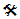

////
|metadata|
{
    "name": "breaking-changes-in-2014-volume-2",
    "controlName": ["Breaking Changes"],
    "tags": [],
    "guid": "3f8518be-3c37-4647-bff9-d18a126ce333","buildFlags": [],
    "createdOn": "2014-09-12T13:45:52.9203408Z"
}
|metadata|
////

= Breaking Changes in 2014 Volume 2

== Breaking Changes Summary

The following table summarizes the breaking changes of the Infragistics WPF 2014 Volume 2 Release. Detailed explanations of the issues and the existing workarounds are provided after the summary table.

==== Legend:

 – Workaround available

 – No known workaround

 – No known workaround, fix planned

==== _<<Ref382990783, xamColorPicker >>_

[options="header", cols="a,a,a"]
|====
|Issue|Description|Status

|<<_Ref398294255,SelectedColorChanged Event Change>>
|The `SelectedColorChanged` event is triggered when the user selects a color from the color palettes with mouse click.
|image::images/Yes.png[]

|====

==== _<<Ref382990784, xamDataPresenter >>_

[options="header", cols="a,a,a"]
|====
|Issue|Description|Status

|<<_Ref398294256,Deprecating the UboundField type>>
|The `UboundField` field type is now deprecated.
|image::images/Yes.png[]

|====

[[_Ref382990783]]
== _xamColorPicker_

[[_Ref398294255]]
=== SelectedColorChanged Event Change

Until Infragistics WPF 2014 Volume 2 Release, the _xamColorPicker_ `SelectedColorChanged` event was triggered every time a user hovers over a color in the _xamColorPicker_ palettes.

Now the `SelectedColorChanged` event is triggered only when the user selects a color with mouse click.

[options="header", cols="a,a"]
|====
|Old Behavior|New Behavior

|SelectedColorChanged event is fired on hovering over a color in the _xamColorPicker_ palettes
|SelectedColorChanged event is fired on color selection with mouse click in the _xamColorPicker_ palettes

|====

[[_Ref382990784]]
== _xamDataPresenter_

[[_Ref398294256]]
=== Deprecating the UboundField Type

The `UnboundField` field type is now deprecated and you should refrain from using it. Instead you should use the new editor specific field types (or the common `Field` type) and set the new `BindingType` property to `Unbound`.

[options="header", cols="a,a"]
|====
|Old Field Definition|New Field Definition

|`<UnboundField />`
|`<Field BindingType="Unbound" />`

|====

*Related Topics:*

* link:xamdatapresenter-add-unbound-fields-to-a-datapresenter-control.html[Configuring Unbound Field]
* link:xamdatagrid-configuring-specific-editor-fields.html[Configuring Specific Editor Fields (xamDataGrid)]