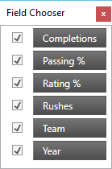

////
|metadata|
{
    "name": "breaking-changes-in-2016-volume-2",
    "controlName": ["Breaking Changes"],
    "tags": [],
    "guid": "d03c1f2a-72f5-44e4-b766-366ce6a89fbc","buildFlags": [],
    "createdOn": "2016-06-02T11:57:27.7825621Z"
}
|metadata|
////

= Breaking Changes in 2016 Volume 2

== Breaking Changes Summary

The following table summarizes the breaking changes of the Infragistics WPF 2016 Volume 2 Release. Detailed explanations of the issues are provided after the summary table.

==== Legend:
image:images/Yes.png[] - Workaround available +
image:images/No.png[] - No known workaround +
image:images/Fix.png[] - No known workaround, fix planned

[options="header", cols="a,a,a"]
|====
|Control|Issue|Status

|<<_Ref001,xamDataPresenter>>
|<<_Ref002,Field Chooser Look>>
|image::images/No.png[]

|<<_Ref003,xamDataChart>>
|<<_Ref004,Redesigned Chart Defaults>>
|image::images/No.png[]

|<<_Ref005,xamPieChart>>
|<<_Ref006,The pie chart default selection is now single select>>
|image::images/Yes.png[]

|====

[[_Ref001]]
== xamDataPresenter

[[_Ref002]] 
==== Field Chooser Look
The default look of the field chooser for data presenter controls with a single field layout now includes a check box on the top for selecting all fields. 

Old Look 

 

New Look 

image::images/xamDataPresenter_FieldChooser_New.png[] 

==== Related topic: 

link:xamdatapresenter-about-the-field-chooser.html[About the Field Chooser]

[[_Ref003]]
== xamDataChart
[[_Ref004]]
=== Redesigned Chart Defaults
[options="header", cols="a,a,a"]
|====
|Element |Previous Value | New Value
|All color resources	
|
|All color resource values were changed, and new resource values are added	
|Brushes	
|
|Most of the brush values were updated	
|ChartBrushes	
|Linear gradient brushes	
|Solid color brushes
|ChartOutlines	
|Linear gradient brushes	
|Solid color brushes, same brushes as ChartBrushes
|Marker Templates (Circle, Triangle, Pyramid, Square, Diamond, Pentagon, Hexagon, Tetragram, Pentagram, Hexagram)	
|StrokeThickness = 0.5	
|StrokeThickness is now bound to MarkerStrokeThickness which has a value of 1
|ToolTipStyle, ToolTipNoBadgeStyle, PieChartToolTipStyle	
|Properties in the ContentControl: 
FontSize=12px 

FontFamily=Verdana

Padding Setter Value =5,5,8,5 

BorderThickness Setter Value = 1	
|Removed all corner radius

Added new setters: FontSize, FontFamily. 

All the FontSizes and FontFamily properties used in the template have template bindings to those setters.

FontSize Setter: StaticResource = ChartSmallFontSize (value = 11)

FontFamily Setter: StaticResource = ChartFontFamily (value = Verdana)

Changed Padding value to use new StaticResource TooltipContentPadding (new value= 5,7).

Converted the BorderThickness value to a StaticResource TooltipBorderThickness, using the same value
|CrosshairTooltipItemTemplate	
|FontSize=12px 

FontFamily=Verdana	
|All the FontSizes and FontFamily properties used in the ContentControl are converted to StaticResources.  

FontSize: ChartSmallFontSize = 11px

FontFamily: ChartFontFamily = Verdana
|Basic Legend Style, ItemLegend, ScaleLegend	
|Background Setter: StaticResource = LegendBackground

BorderBrush Setter: StaticResource = GenericBorder

BorderThickness Setter Value = 1

Padding Setter value = 4

Margin Setter value = 10

ItemsFontFamily, TitleFontFamily Setters = Verdana 

ItemsFontSize, TitleFontSize Setters = 12 

Legend Template previously displayed with rectangles	
|Background Setter change to: StaticResource = LegendBackgroundBrush

BorderBrush Setter changed to StaticResource = LegendBorderBrush (new brush)

BorderThickness Setter value changed to LegendBorderThickness (new resource, same value)

Padding Setter value changed to LegendPadding (new resource, same value)

Margin Setter value changed to LegendMargin (new resource, same value)

ItemsFontFamily,  TitleFontFamily Setters changed to StaticResource = ChartFontFamily 

ItemsFontSize, TitleFontSize Setters changed to StaticResource = ChartSmallFontSize 

Legend Template: Wrapped in one Border
|ScaleLegend Style	
|Polygon element Fill Brush: inline LinearGradientBrush	
|Polygon element Fill Brush changed to StaticResource = LegendScaleFill
|LegendItemTemplate	
|Margin=1 value in StackPanel	
|Margin changed to StaticResource = LegendItemMargin (new resource, Value=4)
|PieChartLegendItemBadgeTemplate, FunnelChartLegendItemBadgeTemplate	
|ContentPresenter Values: 
Width=11
Height=11 
Margin=0 0 2 0
ContentTemplate uses a Rectangle	
|Changes in ContentPresenter:

Width: StaticResource = LegendItemBadgeWidth (New resource, Value =12)

Height: StaticResource = LegendItemBadgeHeight (New resource, Value =12)

Margin: StaticResource = BadgeRightMargin (New resource, Value =0 0 6 0)

ContentTemplate changed to Ellipse
|LegendItemRectBadgeTemplate, LegendItemMarkerlessRectBadgeTemplate	
|Main Grid wrapper Values: 
Width=18

Height=16

Margin=0 0 2 0

The DataTemplate had a path shape (as the badge)
Path dimensions: Width=16, Height=14	
|Changes in Grid wrapper:

Width: StaticResource = LegendItemBadgeWidth

Height: StaticResource = LegendItemBadgeHeight 

Margin: StaticResource = BadgeRightMargin

The DataTemplate changed to an Ellipse (new badge shape)

Ellipse dimensions: Width=LegendItemBadgeWidth, Height=LegendItemBadgeHeight
|LegendItemLineBadgeTemplate	
|Main Grid wrapper Values: 

Width=18

Height=16

Margin=0 0 2 0

ContentPresenter Values: 

Width=11

Height=11

Margin=0 0 2 0	
|Changes in Grid wrapper: 

Width: StaticResource = LineBadgeWidth (New Resource, same value) 

Height: StaticResource = LineBadgeHeight (New Resource, same value) 

Margin: StaticResource = BadgeRightMargin

Changes in ContentPresenter: 

Width= LegendItemBadgeWidth

Height= LegendItemBadgeHeight

Removed margin 
|LegendItemMarkerlessLineBadgeTemplate	
|Main Grid wrapper Values: 

Width=18

Height=16

Margin=0 0 2 0	
|Changes in Grid wrapper: 

Width, Height: StaticResource = LineNoBadgeWidthHeight (New Resource, Value=16) 

Margin: StaticResource = BadgeRightMargin
|LegendItemPointBadgeTemplate	
|ContentPresenter Values: 

Width=11

Height=11

Margin=0 0 2 0	
|Changes in ContentPresenter: 

Width= LegendItemBadgeWidth

Height= LegendItemBadgeHeight

Margin = BadgeRightMargin

|LegendItemFinancialBadgeTemplate, LegendItemFinancialIndicatorBadgeTemplate,  LegendItemPositiveNegativeBadgeTemplate, LegendItemHighDensityBadgeTemplate	
|Main Grid wrapper Values: 

Width=18

Height=16

Margin=0 0 2 0

DataTemplate had path shapes as the badge shape

Path dimensions: Width=16, Height=14

Path (negative value) Stroke bound to ActualOutline	
|Changes in Grid wrapper:

Width: StaticResource = FinancialBadgeWidth (New resource, Value=14)

Height: StaticResource = FinancialBadgeHeight (New resource, Value=14)

Margin: StaticResource = BadgeRightMargin

DataTemplate: changed to use rectangles

Rectangle dimensions: Width=LegendItemFinancialBadgeHeight (New resource, Value=7)

Path (negative value) Stroke bound to NegativeOutline (New resource)
|LegendItemPositiveNegativeBadgeTemplate	ContentPresenter Values Margin=0 0 2 0	Removed margin
|LegendItemHighDensityBadgeTemplate	
|All the changes made in the other legend item templates apply here, except that this template has different Solid color brushes, using HeatMaximumColor and HeatMinimumColor instead of ActualBrush,ActualOutline and NegativeBrush,NegativeOutline

|PreviewPathStyle	
|Fill Setter: 

StaticResource = GenericBackground	

Fill Setter changed to: StaticResource = PreviewPathBrush (new brush)

CrosshairLineStyle	

Fill Setter: StaticResource = GenericBorder
StrokeThickness Setter: Value=1.4

|Fill Setter changed to: 

StaticResource = CrosshairStroke (new brush)

StrokeThickness Setter Value changed to: StaticResource= CrosshairStrokeThickness (New resource, same value)
|XamDataChart Style	
|TitleFontSize=16

SubtitleFontSize=12

TitleFontFamily,  SubtitleFontFamily=Verdana

PlotAreaBackground Setter: StaticResource = ChartPlotAreaBackgroundBrush

DefaultPlotAreaBorderBrush Setter: StaticResource = GenericBorder

DefaultAxisStroke Setter: StaticResource = AxisBorderBrush

DefaultAxisMajorStroke Setter: StaticResource = AxisMajorBorderBrush	

|New Background setter: StaticResource= ChartBackgroundBrush

TitleFontSize Setter changed to: StaticResource = ChartTitleFontSize 

SubtitleFontSize Setter changed to: StaticResource = ChartSmallFontSize 

TitleFontFamily  SubtitleFontFamily Setters changed to: StaticResource = ChartFontFamily 

PlotAreaBackground Setter changed to: StaticResource = PlotAreaBackgroundBrush

DefaultPlotAreaBorderBrush Setter changed to: StaticResource = PlotAreaBorderBrush

DefaultAxisStroke Setter: StaticResource Renamed to = AxisStrokeBrush

DefaultAxisMajorStroke Setter: StaticResource Renamed to = AxisMajorStrokeBrush

|Axis Style	
|TickStrokeThickness Setter Value=1

StrokeThickness Setter Value=1

MajorStrokeThickness Setter Value=1.00

MinorStrokeThickness Setter Value=0.7	
|TickStrokeThickness Setter Value changed to: StaticResource= TickStrokeThickness (New resource, Value=2)

StrokeThickness Setter Value changed to: StaticResource= AxisStrokeThickness (New resource, Value=2)

MajorStrokeThickness Setter Value changed to: StaticResource= MajorStrokeThickness (New resource, same value)

MinorStrokeThickness Setter Value changed to: StaticResource= MinorStrokeThickness (New resource, Value=1)
|XAxis, YAxis Styles	
|LabelSettings and TitleSettings Setters FontSize=12
LabelSettings and TitleSettings Setters FontFamily=Verdana
|New Setter TickLength: Value=0

Setter FontSize changed to: StaticResource ChartSmallFontSize

Setter FontFamily changed to: StaticResource ChartFontFamily
|NumericXAxis, NumericYAxis 	
|MajorStroke setter Value=AxisMajorStroke	

|MajorStroke setter Value=AxisMajorStrokeBrush (resource renamed)

|CategoryAngleAxis, NumericAngleAxis, NumericRadiusAxis	
|MajorStroke setter Value=AxisMajorStroke

LabelSettings Setter FontSize=12

LabelSetting Setter FontFamily=Verdana	
|MajorStroke setter Value=AxisMajorStrokeBrush 

Setter FontSize changed to: StaticResource ChartSmallFontSize 

Setter FontFamily changed to: StaticResource ChartFontFamily
|BarSeries  ColumnSeries  RangeColumnSeries  StackedColumnSeries  StackedBarSeries  Stacked100ColumnSeries  Stacked100BarSeries  RadialColumnSeries	
| --	
|New RadiusX Setter: Value=0

New RadiusY Setter: Value=0
|LineSeries  StepLineSeries  SplineSeries  ScatterLineSeries  ScatterSplineSeries  AbsoluteVolumeOscillatorIndicator  AccumulationDistributionIndicator  AverageTrueRangeIndicator  CommodityChannelIndexIndicator  ForceIndexIndicator  MoneyFlowIndexIndicator  OnBalanceVolumeIndicator  PercentagePriceOscillatorIndicator  PercentageVolumeOscillatorIndicator  PriceVolumeTrendIndicator  RateOfChangeAndMomentumIndicator  TypicalPriceIndicator  MarketFacilitationIndexIndicator  RelativeStrengthIndexIndicator  WeightedCloseIndicator  MedianPriceIndicator  DetrendedPriceOscillatorIndicator  EaseOfMovementIndicator  MassIndexIndicator  NegativeVolumeIndexIndicator  PositiveVolumeIndexIndicator  AverageDirectionalIndexIndicator  BollingerBandWidthIndicator  ChaikinVolatilityIndicator  ChaikinOscillatorIndicator  StandardDeviationIndicator  UltimateOscillatorIndicator  WilliamsPercentRIndicator  CustomIndicator  StochRSIIndicator	
|--	
|New Thickness Setter: Value=LineSeriesStrokeThickness (New resource, value=2)
|WaterfallSeries	
|--	
|New RadiusX Setter: Value=0
New RadiusY Setter: Value=0
New Outline Setter: Value=OutlineBrush (new resource)
|StackedLineSeries  Stacked100LineSeries  StackedSplineSeries  Stacked100SplineSeries  BollingerBandsOverlay  PriceChannelOverlay	
|Thickness setter Value=1	
|New Thickness Setter: Value=LineSeriesStrokeThickness
|HighDensityScatterSeries
|
|New HeatMaximumColor setter: Value= StaticResource HotColor

New HeatMinimumColor setter: Value= StaticResource ColdColor
|FinancialPriceSeries	
|Outline setter value=#FF222222
Thickness setter Value=1	
|New NegativeOutline Setter value: StaticResource=NegativeBrush 

Outline setter value: StaticResource=ActualOutline

Thickness Setter Value changed to: StaticResource= FinancialSeriesStrokeThickness (New resource, same value)

|MovingAverageConvergenceDivergenceIndicator  TRIXIndicator  FastStochasticOscillatorIndicator  SlowStochasticOscillatorIndicator  FullStochasticOscillatorIndicator	
|TrendLineBrush setter Value=Blue
|TrendLineBrush setter Value changed to: StaticResource=TrendlineBaseBrush (new resource)

New Thickness Setter: Value=LineSeriesStrokeThickness
|PolarLineSeries  PolarSplineSeries  RadialLineSeries	
|--	
|New Thickness Setter: Value=LineSeriesStrokeThickness 
|PolarAreaSeries  PolarSplineAreaSeries	
|Setter MarkerType Value=Automatic	
|Setter MarkerType Value changed to None
|PointerToolTipStyle	
|Properties in ContentControl: 

FontSize=12px

FontFamily=Verdana
"PART_POINTER" Polygon Fill: StaticResource TooltipPointerBackgroundBrush

"PART_POINTEROUTLINE" Polygon Stroke: StaticResource GenericBorder

|FontSize Setter: StaticResource = ChartSmallFontSize

FontFamily Setter: StaticResource = ChartFontFamily

"PART_POINTER" Polygon Fill: StaticResource changed to TooltipBackgroundBrush
"PART_POINTEROUTLINE" Polygon Stroke: StaticResource changed to TooltipBorderBrush
|ItemToolTipLayer, CategoryToolTipLayer Styles	
|Brush Setter Value=Gray
Outline Setter Value=LightGray	
|Brush Setter Value changed to: StaticResource=TooltipLayerBrush

Outline Setter Value changed to: StaticResource= TooltipLayerOutline
|PieChartBase	
|Border inside ControlTemplate: CornerRadius=4	
|Removed CornerRadius
|====

[[_Ref005]]
== xamPieChart
[[_Ref006]]
=== New default value for selection in xamPieChart
The new default selection value for the Pie Chart control is now SingleSelect. 

In order to retain your existing pie chart selection logic without interfering with the new selection feature, change the SliceSelectionMode property to “Manual”.