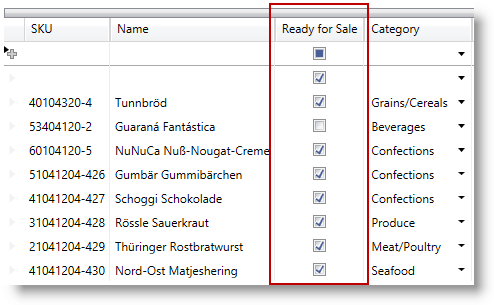
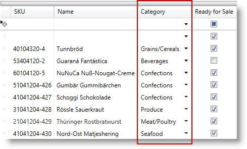
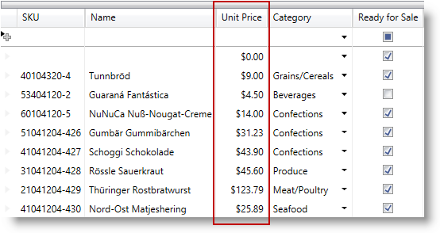
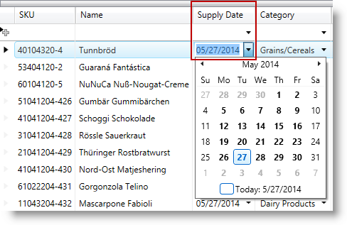
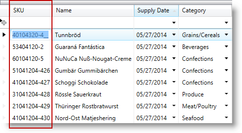
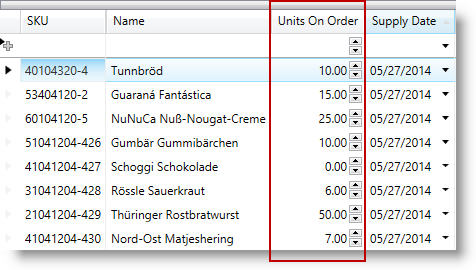
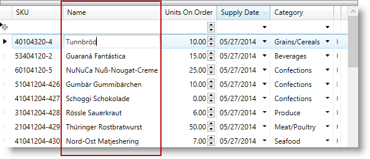

////
|metadata|
{
    "name": "configuring-specific-editor-fields",
    "controlName": [],
    "tags": [],
    "guid": "eea3a925-b003-444a-8249-d75591d3a97a",
    "buildFlags": [],
    "createdOn": "2014-06-26T13:32:28.1905416Z"
}
|metadata|
////

== Topic Overview

=== Purpose

This topic describes an easy and straightforward way of configuring specific editor fields for different data types in the _xamDataPresenter_™ controls.

=== Required background

The following topics are prerequisites to understanding this topic:

[options="header", cols="a,a"]
|====
|Topic|Purpose

| link:wpf-terms-and-concepts.html[Terms and Concepts]
|This section defines the major elements that constitute the controls that make up The Data Presenter Family.

| link:xamdatagrid-getting-started-with-xamdatagrid.html[Adding xamDataGrid to Your Page]
|This topic describes how to add a _xamDataGrid_ control to your page.

| link:xamdata-generating-fields-manually-versus-automatically.html[Generating Fields Manually Versus Automatically]
|This topic describes how to specify manually FieldLayouts and Fields in the _xamDataGrid_ control.

|====

=== In this topic

This topic contains the following sections:

* <<_Ref388889864, Specific Editor Fields Summary >>
* <<_Ref388887194, Configuring CheckBox Field >>
* <<_Ref388887204, Configuring ComboBox Field >>
* <<_Ref388887214, Configuring Currency Field >>
* <<_Ref388887220, Configuring DateTime Field >>
* <<_Ref388887226, Configuring Masked Text Field >>
* <<_Ref388887231, Configuring Numeric Field >>
* <<_Ref388887237, Configuring Text Field >>
* <<_Ref388889910, Related Content >>

** <<_Ref388889914,Topics>>
** <<_Ref388889917,Samples>>

[[_Ref388889864]]
== Specific Editor Fields Summary

=== Specific editor fields summary

The  _xamDataPresenter_   controls provide two ways of defining fields – automatic and manual. In many cases, the preferred way is to specify a particular editor manually.

The different editor fields offer an easy and straightforward way to specify a particular editor to handle the specific data type.

=== Specific editor fields summary chart

The following table briefly lists the configurable editor fields in the  _xamDataPresenter_   controls and maps them to the related class. Further details are available after the table.

[options="header", cols="a,a,a"]
|====
|Configurable aspect|Details|Class

|<<_Ref388887194,Configuring CheckBox Field>>
|Use the `CheckBoxField` to edit Boolean data type through the _xamCheckEditor_ control.
|
* link:{ApiPlatform}datapresenter.v{ProductVersion}~infragistics.windows.datapresenter.checkboxfield_members.html[CheckBoxField] 

|<<_Ref388887204,Configuring ComboBox Field>>
|Use the `ComboBoxField` to edit items collections through the _xamComboEditor_ control.
|
* link:{ApiPlatform}datapresenter.v{ProductVersion}~infragistics.windows.datapresenter.comboboxfield_members.html[ComboBoxField] 

|<<_Ref388887214,Configuring Currency Field>>
|Use the `CurrencyField` to edit currency data through the _xamCurrencyEditor_ control.
|
* link:{ApiPlatform}datapresenter.v{ProductVersion}~infragistics.windows.datapresenter.currencyfield_members.html[CurrencyField] 

|<<_Ref388887220,Configuring DateTime Field>>
|Use the `DateTimeField` to edit `DateTime` data type through the _xamDateTimeEditor_ control.
|
* link:{ApiPlatform}datapresenter.v{ProductVersion}~infragistics.windows.datapresenter.datetimefield_members.html[DateTimeField] 

|<<_Ref388887226,Configuring Masked Text Field>>
|Use the `MaskedTextField` to edit data through the _xamMaskedEditor_ control.
|
* link:{ApiPlatform}datapresenter.v{ProductVersion}~infragistics.windows.datapresenter.maskedtextfield_members.html[MaskedTextField] 

|<<_Ref388887231,Configuring Numeric Field>>
|Use the `NumericField` to edit numeric data through the _xamNumericEditor_ control.
|
* link:{ApiPlatform}datapresenter.v{ProductVersion}~infragistics.windows.datapresenter.numericfield_members.html[NumericField] 

|<<_Ref388887237,Configuring Text Field>>
|Use the `TextField` to edit data through the _xamTextEditor_ control.
|
* link:{ApiPlatform}datapresenter.v{ProductVersion}~infragistics.windows.datapresenter.textfield_members.html[TextField] 

|====

[[_Ref388887194]]
== Configuring CheckBox Field

[[_Hlk368069110]]

=== Overview

Use a link:{ApiPlatform}datapresenter.v{ProductVersion}~infragistics.windows.datapresenter.checkboxfield_members.html[CheckBoxField] to represent boolean data in the  _xamDataPresenter_   controls.

In this case, the embedded editor is the  _xamCheckEditor_   control. For more information about this control, read the link:xamcheckeditor.html[xamCheckEditor] topic.

For more information about the base link:{ApiPlatform}datapresenter.v{ProductVersion}~infragistics.windows.datapresenter.field_members.html[Field]'s properties, read the link:xamdata-terms-fields.html[Fields] topic. Some of the specific editor field properties are described in the *Property settings* section below.

=== Property settings

The following table maps the desired configuration to the property settings that manage it.

[options="header", cols="a,a,a"]
|====
|In order to:|Use this property:|And set it to:

|Specify if the check box editor allows three or two checked states.
| link:{ApiPlatform}datapresenter.v{ProductVersion}~infragistics.windows.datapresenter.checkboxfield~isthreestate.html[IsThreeState]
|`bool`? 

By default, the two determined states – checked/unchecked are allowed.

|====

[[_Hlk337817761]]

=== Example

The screenshot below demonstrates the `CheckBoxField` defined in the  _xamDataGrid_   control.

Following is the code that implements this example.

*In XAML:*

[source,xaml]
----
<igDP:CheckBoxField  Name="ReadyForSale" Label="Ready For Sale" />
----

[[_Ref388887204]]
== Configuring ComboBox Field

=== Overview

Use a link:{ApiPlatform}datapresenter.v{ProductVersion}~infragistics.windows.datapresenter.comboboxfield_members.html[ComboBoxField] to represent items collections in the  _xamDataPresenter_   controls.

In this case, the embedded editor is the  _xamComboEditor_   control. For more information about this control, read the link:xamcomboeditor.html[xamComboEditor] topic.

For more information about the base link:{ApiPlatform}datapresenter.v{ProductVersion}~infragistics.windows.datapresenter.field_members.html[Field]'s properties, read the link:xamdata-terms-fields.html[Fields] topic. Some of the specific editor field properties are described in the *Property settings* section below.

=== Property settings

The following table maps the desired configuration to the property settings that manage it.

[options="header", cols="a,a,a"]
|====
|In order to:|Use this property:|And set it to:

|Specify the path to the data item property which value will be displayed in the _xamComboEditor._
| link:{ApiPlatform}datapresenter.v{ProductVersion}~infragistics.windows.datapresenter.comboboxfield~displaymemberpath.html[DisplayMemberPath]
|`string`

|Specify whether to display the display text or the value in the edit portion of the _xamComboEditor._
| link:{ApiPlatform}datapresenter.v{ProductVersion}~infragistics.windows.datapresenter.comboboxfield~displayvaluesource.html[DisplayValueSource]
| link:{ApiPlatform}editors.v{ProductVersion}~infragistics.windows.editors.displayvaluesource.html[DisplayValueSource]? 

By default, the `DisplayText` is displayed.

|Specify when the _xamComboEditor_ dropdown button is displayed.
| link:{ApiPlatform}datapresenter.v{ProductVersion}~infragistics.windows.datapresenter.comboboxfield~dropdownbuttondisplaymode.html[DropDownButtonDisplayMode]
| link:{ApiPlatform}v{ProductVersion}~infragistics.controls.editors.dropdownbuttondisplaymode.html[DropDownButtonDisplayMode]? 

By default, the dropdown button is `Always` visible. The other options are `Focused`, `MouseOver` and `OnlyInEditMode`.

|Specify whether the user is allowed to resize the _xamComboEditor_ dropdown.
| link:{ApiPlatform}datapresenter.v{ProductVersion}~infragistics.windows.datapresenter.comboboxfield~dropdownresizemode.html[DropDownResizeMode]
| link:{ApiPlatform}v{ProductVersion}~infragistics.windows.controls.popupresizemode.html[PopupResizeMode]? 

By default, the user can resize the drop down in `Both` directions – horizontally and vertically.

|Specify if the text in the _xamComboEditor_ is editable.
| link:{ApiPlatform}datapresenter.v{ProductVersion}~infragistics.windows.datapresenter.comboboxfield~iseditable.html[IsEditable]
|`bool?`

|Specify the _xamComboEditor_ items collection.
| link:{ApiPlatform}datapresenter.v{ProductVersion}~infragistics.windows.datapresenter.comboboxfield~itemssource.html[ItemsSource]
|`IEnumerable` 

.Note 

[NOTE] 

==== 

A ComboBoxItemsProvider is internally created to wrap the ItemsSource so that lookups are optimized. 

====

|Specify whether to restrict the user input to the items in the items source.
| link:{ApiPlatform}datapresenter.v{ProductVersion}~infragistics.windows.datapresenter.comboboxfield~limittolist.html[LimitToList]
|`bool?` 

By default, if the _xamComboEditor_ is editable, user can enter items that are not available in the items collection. If the typed item is found in the items collection, it will be selected. 

If you want to restrict the user input, set the `LimitToList` to `true`. Use the link:{ApiPlatform}datapresenter.v{ProductVersion}~infragistics.windows.datapresenter.field~invalidvaluebehavior.html[InvalidValueBehavior] property to specify the editor behavior when the user attempts to leave it with an invalid value.

|Specify the text to display when the value is null.
| link:{ApiPlatform}datapresenter.v{ProductVersion}~infragistics.windows.datapresenter.textfieldbase~nulltext.html[NullText]
|`string`

|Specify the maximum drop-down height.
| link:{ApiPlatform}datapresenter.v{ProductVersion}~infragistics.windows.datapresenter.comboboxfield~maxdropdownheight.html[MaxDropDownHeight]
|`double?`

|Specify the maximum drop-down width.
| link:{ApiPlatform}datapresenter.v{ProductVersion}~infragistics.windows.datapresenter.comboboxfield~maxdropdownwidth.html[MaxDropDownWidth]
|`double?`

|Specify the minimum drop-down width.
| link:{ApiPlatform}datapresenter.v{ProductVersion}~infragistics.windows.datapresenter.comboboxfield~mindropdownwidth.html[MinDropDownWidth]
|`double?`

|Specify the path to the data item property which value will be returned when an item is selected.
| link:{ApiPlatform}datapresenter.v{ProductVersion}~infragistics.windows.datapresenter.comboboxfield~valuepath.html[ValuePath]
|`string`

|Specify the converter to use for converting between display text and value
| link:{ApiPlatform}datapresenter.v{ProductVersion}~infragistics.windows.datapresenter.textfieldbase~valuetodisplaytextconverter.html[ValueToDisplayTextConverter]
|`IValueConverter`

|====

=== Example

The screenshot below demonstrates the `ComboBoxField` defined in the  _xamDataGrid_   control.

Following is the code that implements this example.

*In XAML:*

[source,xaml]
----
<igDP:ComboBoxField Name="Category" Label="Category"
                    ItemsSource="{Binding Source={StaticResource categories}}"
                    DisplayMemberPath="Name" />
----

[[_Ref388887214]]
== Configuring Currency Field

=== Overview

Use a link:{ApiPlatform}datapresenter.v{ProductVersion}~infragistics.windows.datapresenter.currencyfield_members.html[CurrencyField] to represent currency data in the  _xamDataPresenter_   controls.

In this case, the embedded editor is the  _xamCurrencyEditor_   control. For more information about this control, read the link:xamcurrencyeditor.html[xamCurrencyEditor] topic.

For more information about the base link:{ApiPlatform}datapresenter.v{ProductVersion}~infragistics.windows.datapresenter.field_members.html[Field]'s properties, read the link:xamdata-terms-fields.html[Fields] topic.

.Note
[NOTE]
====
The link:{ApiPlatform}datapresenter.v{ProductVersion}~infragistics.windows.datapresenter.currencyfield_members.html[CurrencyField] derives from link:{ApiPlatform}datapresenter.v{ProductVersion}~infragistics.windows.datapresenter.maskedtextfield_members.html[MaskedTextField] and therefore inherits all of its properties.
====

=== Example

The screenshot below demonstrates the `CurrencyField` defined in the  _xamDataGrid_   control.

Following is the code that implements this example.

*In XAML:*

[source,xaml]
----
<igDP:CurrencyField Name="UnitPrice" Label="Unit Price" />
----

[[_Ref388887220]]
== Configuring DateTime Field

=== Overview

Use a link:{ApiPlatform}datapresenter.v{ProductVersion}~infragistics.windows.datapresenter.datetimefield_members.html[DateTimeField] to represent `DateTime` data in the  _xamDataPresenter_   controls.

In this case, the embedded editor is the  _xamDateTimeEditor_   control. For more information about this control, read the link:xamdatetimeeditor.html[xamDateTimeEditor] topic.

For more information about the base link:{ApiPlatform}datapresenter.v{ProductVersion}~infragistics.windows.datapresenter.field_members.html[Field]'s properties, read the link:xamdata-terms-fields.html[Fields] topic. Some of the specific editor field properties are described in the *Property settings* section below.

.Note
[NOTE]
====
The link:{ApiPlatform}datapresenter.v{ProductVersion}~infragistics.windows.datapresenter.datetimefield_members.html[DateTimeField] derives from link:{ApiPlatform}datapresenter.v{ProductVersion}~infragistics.windows.datapresenter.maskedtextfield_members.html[MaskedTextField] and therefore inherits all of its properties.
====

=== Property settings

The following table maps the desired configuration to the property settings that manage it.

[options="header", cols="a,a,a"]
|====
|In order to:|Use this property:|And set it to:

|Specify if the drop down calendar appears to select a date
| link:{ApiPlatform}datapresenter.v{ProductVersion}~infragistics.windows.datapresenter.datetimefield~allowdropdown.html[AllowDropDown]
|`bool?`

|Specify when the _xamDateTimeEditor_ dropdown button is displayed.
| link:{ApiPlatform}datapresenter.v{ProductVersion}~infragistics.windows.datapresenter.datetimefield~dropdownbuttondisplaymode.html[DropDownButtonDisplayMode]
| link:{ApiPlatform}editors.v{ProductVersion}~infragistics.windows.editors.dropdownbuttondisplaymode.html[DropDownButtonDisplayMode]? 

By default, the dropdown button is `Always` visible. The other options are `Focused`, `MouseOver` and `OnlyInEditMode`.

|====

=== Example

The screenshot below demonstrates the `DateTimeField` defined in the  _xamDataGrid_   control.

Following is the code that implements this example.

*In XAML:*

[source,xaml]
----
<igDP:DateTimeField Name="SupplyDate" Label="Supply Date"  />
----

[[_Ref388887226]]
== Configuring Masked Text Field

=== Overview

Use a link:{ApiPlatform}datapresenter.v{ProductVersion}~infragistics.windows.datapresenter.maskedtextfield_members.html[MaskedTextField] to represent masked data in the  _xamDataPresenter_   controls.

In this case, the embedded editor is the  _xamMaskedEditor_   control. For more information about this control, read the link:xammaskededitor.html[xamMaskedEditor] topic.

For more information about the base link:{ApiPlatform}datapresenter.v{ProductVersion}~infragistics.windows.datapresenter.field_members.html[Field]'s properties, read the link:xamdata-terms-fields.html[Fields] topic. Some of the specific editor field properties are described in the *Property settings* section below.

=== Property settings

The following table maps the desired configuration to the property settings that manage it.

[options="header", cols="a,a,a"]
|====
|In order to:|Use this property:|And set it to:

|Specify whether to shift characters across section boundaries when deleting characters.
| link:{ApiPlatform}datapresenter.v{ProductVersion}~infragistics.windows.datapresenter.maskedtextfield~allowshiftingacrosssections.html[AllowShiftingAcrossSections]
|`bool?` 

Default value is `true`.

|Specify whether to auto-fill empty date when the user attempts to leave the editor.
| link:{ApiPlatform}datapresenter.v{ProductVersion}~infragistics.windows.datapresenter.maskedtextfield~autofilldate.html[AutoFillDate]
| link:{ApiPlatform}controls.editors.xammaskedinput.v{ProductVersion}~infragistics.controls.editors.autofilldate.html[AutoFillDate]? 

Default value is `None`.

|Specify how the editor content will be copied to the clipboard when data masking is enabled.
| link:{ApiPlatform}datapresenter.v{ProductVersion}~infragistics.windows.datapresenter.maskedtextfield~clipmode.html[ClipMode]
| link:{ApiPlatform}editors.v{ProductVersion}~infragistics.windows.editors.maskmode.html[MaskMode]?

|Specify how the editor content is stored by the data source when data masking is enabled.
| link:{ApiPlatform}datapresenter.v{ProductVersion}~infragistics.windows.datapresenter.maskedtextfield~datamode.html[DataMode]
| link:{ApiPlatform}editors.v{ProductVersion}~infragistics.windows.editors.maskmode.html[MaskMode]?

|Specify how the editor content is displayed when the control is not in edit mode and data masking is enabled.
| link:{ApiPlatform}datapresenter.v{ProductVersion}~infragistics.windows.datapresenter.maskedtextfield~displaymode.html[DisplayMode]
| link:{ApiPlatform}editors.v{ProductVersion}~infragistics.windows.editors.maskmode.html[MaskMode]?

|Specify the text to display when the value is null.
| link:{ApiPlatform}datapresenter.v{ProductVersion}~infragistics.windows.datapresenter.textfieldbase~nulltext.html[NullText]
|`string`

|Specify the mask to be applied on the control data
| link:{ApiPlatform}datapresenter.v{ProductVersion}~infragistics.windows.datapresenter.maskedtextfield~mask.html[Mask]
|`string`

|Specify the character used as the pad character.
| link:{ApiPlatform}datapresenter.v{ProductVersion}~infragistics.windows.datapresenter.maskedtextfield~padchar.html[PadChar]
|`char?` 

The default pad character is the space character (' ').

|Specify the prompt character.
| link:{ApiPlatform}datapresenter.v{ProductVersion}~infragistics.windows.datapresenter.maskedtextfield~promptchar.html[PromptChar]
|`char?` 

The default prompt character is the underscore (_).

|Specify whether to select only the entered characters or all the characters (including prompt characters) when all text selection is performed.
| link:{ApiPlatform}datapresenter.v{ProductVersion}~infragistics.windows.datapresenter.maskedtextfield~selectallbehavior.html[SelectAllBehavior]
| link:{ApiPlatform}editors.v{ProductVersion}~infragistics.windows.editors.maskselectallbehavior.html[MaskSelectAllBehavior]? 

The default value `SelectAllCharacters`.

|Specify when the editor spin buttons are displayed.
| link:{ApiPlatform}datapresenter.v{ProductVersion}~infragistics.windows.datapresenter.maskedtextfield~spinbuttondisplaymode.html[SpinButtonDisplayMode]
| link:{ApiPlatform}controls.editors.xammaskedinput.v{ProductVersion}~infragistics.controls.editors.spinbuttondisplaymode.html[SpinButtonDisplayMode]? 

By default, the spin buttons are `Never` visible. The other options are `Always`, `MouseOver,` `Focused` and `OnlyInEditMode`.

|Specify the value to increment/decrement the value of the editor when the up or down spin buttons are clicked.
| link:{ApiPlatform}datapresenter.v{ProductVersion}~infragistics.windows.datapresenter.maskedtextfield~spinincrement.html[SpinIncrement]
|`object` 

The type of the increment/decrement depends on the data type that is edited in the control.

|Specify if the spin buttons should wrap the editor’s value.
| link:{ApiPlatform}datapresenter.v{ProductVersion}~infragistics.windows.datapresenter.maskedtextfield~spinwrap.html[SpinWrap]
|`bool?` 

The default value is `False`.

|Specifies whether to trim the insignificant zero's in fraction part of numeric masks.
| link:{ApiPlatform}datapresenter.v{ProductVersion}~infragistics.windows.datapresenter.maskedtextfield~trimfractionalzeros.html[TrimFractionalZeros]
|`bool?` 

The default value is `False`.

|Specify the converter to use for converting between display text and value
| link:{ApiPlatform}datapresenter.v{ProductVersion}~infragistics.windows.datapresenter.textfieldbase~valuetodisplaytextconverter.html[ValueToDisplayTextConverter]
|`IValueConverter`

|====

=== Example

The screenshot below demonstrates the `MaskedTextField` defined in the  _xamDataGrid_   control.

Following is the code that implements this example.

*In XAML:*

[source,xaml]
----
<igDP:MaskedTextField Name="SKU" Label="SKU" Mask="########-###"/>
----

[[_Ref388887231]]
== Configuring Numeric Field

=== Overview

Use a link:{ApiPlatform}datapresenter.v{ProductVersion}~infragistics.windows.datapresenter.numericfield_members.html[NumericField] to represent numeric data in the  _xamDataPresenter_   controls.

In this case, the embedded editor is the  _xamNumericEditor_   control. For more information about this control, read the link:xamnumericeditor.html[xamNumericEditor] topic.

For more information about the base link:{ApiPlatform}datapresenter.v{ProductVersion}~infragistics.windows.datapresenter.field_members.html[Field]'s properties, read the link:xamdata-terms-fields.html[Fields] topic. Some of the specific editor field properties are described in the *Property settings* section below.

.Note
[NOTE]
====
The link:{ApiPlatform}datapresenter.v{ProductVersion}~infragistics.windows.datapresenter.numericfield_members.html[NumericField] derives from link:{ApiPlatform}datapresenter.v{ProductVersion}~infragistics.windows.datapresenter.maskedtextfield_members.html[MaskedTextField] and therefore inherits all of its properties.
====

=== Example

The screenshot below demonstrates the `NumericField` defined in the  _xamDataGrid_   control.

Following is the code that implements this example.

*In XAML:*

[source,xaml]
----
<igDP:NumericField Name="UnitsOnOrder" Label="Units On Order"
                   SpinButtonDisplayMode="Always"
                   SpinIncrement="5"/>
----

[[_Ref388887237]]
== Configuring Text Field

=== Overview

Use a link:{ApiPlatform}datapresenter.v{ProductVersion}~infragistics.windows.datapresenter.textfield_members.html[TextField] to represent data in the  _xamDataPresenter_   controls.

In this case, the embedded editor is the  _xamTextEditor_   control. For more information about this control, read the link:xamtexteditor.html[xamTextEditor] topic.

For more information about the base link:{ApiPlatform}datapresenter.v{ProductVersion}~infragistics.windows.datapresenter.field_members.html[Field]'s properties, read the link:xamdata-terms-fields.html[Fields] topic. Some of the specific editor field properties are described in the *Property settings* section below.

=== Property settings

The following table maps the desired configuration to the property settings that manage it.

[options="header", cols="a,a,a"]
|====
|In order to:|Use this property:|And set it to:

|Specify if pressing the `RETURN` key creates a new line
| link:{ApiPlatform}datapresenter.v{ProductVersion}~infragistics.windows.datapresenter.textfield~acceptsreturn.html[AcceptsReturn]
|`bool?`

|Specify if pressing the `TAB` key creates a tab character or moves the focus
| link:{ApiPlatform}datapresenter.v{ProductVersion}~infragistics.windows.datapresenter.textfield~acceptstab.html[AcceptsTab]
|`bool?`

|Specify the visibility of the horizontal scroll bar
| link:{ApiPlatform}datapresenter.v{ProductVersion}~infragistics.windows.datapresenter.textfield~horizontalscrollbarvisibility.html[HorizontalScrollBarVisibility]
|`ScrollBarVisibility?`

|Specify the text to display when the value is null.
| link:{ApiPlatform}datapresenter.v{ProductVersion}~infragistics.windows.datapresenter.textfieldbase~nulltext.html[NullText]
|`string`

|Specify the horizontal text alignment
| link:{ApiPlatform}datapresenter.v{ProductVersion}~infragistics.windows.datapresenter.textfield~textalignment.html[TextAlignment]
|`TextAlignment?`

|Specify text wrapping
| link:{ApiPlatform}datapresenter.v{ProductVersion}~infragistics.windows.datapresenter.textfield~textwrapping.html[TextWrapping]
|`TextWrapping?`

|Specify the visibility of the vertical scroll bar
| link:{ApiPlatform}datapresenter.v{ProductVersion}~infragistics.windows.datapresenter.textfield~verticalscrollbarvisibility.html[VerticalScrollBarVisibility]
|`ScrollBarVisibility`

|Specify the converter to use for converting between display text and value
| link:{ApiPlatform}datapresenter.v{ProductVersion}~infragistics.windows.datapresenter.textfieldbase~valuetodisplaytextconverter.html[ValueToDisplayTextConverter]
|`IValueConverter`

|====

=== Example

The screenshot below demonstrates the `TextField` defined in the  _xamDataGrid_   control.

Following is the code that implements this example.

*In XAML:*

[source,xaml]
----
<igDP:TextField Name="Name" Label="Name"/>
----

[[_Ref388889910]]
== Related Content

[[_Ref388889914]]

=== Topics

The following topics provide additional information related to this topic.

[options="header", cols="a,a"]
|====
|Topic|Purpose

| link:xamdatapresenter-define-a-field-layout.html[Define a Field Layout]
|This topic describes how to define field layouts to specify which fields to display and to set properties related to those fields in the _xamDataPresenter_ controls.

| link:xamdatapresenter-configuring-template-field.html[Configuring Template Field]
|This topic describes how to create a field with a custom display and edit template using a TemplateField in the _xamDataPresenter_ controls.

| link:xamdata-generating-fields-manually-versus-automatically.html[Generating Fields Manually Versus Automatically]
|This topic describes the difference between automatic and manual Fields generation in the _xamDataPresenter_ controls.

| link:xamdatapresenter-manually-assigning-a-field-layout-to-xamdatapresenter.html[Manually Assigning a Field Layout to xamDataPresenter]
|This topic describes how you can create multiple FieldLayouts for the _xamDataPresenter_ controls.

| link:xam-data-grid-displaying-an-image-in-a-field.html[Displaying an Image in a Field]
|This topic describes how to add a Field to display an image overriding the CellValuePresenter's template in the _xamDataPresenter_ controls.

| link:xamdatapresenter-load-field-customizations.html[Load Field Customizations]
|This topic describes how to load field customizations for the _xamDataPresenter_ controls.

| link:xamdatapresenter-save-field-customizations.html[Save Field Customizations]
|This topic describes how to save field customizations for the _xamDataPresenter_ controls.

| link:xamdatagrid-changing-the-default-column-and-row-definitions.html[Changing the Default Column and Row Definitions]
|This topic describes how to change the layout customizing the Row, Column, ColumnSpan, or RowSpan on each Field to further control the layout of the Record.

| link:xamdatagrid-changing-the-record-orientation.html[Changing the Record Orientation]
|This topic describes how to change the Record orientation.

| link:xamdata-enabling-right-to-left-support.html[Enabling Right to Left Support]
|This topic describes how to change the content flow direction.

| link:xamdatagrid-fields-editors-configuration-.html[Field’s Editors Configuration]
|This topic explains how to configure the controls on the data presenter field editor.

|====

[[_Ref388889917]]

=== Samples

The following sample provides additional information related to this topic.

[options="header", cols="a,a"]
|====
|Sample|Purpose

| link:{SamplesURL}/data-grid/specific-editor-fields[Specific Editor Fields]
|This sample demonstrates how with a single line of code a specific editor field is defined in the _xamDataGrid_ control.

|====