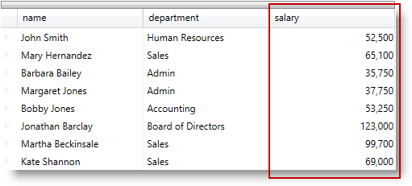
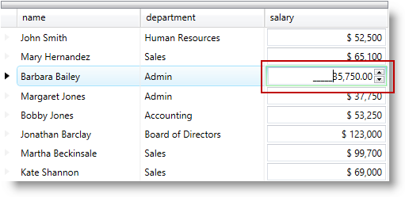

////

|metadata|
{
    "name": "configuring-template-field",
    "controlName": [],
    "tags": [],
    "guid": "791749c5-7ea8-444e-bc21-a9859f0c7649",  
    "buildFlags": [],
    "createdOn": "2014-06-26T13:33:16.4505233Z"
}
|metadata|
////

= Configuring Template Field

== Topic Overview

=== Purpose

This topic describes how to create a field with a custom display and edit template using a TemplateField in the  _xamDataPresenter_™ controls.

=== Required background

The following topics are prerequisites to understanding this topic:

[options="header", cols="a,a"]
|====
|Topic|Purpose

| link:wpf-terms-and-concepts.html[Terms and Concepts]
|This section defines the major elements that constitute the controls that make up The Data Presenter Family.

| link:xamdatagrid-getting-started-with-xamdatagrid.html[Adding xamDataGrid to Your Page]
|This topic describes how to add a _xamDataGrid_ control to your page.

| link:xamdata-generating-fields-manually-versus-automatically.html[Generating Fields Manually Versus Automatically]
|This topic describes how to specify manually FieldLayouts and Fields in the _xamDataGrid_ control.

|====

=== In this topic

This topic contains the following sections:

* <<_Ref390115051,Template Field Configuration Summary>>
* <<_Ref390760850,Configuring Template Field’s Display Template>>
* <<_Ref390113007,Configuring Template Field’s Edit Template>>
* <<_Ref390691228,Code Example: Using a Template Field>>
* <<_Ref390115068,Related Content>>

** <<_Ref390115073,Topics>>
** <<_Ref390115077,Samples>>

[[_Ref390115051]]
== Template Field Configuration Summary

=== Template field configuration summary

The Template Field provides functionality for specifying custom data templates for both display and edit modes in the  _xamDataPresenter_   controls.

=== Template field configuration summary chart

The following table explains briefly the configurable aspects of the `TemplateField` and maps them to the properties that configure them. Further details are available after the table.

[options="header", cols="a,a,a"]
|====
|Configurable aspect|Details|Properties

|<<_Ref390112988,Configuring Template Field's Display Template>>
|Use the `TemplateField`’s `DisplayTemplate` property to customize field display.
|
* link:{ApiPlatform}datapresenter{ApiVersion}~infragistics.windows.datapresenter.templatefield~displaytemplate.html[DisplayTemplate] 

|<<_Ref390113007,Configuring Template Field's Edit Template>>
|Use the `TemplateField`’s `EditTemplate` property to provide a custom field editor.
|
* link:{ApiPlatform}datapresenter{ApiVersion}~infragistics.windows.datapresenter.templatefield~edittemplate.html[EditTemplate] 

|====

[[_Ref390112988]]
[[_Ref390760850]]
== Configuring Template Field’s Display Template

[[_Hlk368069110]]

=== Overview

Use link:{ApiPlatform}datapresenter{ApiVersion}~infragistics.windows.datapresenter.templatefield_members.html[TemplateField]’s `DisplayTemplate` property to customize the field display when not in edit mode.

Use the `TemplateEditorValueBinding` markup extension to facilitate the binding to the underlying data.

=== Property settings

The following table maps the desired configuration to the property settings that manage it.

[options="header", cols="a,a,a"]
|====
|In order to:|Use this property:|And set it to:

|Provide custom field display
| link:{ApiPlatform}datapresenter{ApiVersion}~infragistics.windows.datapresenter.templatefield~displaytemplate.html[DisplayTemplate]
|`DataTemplate`

|====

[[_Hlk337817761]]

=== Example

The screenshot below demonstrates how the field would look as a result of the following code:

Following is the code that implements the “salary” template field.

*In XAML:*

[source,xaml]
----
<igDP:TemplateField Name="salary" >
    <!-- [Your Display Template Here]  -->
    <!-- [Your Edit Template Here]  -->
</igDP:TemplateField>
----

Following is the code that implements the `TemplateField` display template.

*In XAML:*

[source,xaml]
----
<igDP:TemplateField.DisplayTemplate>
    <DataTemplate>
        <TextBlock Text="{igEditors:TemplateEditorValueBinding}"
                   HorizontalAlignment="Right"/>
    </DataTemplate>
</igDP:TemplateField.DisplayTemplate>
----

The following code is equivalent to the code above.

*In XAML:*

[source,xaml]
----
<igDP:TemplateField.DisplayTemplate>
    <DataTemplate>
        <TextBlock Text="{Binding Path=(igEditors:TemplateEditor.Editor).Value, RelativeSource={RelativeSource Self}}"
                   HorizontalAlignment="Right"/>
    </DataTemplate>
</igDP:TemplateField.DisplayTemplate>
----

[[_Ref390113007]]
== Configuring Template Field’s Edit Template

=== Overview

Use link:{ApiPlatform}datapresenter{ApiVersion}~infragistics.windows.datapresenter.templatefield_members.html[TemplateField]’s `EditTemplate` to specify template content with a custom field editor.

Use the `TemplateEditorValueBinding` markup extension to facilitate the binding to the underlying data.

=== Property settings

The following table maps the desired configuration to the property settings that manage it.

[options="header", cols="a,a,a"]
|====
|In order to:|Use this property:|And set it to:

|Provide custom field editor
| link:{ApiPlatform}datapresenter{ApiVersion}~infragistics.windows.datapresenter.templatefield~edittemplate.html[EditTemplate]
|`DataTemplate`

|====

=== Example

The screenshot below demonstrates how the custom editor field would look and behave as a result of the following code:

Following is the code that implements the “salary” template field.

*In XAML:*

[source,xaml]
----
<igDP:TemplateField Name="salary" >
    <!-- [Your Display Template Here]  -->
    <!-- [Your Edit Template Here]  -->
</igDP:TemplateField>
----

Following is the code that implements the `TemplateField` edit template.

*In XAML:*

[source,xaml]
----
<igDP:TemplateField.EditTemplate>
    <DataTemplate>
        <Border BorderBrush="LightGreen" BorderThickness="1">
            <igEditors:XamNumericEditor Value="{igEditors:TemplateEditorValueBinding}"                                                                  SpinButtonDisplayMode="Always"
SpinIncrement="50"/>
        </Border>
    </DataTemplate>
</igDP:TemplateField.EditTemplate>
----

The following code is equivalent to the code above.

*In XAML:*

[source,xaml]
----
<igDP:TemplateField.EditTemplate>
    <DataTemplate>
        <Border BorderBrush="LightGreen" BorderThickness="1">
            <igEditors:XamNumericEditor Value="{Binding Path=(igEditors:TemplateEditor.Editor).Value, RelativeSource={RelativeSource Self}, UpdateSourceTrigger=PropertyChanged}"                                                       SpinButtonDisplayMode="Always"                                                                 SpinIncrement="50"/>
        </Border>
    </DataTemplate>
</igDP:TemplateField.EditTemplate>
----

[[_Ref390691228]]
== Code Example: Using a Template Field

=== Description

The following code is the full example of using the `TemplateField` in the  _xamDataGrid_   control.

=== Code

Use the following namespaces:

*In XAML:*

[source,xaml]
----
xmlns:igDP="http://infragistics.com/DataPresenter"
xmlns:igEditors="http://infragistics.com/Editors"
----

*In XAML:*

[source,xaml]
----
<igDP:XamDataGrid x:Name="DataGrid" BindToSampleData="True" AutoFit="True">
    <igDP:XamDataGrid.FieldLayouts>
        <igDP:FieldLayout>
            <igDP:FieldLayout.Fields>
                <igDP:TextField Name="name"/>
                <igDP:TextField Name="department"/>
                <igDP:TextField Name="email" Visibility="Collapsed" />
                <igDP:TemplateField Name="salary" >
                    <igDP:TemplateField.DisplayTemplate>
                        <DataTemplate>
                            <TextBlock Text="{igEditors:TemplateEditorValueBinding}"
                                       HorizontalAlignment="Right"/>
                        </DataTemplate>
                    </igDP:TemplateField.DisplayTemplate>
                    <igDP:TemplateField.EditTemplate>
                        <DataTemplate>
                            <Border BorderBrush="LightGreen" BorderThickness="1">
                                <igEditors:XamNumericEditor Value="{igEditors:TemplateEditorValueBinding}"                                    SpinButtonDisplayMode="Always" SpinIncrement="50"/>
                            </Border>
                        </DataTemplate>
                    </igDP:TemplateField.EditTemplate>                                             </igDP:TemplateField>
            </igDP:FieldLayout.Fields>
        </igDP:FieldLayout>
    </igDP:XamDataGrid.FieldLayouts>
</igDP:XamDataGrid>
----

[[_Ref390115068]]
== Related Content

[[_Ref390115073]]

=== Topics

The following topics provide additional information related to this topic.

[options="header", cols="a,a"]
|====
|Topic|Purpose

| link:xamdatapresenter-define-a-field-layout.html[Define a Field Layout]
|This topic describes how to define field layouts to specify which fields to display and to set properties related to those fields in the _xamDataPresenter_ controls.

| link:xamdatapresenter-configuring-specific-editor-fields.html[Configuring Specific Editor Fields]
|This topic describes an easy and straightforward way of configuring specific editor fields for different data types in the _xamDataPresenter_ controls.

| link:xamdata-generating-fields-manually-versus-automatically.html[Generating Fields Manually Versus Automatically]
|This topic describes the difference between automatic and manual Fields generation in the _xamDataPresenter_ controls.

| link:xamdatapresenter-manually-assigning-a-field-layout-to-xamdatapresenter.html[Manually Assigning a Field Layout to xamDataPresenter]
|This topic describes how you can create multiple FieldLayouts for the _xamDataPresenter_ controls.

| link:xam-data-grid-displaying-an-image-in-a-field.html[Displaying an Image in a Field]
|This topic describes how to add a Field to display an image overriding the CellValuePresenter's template in the _xamDataPresenter_ controls.

| link:xamdatapresenter-load-field-customizations.html[Load Field Customizations]
|This topic describes how to load field customizations for the _xamDataPresenter_ controls.

| link:xamdatapresenter-save-field-customizations.html[Save Field Customizations]
|This topic describes how to save field customizations for the _xamDataPresenter_ controls.

| link:xamdatagrid-changing-the-default-column-and-row-definitions.html[Changing the Default Column and Row Definitions]
|This topic describes how to change the layout customizing the Row, Column, ColumnSpan, or RowSpan on each Field to further control the layout of the Record.

| link:xamdatagrid-changing-the-record-orientation.html[Changing the Record Orientation]
|This topic describes how to change the Record orientation.

| link:xamdata-enabling-right-to-left-support.html[Enabling Right to Left Support]
|This topic describes how to change the content flow direction.

| link:xamdatagrid-fields-editors-configuration-.html[Field’s Editors Configuration]
|This topic explains how to configure the controls on the data presenter field editor.

|====

[[_Ref390115077]]

=== Samples

The following sample provides additional information related to this topic.

[options="header", cols="a,a"]
|====
|Sample|Purpose

| link:{SamplesURL}/data-grid/template-fields[Template Fields]
|This sample demonstrates how template fields are created containing different editors in the _xamDataGrid_ control.

|====