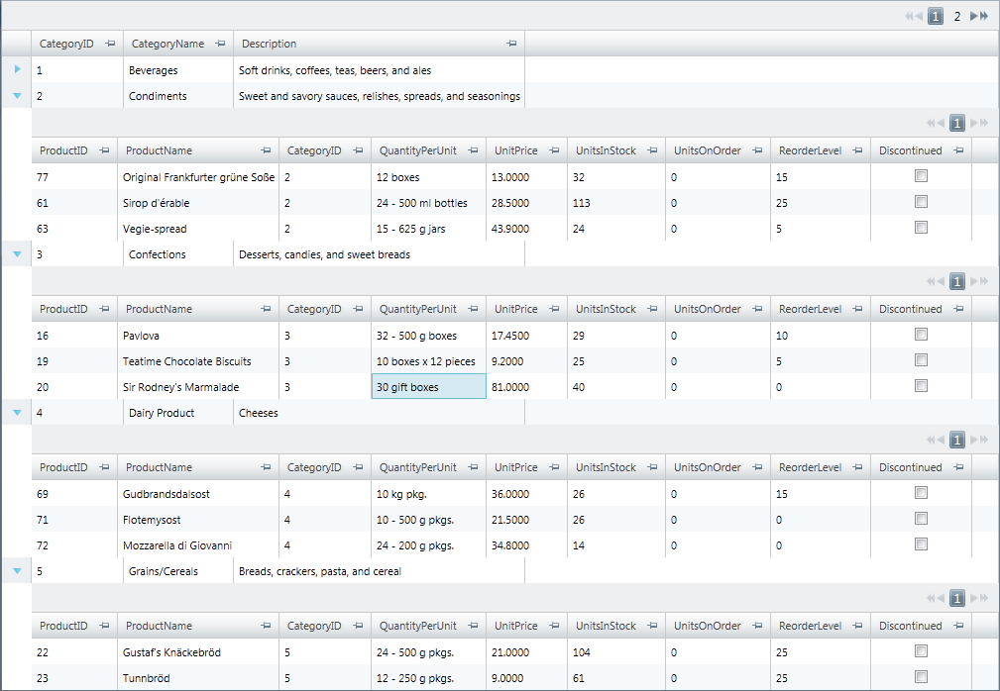
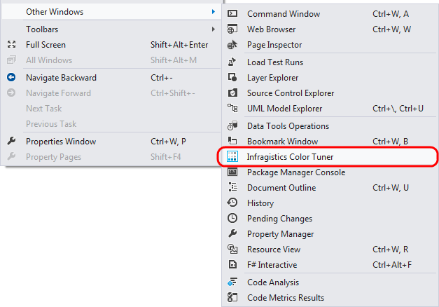
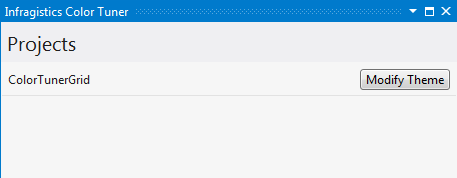
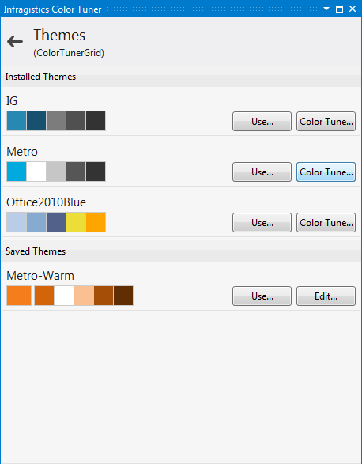
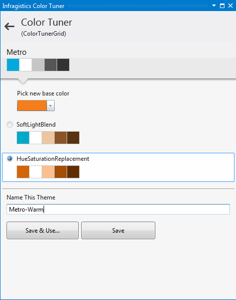
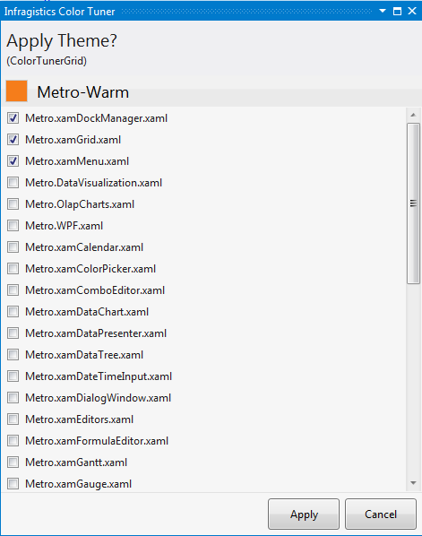
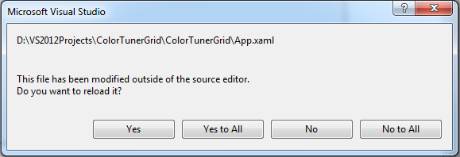
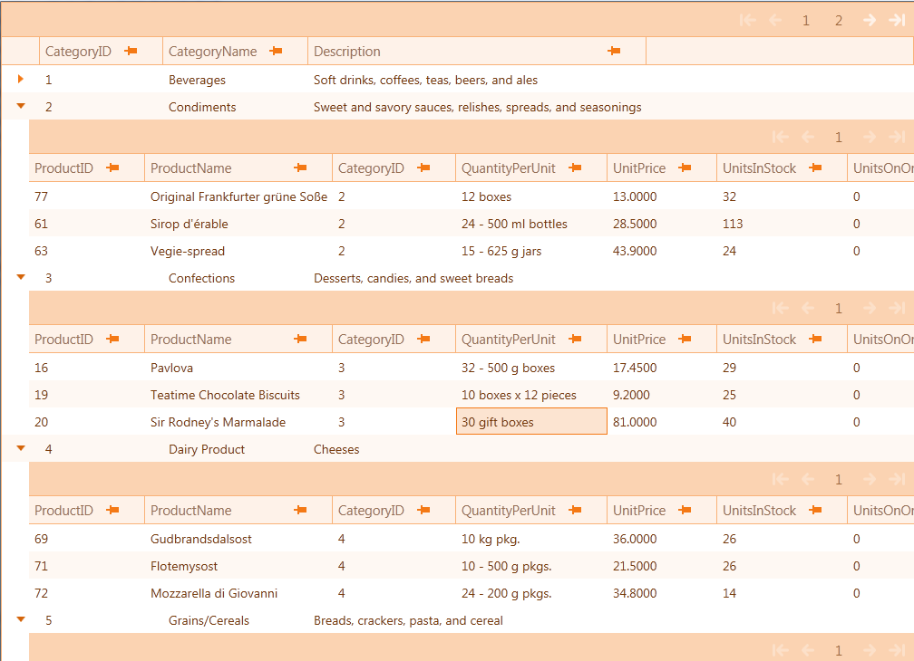

////
|metadata|
{
    "name": "creating-and-applying-color-tuning-configurations",
    "controlName": ["Infragistics Color Tuner"],
    "tags": [],
    "guid": "ae166377-91e4-41b4-89d0-27bf2a99fb70","buildFlags": [],
    "createdOn": "2016-05-25T18:22:00.2914054Z"
}
|metadata|
////

= Creating And Applying Color Tuning Configurations

=== Purpose

This topic walks you through creating and applying custom color tuned themes using the Infragistics Color Tuner.

=== Required background

The following table lists the topics required as a prerequisite to understanding this topic.

[options="header", cols="a,a"]
|====
|Topic|Purpose

| link:reswash-using.html[Using Resource Washer]
|This topic introduces you to the _ResourceWasher_ component where you can learn to change the overall color schemes of your application.

| link:using-infragistics-color-tuner.html[Using Infragistics Color Tuner]
|This topic introduces you to Infragistics Color Tuner, an extension to Visual Studio 2010. It allows you to apply and color tune XAML themes of the controls using convenient UI.

|====

=== In this topic

This topic contains the following sections:

* <<_Ref318799981, Creating Custom Tuned Theme >>

** <<_Ref318799988,Introduction>>

** <<_Ref318799994,Requirements>>

** <<_Ref318800001,Overview>>

** <<_Ref318800010,Steps>>

* <<_Ref318800020, Related Content >>

[[_Ref318799981]]
== Creating Custom Tuned Theme

[[_Ref318799988]]

=== Introduction

This procedure describes the necessary steps for creating and applying custom color tuned themes for specific application level Infragistics® controls.

[[_Ref318799994]]

=== Requirements

To complete this procedure, you need to have a working project using Infragistics controls. You can easily create one following the link:xamgrid-adding-xamgrid-to-your-page.html[Adding xamGrid to Your Page] topic.

.Note
[NOTE]
====
To use Infragistics Color Tuner, you need a project with Infragistics assemblies. This walkthrough uses a `xamGrid` control to display the Infragistics Color Tuner's usage. Using the same approach, you can apply color tuning to any Infragistics control.
====

[[_Ref318800001]]

=== Overview

This topic takes you systematic through creating and applying custom color tuned themes. The following is a thumbnail overview of the process:

[start=1]
. *Preview the application without the theme applied* 
[start=2]
. *Create the new theme* 
[start=3]
. *Apply the theme* 
[start=4]
. *Preview the application with theme applied* 

[[_Ref318800010]]

=== Steps

=== Preview the application without theme applied

The following screenshot demonstrates how a project renders without any theme applied. If you have followed the walkthrough in the link:xamgrid-adding-xamgrid-to-your-page.html[Adding xamGrid to Your Page] topic, your project should look similar.

=== Create the new theme

[start=1]
. To create a color tuned theme using Microsoft® Visual Studio™, navigate to View$$->$$Other Windows $$->$$ Infragistics Color Tuner and start the Infragistics Color Tuner.
+

+
A Project window appears with the name of your project and a Modify Themes button.

[start=2]
. Press the Modify Themes button.
+

+
A Themes window appears, listing several default themes in the Installed Themes area of the window. On the right side of the default theme name there is the– Use… button and the Color Tune… button. For the  _Metro_   theme, click the Color Tune button.
+

+
A Theme washer window appears.

[start=3]
. Choose a base color, color wash mode and name for your theme. For this tutorial use Orange Base color (#FFF79646), HueSaturationReplacement wash mode and the Metro-Warm name.
+

[start=4]
. Click the Save button to save your changes.
+
The themes window reappears. Besides the Installed Themes there is another section, called Saved Themes, which is where your custom tuned themes are displayed.

=== Apply the theme

[start=1]
. From the Apply Theme window displaying a list of all available control .xaml theme files, check a check box for the control .xaml, to which you want to apply the theme.
+
This tutorial uses  _xamGrid_  ,  _xamMenu_   and  _xamDockManager_  , so you can select Metro.xamGrid.xaml, Metro.xamMenu.xaml and Metro.xamDockManager.xaml from the list.

[start=2]
. To confirm, click the Apply button.
+

+
Infragistics Color Tuner writes your choice in  _App.xaml_   project file. If the App.xaml file is amongst the open files a Microsoft Visual Studio dialog window appears asking you whether or not you want to reload the changed App.xaml file; Select Yes.
+

=== Preview the application with theme applied

Following is the view of the project with your custom tuned theme applied.

[[_Ref318800020]]
== Related Content

=== Topics

The following topics provide additional information related to this topic.

[options="header", cols="a,a"]
|====
|Topic|Purpose

| link:sharing-color-tuning-configuration.html[Sharing Color Tuning Configurations]
|This topic is a walkthrough for sharing color-tuning configurations.

| link:reswash-using.html[Using Resource Washer]
|This topic introduces you to the _ResourceWasher_ component where you can learn to change the overall color schemes of your application.

| link:using-infragistics-color-tuner.html[Using Infragistics Color Tuner]
|This topic introduces you to Infragistics Color Tuner, an extension to Visual Studio 2010. It allows you to apply and color tune XAML themes of the WPF controls using convenient UI.

|====