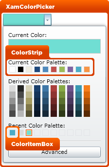
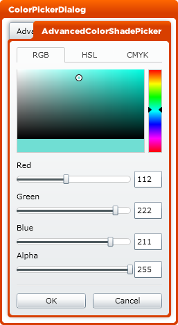

////

|metadata|
{
    "name": "designers-guide-styling-points-for-xamcolorpicker",
    "controlName": [],
    "tags": ["Layouts","Styling","Theming"],
    "guid": "14ee6dac-fb2b-4c4f-82d8-2bb7f63a6169",  
    "buildFlags": ["wpf","sl"],
    "createdOn": "2012-01-30T16:46:26.9448012Z"
}
|metadata|
////

= Styling Points for xamColorPicker

== xamColorPicker Properties

The following diagram highlights the different controls used by xamColorPicker™. To re-style a particular item, first identify the TargetType in the diagram then identify the corresponding Style property/properties in the table that follows.

The following table lists the various cell controls used by the xamColorPicker control and identifies the properties that can be used to set a custom style.

[options="header", cols="a,a,a"]
|====
|TargetType|Style Properties|Description

|xamColorPicker
|xamColorPicker.Style
|Styles the xamColorPicker control.

|ColorStrip
|ColorStrip.Style
|Styles the color strip area.

|ColorItemBox
|ColorItemBox.Style
|Styles the color item box area.

|====

The following table lists the various cell controls used by the xamColorPicker control and identifies the properties that can be used to set a custom style.

[options="header", cols="a,a,a"]
|====
|TargetType|Style Properties|Description

|AdvancedColorShadePicker
|AdvancedColorShadePicker.Style
|Styles the advanced editor area.

|====