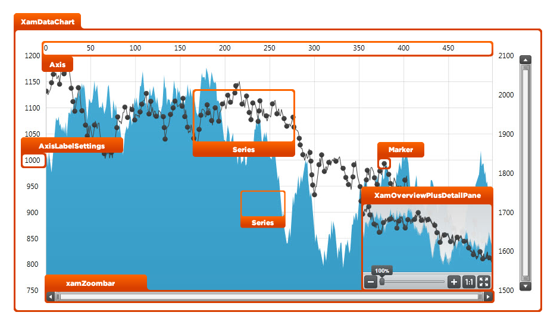
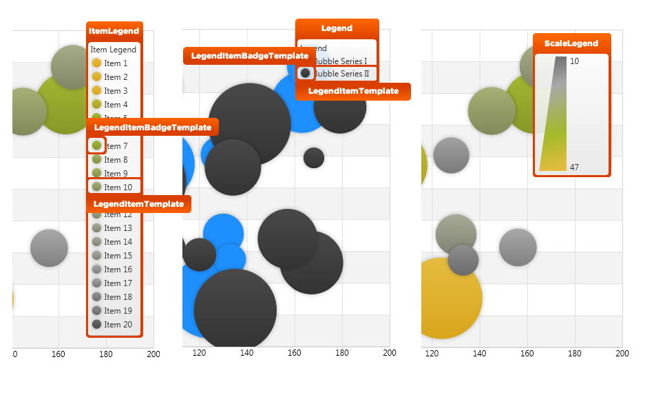
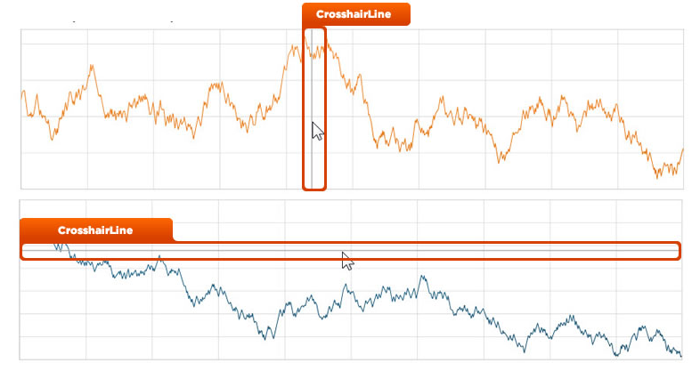

////

|metadata|
{
    "name": "designers-guide-styling-points-for-xamdatachart",
    "controlName": [],
    "tags": ["Charting","Styling","Templating"],
    "guid": "3ffb894d-4402-4322-8e83-442d907b7ec4",  
    "buildFlags": [],
    "createdOn": "2012-04-05T16:16:17.0942759Z"
}
|metadata|
////

= Styling Points for xamDataChart

== Topic Overview

=== Purpose

This topic provides designers styling points for the link:{ApiPlatform}controls.charts.xamdatachart.v{ProductVersion}~infragistics.controls.charts.xamdatachart.html[xamDataChart]™ control.

[[_Ref320651776]]
== Styling Points

=== xamDataChart properties

The following diagrams highlight the different controls used by the  _xamDataChart_   control. To re-style a particular item, first identify the TargetType in the diagram then identify the corresponding Style property/properties in the table that follows.

The following table summarized properties for styling visual elements the  _xamDataChart_   control:

[options="header", cols="a,a,a"]
|====
|TargetType|Style Property|Description

| link:{ApiPlatform}controls.charts.xamdatachart.v{ProductVersion}~infragistics.controls.charts.xamdatachart.html[xamDataChart]
| link:{ApiPlatform}controls.charts.xamdatachart.v{ProductVersion}~infragistics.controls.charts.xamdatachart.html[xamDataChart]. link:http://msdn.microsoft.com/en-us/library/system.windows.frameworkelement.style.aspx[Style]
|Specifies a style for the _xamDataChart_ control.

ifdef::wpf,sl[]
| link:{ApiPlatform}datavisualization.v{ProductVersion}~infragistics.controls.xamzoombar.html[xamZoombar]
| link:{ApiPlatform}controls.charts.xamdatachart.v{ProductVersion}~infragistics.controls.charts.xamdatachart.html[xamDataChart]. link:{ApiPlatform}controls.charts.xamdatachart.v{ProductVersion}~infragistics.controls.seriesviewer~zoombarstyle.html[ZoombarStyle]
|Specifies a style for the _xamDataChart_ control’s zoombars.
endif::wpf,sl[]

ifdef::wpf,sl[]
| link:{ApiPlatform}datavisualization.v{ProductVersion}~infragistics.controls.xamoverviewplusdetailpane_members.html[xamOverviewPlusDetailPane]
| link:{ApiPlatform}controls.charts.xamdatachart.v{ProductVersion}~infragistics.controls.charts.xamdatachart.html[xamDataChart]. link:{ApiPlatform}controls.charts.xamdatachart.v{ProductVersion}~infragistics.controls.seriesviewer~overviewplusdetailpanestyle.html[OverviewPlusDetailPaneStyle]
|Specifies a style for the _xamDataChart_ control’s chart overview pane.
endif::wpf,sl[]

| link:http://msdn.microsoft.com/en-us/library/system.windows.shapes.line.aspx[Line]
| link:{ApiPlatform}controls.charts.xamdatachart.v{ProductVersion}~infragistics.controls.charts.xamdatachart.html[xamDataChart]. link:{ApiPlatform}controls.charts.xamdatachart.v{ProductVersion}~infragistics.controls.seriesviewer~crosshairlinestyle.html[CrosshairLineStyle]
|Specifies a style for the _xamDataChart_ control’s crosshair.

| link:{ApiPlatform}controls.charts.xamdatachart.v{ProductVersion}~infragistics.controls.charts.axis_members.html[Axis] (All types of Axis)
| link:{ApiPlatform}controls.charts.xamdatachart.v{ProductVersion}~infragistics.controls.charts.xamdatachart.html[xamDataChart]. link:{ApiPlatform}controls.charts.xamdatachart.v{ProductVersion}~infragistics.controls.charts.xamdatachart~axes.html[Axes][x]. link:http://msdn.microsoft.com/en-us/library/system.windows.frameworkelement.style.aspx[Style]
|Specifies a style for the _xamDataChart_ control’s axis.

| link:{ApiPlatform}controls.charts.xamdatachart.v{ProductVersion}~infragistics.controls.charts.axislabelsettings_members.html[AxisLabelSettings]
| link:{ApiPlatform}controls.charts.xamdatachart.v{ProductVersion}~infragistics.controls.charts.xamdatachart.html[xamDataChart]. link:{ApiPlatform}controls.charts.xamdatachart.v{ProductVersion}~infragistics.controls.charts.xamdatachart~axes.html[Axes][x]. link:{ApiPlatform}controls.charts.xamdatachart.v{ProductVersion}~infragistics.controls.charts.axis~labelsettings.html[LabelSettings]
|Specifies a style for label settings for an axis.

| link:{ApiPlatform}controls.charts.xamdatachart.v{ProductVersion}~infragistics.controls.seriesviewer~series.html[Series] (All Types of Series) 

For example: 

* link:{ApiPlatform}controls.charts.xamdatachart.v{ProductVersion}~infragistics.controls.charts.areaseries_members.html[AreaSeries] 

* link:{ApiPlatform}controls.charts.xamdatachart.v{ProductVersion}~infragistics.controls.charts.columnseries_members.html[ColumnSeries] 

* link:{ApiPlatform}controls.charts.xamdatachart.v{ProductVersion}~infragistics.controls.charts.barseries_members.html[BarSeries] 

* link:{ApiPlatform}controls.charts.xamdatachart.v{ProductVersion}~infragistics.controls.charts.stackedbarseries_members.html[StackedBarSeries] 

* link:{ApiPlatform}controls.charts.xamdatachart.v{ProductVersion}~infragistics.controls.charts.stacked100barseries_members.html[Stacked100BarSeries] 

* link:{ApiPlatform}controls.charts.xamdatachart.v{ProductVersion}~infragistics.controls.charts.bubbleseries_members.html[BubbleSeries] 

* link:{ApiPlatform}controls.charts.xamdatachart.v{ProductVersion}~infragistics.controls.charts.scatterseries_members.html[ScatterSeries] 

* link:{ApiPlatform}controls.charts.xamdatachart.v{ProductVersion}~infragistics.controls.charts.polarsplineseries_members.html[PolarSplineSeries] 

* link:{ApiPlatform}controls.charts.xamdatachart.v{ProductVersion}~infragistics.controls.charts.polarscatterseries_members.html[PolarScatterSeries] 

* link:{ApiPlatform}controls.charts.xamdatachart.v{ProductVersion}~infragistics.controls.charts.radialareaseries_members.html[RadialAreaSeries] 

* link:{ApiPlatform}controls.charts.xamdatachart.v{ProductVersion}~infragistics.controls.charts.radialpieseries_members.html[RadialPieSeries] 

* link:{ApiPlatform}controls.charts.xamdatachart.v{ProductVersion}~infragistics.controls.charts.valueoverlay_members.html[ValueOverlay] 

* link:{ApiPlatform}controls.charts.xamdatachart.v{ProductVersion}~infragistics.controls.charts.financialpriceseries_members.html[FinancialPriceSeries] 

* link:{ApiPlatform}controls.charts.xamdatachart.v{ProductVersion}~infragistics.controls.charts.massindexindicator_members.html[MassIndexIndicator] 

* link:{ApiPlatform}controls.charts.xamdatachart.v{ProductVersion}~infragistics.controls.charts.typicalpriceindicator_members.html[TypicalPriceIndicator] 

| link:{ApiPlatform}controls.charts.xamdatachart.v{ProductVersion}~infragistics.controls.charts.xamdatachart.html[xamDataChart]. link:{ApiPlatform}controls.charts.xamdatachart.v{ProductVersion}~infragistics.controls.seriesviewer~series.html[Series][x]. link:http://msdn.microsoft.com/en-us/library/system.windows.frameworkelement.style.aspx[Style] 

link:{ApiPlatform}controls.charts.xamdatachart.v{ProductVersion}~infragistics.controls.charts.xamdatachart.html[xamDataChart]. link:{ApiPlatform}controls.charts.xamdatachart.v{ProductVersion}~infragistics.controls.seriesviewer~series.html[Series][x]. link:{ApiPlatform}controls.charts.xamdatachart.v{ProductVersion}~infragistics.controls.charts.series~legenditemtemplate.html[LegendItemTemplate] 

link:{ApiPlatform}controls.charts.xamdatachart.v{ProductVersion}~infragistics.controls.charts.xamdatachart.html[xamDataChart]. link:{ApiPlatform}controls.charts.xamdatachart.v{ProductVersion}~infragistics.controls.seriesviewer~series.html[Series][x]. link:{ApiPlatform}controls.charts.xamdatachart.v{ProductVersion}~infragistics.controls.charts.series~legenditembadgetemplate.html[LegendItemBadgeTemplate]
|Specifies a style for a series in the _xamDataChart_ control’s link:{ApiPlatform}controls.charts.xamdatachart.v{ProductVersion}~infragistics.controls.seriesviewer~series.html[Series] collection. 

Specifies a style for legend item and legend badge templates for a series in the _xamDataChart_ control’s link:{ApiPlatform}controls.charts.xamdatachart.v{ProductVersion}~infragistics.controls.seriesviewer~series.html[Series] collection.

| link:{ApiPlatform}controls.charts.xamdatachart.v{ProductVersion}~infragistics.controls.charts.marker_members.html[Marker]
| link:{ApiPlatform}controls.charts.xamdatachart.v{ProductVersion}~infragistics.controls.charts.markerseries_members.html[MarkerSeries]. link:{ApiPlatform}controls.charts.xamdatachart.v{ProductVersion}~infragistics.controls.charts.markerseries~markerstyle.html[MarkerStyle] 

(Applies to Series that inherits)
|Specifies a style for markers of a series that inherits link:{ApiPlatform}controls.charts.xamdatachart.v{ProductVersion}~infragistics.controls.charts.markerseries_members.html[MarkerSeries] class (for example, link:{ApiPlatform}controls.charts.xamdatachart.v{ProductVersion}~infragistics.controls.charts.lineseries_members.html[LineSeries]).

| link:{ApiPlatform}controls.charts.xamdatachart.v{ProductVersion}~infragistics.controls.charts.legend_members.html[Legend]
| link:{ApiPlatform}controls.charts.xamdatachart.v{ProductVersion}~infragistics.controls.charts.legend_members.html[Legend]. link:http://msdn.microsoft.com/en-us/library/system.windows.frameworkelement.style.aspx[Style]
|Specifies a style for the _xamDataChart_ control’s Legend which is used with all types of link:{ApiPlatform}controls.charts.xamdatachart.v{ProductVersion}~infragistics.controls.seriesviewer~series.html[Series] objects.

| link:{ApiPlatform}controls.charts.xamdatachart.v{ProductVersion}~infragistics.controls.charts.itemlegend_members.html[ItemLegend]
| link:{ApiPlatform}controls.charts.xamdatachart.v{ProductVersion}~infragistics.controls.charts.itemlegend_members.html[ItemLegend]. link:http://msdn.microsoft.com/en-us/library/system.windows.frameworkelement.style.aspx[Style]
|Specifies a style for the _xamDataChart_ control’s link:{ApiPlatform}controls.charts.xamdatachart.v{ProductVersion}~infragistics.controls.charts.itemlegend_members.html[ItemLegend] which is used with link:{ApiPlatform}controls.charts.xamdatachart.v{ProductVersion}~infragistics.controls.charts.bubbleseries_members.html[BubbleSeries].

| link:{ApiPlatform}controls.charts.xamdatachart.v{ProductVersion}~infragistics.controls.charts.scalelegend_members.html[ScaleLegend]
| link:{ApiPlatform}controls.charts.xamdatachart.v{ProductVersion}~infragistics.controls.charts.scalelegend_members.html[ScaleLegend]. link:http://msdn.microsoft.com/en-us/library/system.windows.frameworkelement.style.aspx[Style]
|Specifies a style for the _xamDataChart_ control’s link:{ApiPlatform}controls.charts.xamdatachart.v{ProductVersion}~infragistics.controls.charts.scalelegend_members.html[ScaleLegend] which is used with link:{ApiPlatform}controls.charts.xamdatachart.v{ProductVersion}~infragistics.controls.charts.bubbleseries_members.html[BubbleSeries].

|====

[[_Ref320185294]]
== Related Content

=== Topics

The following topics provide additional information related to this topic.

[options="header", cols="a,a"]
|====
|Topic|Purpose

| link:datachart-axes.html[Axes]
|This topic provides information about using axes in the _xamDataChart_ control.

| link:datachart-legends.html[Legends]
|This topic provides information about using legends in the _xamDataChart_ control.

| link:datachart-series-types.html[Types of Series]
|This topic provides information about supported types of series in the _xam_ _DataChart_ control.

|====