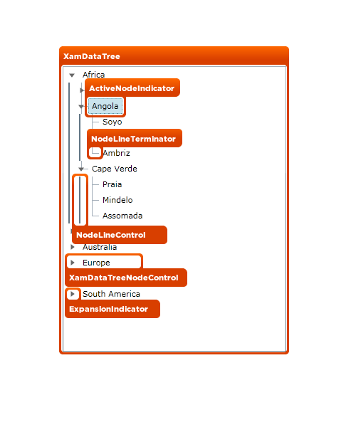

////

|metadata|
{
    "name": "designers-guide-styling-points-for-xamdatatree",
    "controlName": [],
    "tags": ["Styling","Templating"],
    "guid": "1bd57d3f-89dc-4e97-95f7-d50678098427",  
    "buildFlags": ["sl","wpf"],
    "createdOn": "2012-01-30T16:46:26.9528012Z"
}
|metadata|
////

= Styling Points for xamDataTree

== xamDataTree Properties

The following diagram highlights the different controls used by the xamDataTree™ control. To re-style a particular item, first identify the TargetType in the diagram then identify the corresponding Style property/properties in the table that follows.

== xamDataTree Style Properties and TargetTypes

The following table lists the various controls used by xamDataTree and identifies the properties that can be used to set a custom style.

[options="header", cols="a,a,a"]
|====
|TargetType|Style Property|Description

|XamDataTree
|xamDataTree.Style
|Styles the xamDataTree control

|ActiveNodeIndicator
|ActiveNodeIndicator.Style
|Styles the active node indicator

|NodeLineTerminator
|NodeLineTerminator.Style
|Styles the node line terminator

|NodeLineControl
|NodeLineControl.Style
|Styles the node line control

|XamDataTreeNodeControl
|XamDataTreeNode.Style
|Styles the xamDataTreeNode control

|ExpansionIndicator
|ExpansionIndicator.Style
|Styles the expansion indicator

|====