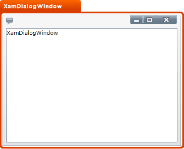

////

|metadata|
{
    "name": "designers-guide-styling-points-for-xamdialogwindow",
    "controlName": [],
    "tags": ["Styling","Templating"],
    "guid": "{72422124-70BF-4458-91EA-E0D4C52B6731}",  
    "buildFlags": ["sl","wpf"],
    "createdOn": "2012-01-30T16:46:26.9558012Z"
}
|metadata|
////

= Styling Points for xamDialogWindow

== xamDialogWindow Properties

The following diagram highlights the different controls used by the xamDialogWindow™ control. To re-style a particular item, first identify the TargetType in the diagram then identify the corresponding Style property/properties in the table that follows.

== xamDialogWindow Style Properties and TargetTypes

The following table lists the various controls used by xamDialogWindow and identifies the properties that can be used to set a custom style.

[options="header", cols="a,a,a"]
|====
|TargetType|Style Properties|Description

|xamDialogWindow
|xamDialogWindow.Style
|Styles the dialog window control

|====