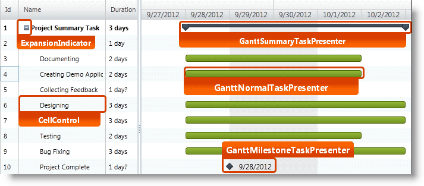
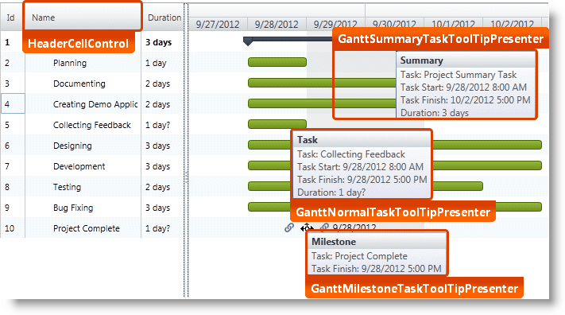
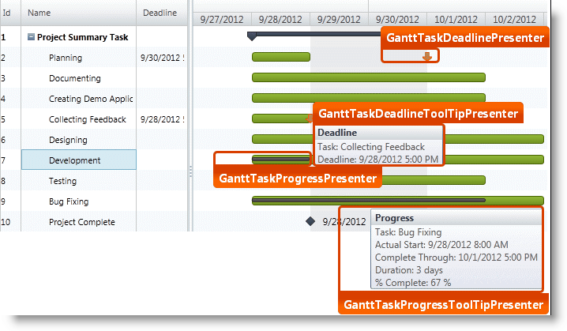
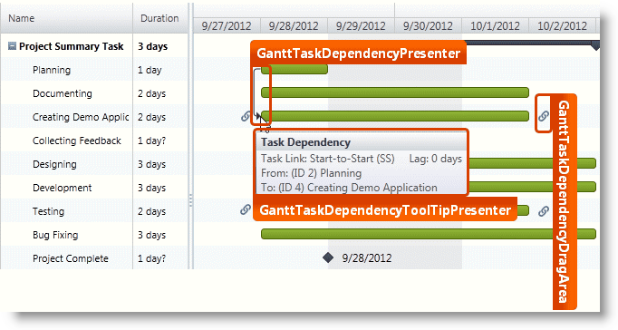
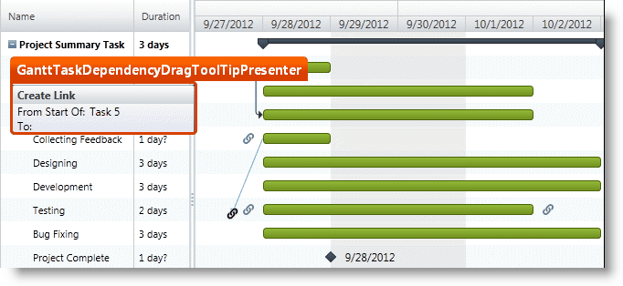
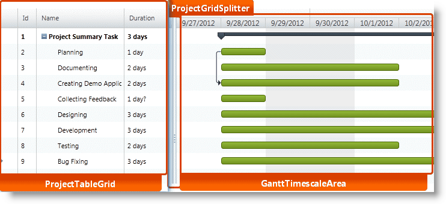
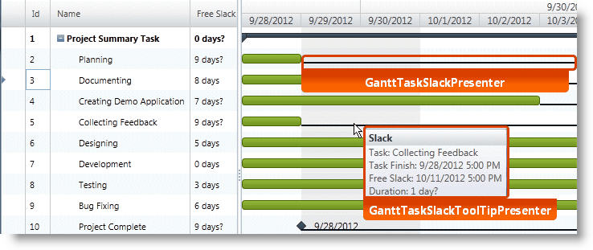
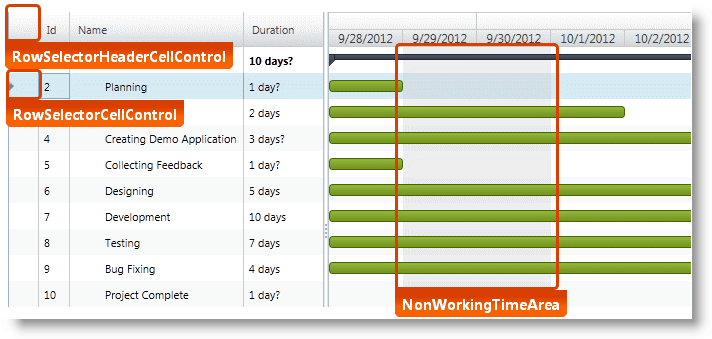
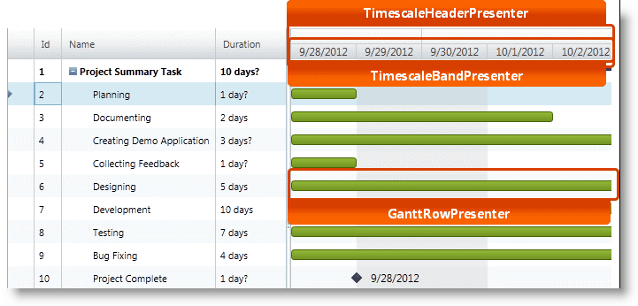
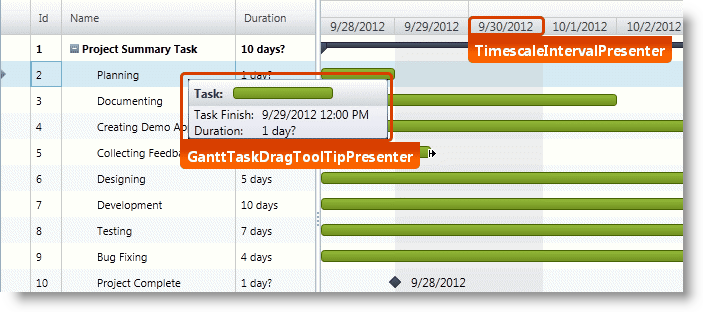

////
|metadata|
{
    "name": "designers-guide-styling-points-for-xamgantt",
    "controlName": [],
    "tags": ["Charting","Data Presentation","Scheduling","Styling","Templating"],
    "guid": "47cbc157-10e6-4e7c-8410-21b6679751ac",
    "buildFlags": ["sl","wpf"],
    "createdOn": "2012-09-28T14:08:42.3861893Z"
}
|metadata|
////

= Styling Points for xamGantt

=== Introduction

Using _xamGantt™_ control to customize the default look and feel of target types via control properties.

=== Preview

The following screenshots identify the various target types, which are configurable using  _xamGantt_ ’s control properties. This allows you to customize those target types associated with this control using your desired style.

== _xamGantt_ Styling Properties

[options="header", cols="a,a,a"]
|====
|Target type|Style property|Description

|TextBlock
|xamGantt.ManualValueTextBlockStyle
|Styles a TextBlock in the grid section of the xamGantt when the value represents a manual/text value (for example ManualStart, ManualFinish or ManualDuration field).

|ExpansionIndicator
|xamGantt.ExpansionIndicatorStyle
|Styles the element within the *Task Name* column used to expand and collapse a summary task.

|XamGantt
|xamGantt.Style
|Styles various visual aspects of the xamGantt.
 
|ProjectGridSplitter
|-
|Represents the grid splitter that separates and resizes the grid and chart sections of the xamGantt.
 
|CellControl
|ProjectTableGrid.CellStyle
|Represents all standard cells in the grid section of the xamGantt.
 
|RowSelectorCellControl
|ProjectTableGrid.RowSelectorCellStyle
|Represents the row selector in the grid rows of the xamGantt.

|HeaderCellControl
|ProjectTableGrid.HeaderStyle
|Represents all standard cells in a header row in the grid section of the xamGantt.
 
|RowSelectorHeaderCellControl
|ProjectTableGrid.RowSelectorHeaderStyle
|Represents the row selector in the header row.
 
|GanttTimescaleArea
|-
|Represents the chart section of the xamGantt.
 
|TimescaleHeaderPresenter
|-
|Represents the header area that contains the Timescale information above the task bars in the chart section of the xamGantt.
 
|TimescaleBandPresenter
|-
|Represents a single link:{ApiPlatform}controls.schedules.xamgantt{ApiVersion}~infragistics.controls.schedules.timescaleBandBase.html[TimescaleBandBase] within a link:{ApiPlatform}controls.schedules.xamgantt{ApiVersion}~infragistics.controls.schedules.primitives.timescaleheaderpresenter.html[TimescaleHeaderPresenter] in the chart section of the xamGantt.

|GanttRowPresenter
|-
|Represents the background area for each link:{ApiPlatform}controls.schedules.xamgantt{ApiVersion}~infragistics.controls.schedules.projecttask.html[ProjectTask] item within the chart section of the xamGantt.
 
|NonWorkingTimeArea
|-
|Represents the background area that highlights the non-working time information in the chart section of the xamGantt based on the resolved link:{ApiPlatform}controls.schedules.xamgantt{ApiVersion}~infragistics.controls.schedules.projectviewsettings.html[ProjectViewSettings] link:{ApiPlatform}controls.schedules.xamgantt{ApiVersion}~infragistics.controls.schedules.projectviewsettings~nonworkingtimehighlightstyle.html[NonWorkingTimeHighlightStyle].

|GanttTaskDragArea
|-
|By default, this element has no visual representation but designates the area of the xamGantt task bar that is UI interactive.
 
|GanttTaskDependencyToolTipPresenter
|-
|Represents the content of the tooltip for a GanttTaskDependencyPresenter.
 
|GanttTaskDependencyPresenter
|-
|Represents a link:{ApiPlatform}controls.schedules.xamgantt{ApiVersion}~infragistics.controls.schedules.projecttaskdependency.html[ProjectTaskDependency] (the predecessor/successor relationship between two tasks) within the chart area of the xamGantt.
 
|GanttTaskDependencyDragToolTipPresenter
|-
|Represents the content for the tooltip displayed while dragging a link:{ApiPlatform}controls.schedules.xamgantt{ApiVersion}~infragistics.controls.schedules.primitives.gantttaskdependencydragarea.html[GanttTaskDependencyDragArea] to create a new link:{ApiPlatform}controls.schedules.xamgantt{ApiVersion}~infragistics.controls.schedules.projecttaskdependency.html[ProjectTaskDependency].
 
|GanttTaskDependencyDragArea
|-
|Represents the element displayed before and after a xamGantt task bar that creates a start or finish link:{ApiPlatform}controls.schedules.xamgantt{ApiVersion}~infragistics.controls.schedules.projecttaskdependency.html[ProjectTaskDependency] for the associated link:{ApiPlatform}controls.schedules.xamgantt{ApiVersion}~infragistics.controls.schedules.projecttask.html[ProjectTask].
 
|TimescaleIntervalPresenter
|-
|Represents a single date range for a given link:{ApiPlatform}controls.schedules.xamgantt{ApiVersion}~infragistics.controls.schedules.timescaleBandBase.html[TimescaleBandBase] within the TimescaleBandPresenter.
 
|ProjectTableGrid
|-
|Represents the grid area of the xamGantt.
 
|GanttTaskDragToolTipPresenter
|-
|Represents the content of the tooltip displayed while dragging or resizing a xamGantt task bar.
 
|GanttTaskProgressToolTipPresenter
|-
|Represents the content of the tooltip displayed when hovering the mouse over a GanttTaskProgressPresenter.
 
|GanttTaskProgressPresenter
|-
|Represents the link:{ApiPlatform}controls.schedules.xamgantt{ApiVersion}~infragistics.controls.schedules.projecttask.html[ProjectTask] progress bar within the chart section of the xamGantt. +
The representation depends on the position of the *Complete Through* date for the task.
 
|GanttTaskSlackToolTipPresenter
|-
|Represents the content of the tooltip displayed when hovering the mouse over a GanttTaskSlackPresenter.
 
|GanttTaskSlackPresenter
|-
|Represents the calculated Free Slack for a link:{ApiPlatform}controls.schedules.xamgantt{ApiVersion}~infragistics.controls.schedules.projecttask.html[ProjectTask] in the chart section of the xamGantt. +
This element is visible when the link:{ApiPlatform}controls.schedules.xamgantt{ApiVersion}~infragistics.controls.schedules.projectviewsettings.html[ProjectViewSettings] link:{ApiPlatform}controls.schedules.xamgantt{ApiVersion}~infragistics.controls.schedules.projectviewsettings~isslackvisible.html[IsSlackVisible] property is set to true.
 
|GanttTaskDeadlineToolTipPresenter
|-
|Represents the content of the tooltip displayed when hovering the mouse over a GanttTaskDeadlinePresenter.
 
|GanttTaskDeadlinePresenter
|-
|Represents a deadline within the chart section of the xamGantt.
 
|GanttMilestoneTaskToolTipPresenter
|-
|Represents the content of the tooltip displayed when hovering the mouse over a GanttMilestoneTaskPresenter.
 
|GanttMilestoneTaskPresenter
|-
|Represents a link:{ApiPlatform}controls.schedules.xamgantt{ApiVersion}~infragistics.controls.schedules.projecttask.html[ProjectTask] that is a milestone within the chart section of the xamGantt.
 
|GanttNormalTaskToolTipPresenter
|-
|Represents the content of the tooltip displayed when hovering the mouse over a GanttNormalTaskPresenter.
 
|GanttNormalTaskPresenter
|-
|Represents a link:{ApiPlatform}controls.schedules.xamgantt{ApiVersion}~infragistics.controls.schedules.projecttask.html[ProjectTask] that is neither a milestone nor a summary within the chart section of the xamGantt.
 
|GanttSummaryTaskToolTipPresenter
|- 
|Represents the content of the tooltip displayed when hovering the mouse over a GanttSummaryTaskPresenter.
 
|GanttSummaryTaskPresenter
|-
|Represents a summary link:{ApiPlatform}controls.schedules.xamgantt{ApiVersion}~infragistics.controls.schedules.projecttask.html[ProjectTask] that is not a milestone within the chart section of the xamGantt.

|====