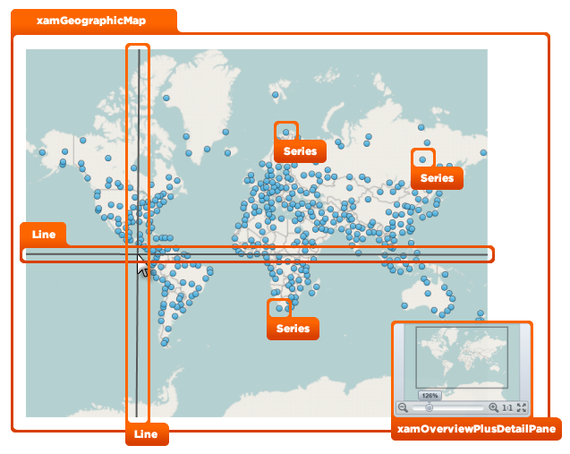
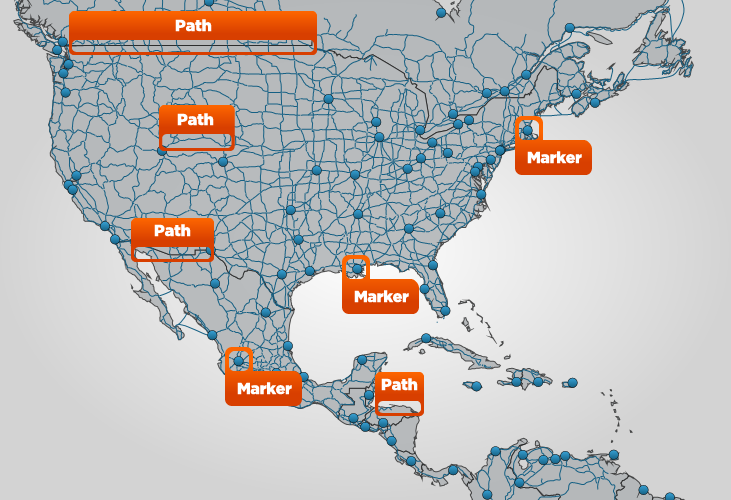

////

|metadata|
{
    "name": "designers-guide-styling-points-for-xamgeographicmap",
    "controlName": [],
    "tags": ["Styling","Templating"],
    "guid": "2a5efb03-fcbb-4793-a370-058b7bf97e5a",  
    "buildFlags": ["wpf","sl"],
    "createdOn": "2012-04-05T16:16:26.1682759Z"
}
|metadata|
////

= Styling Points for xamGeographicMap

== Topic Overview

=== Purpose

This topic provides designers styling points for the link:{ApiPlatform}controls.maps.xamgeographicmap.v{ProductVersion}~infragistics.controls.maps.xamgeographicmap_members.html[xamGeographicMap]™ control.

[[_Ref320651776]]
== Styling Points

=== xamGeographicMap properties

The following diagram highlights the different controls used by the _xamGeographicMap_ control. To re-style a particular item, first identify the TargetType in the diagram then identify the corresponding Style property/properties in the table that follows.

The following table summarized properties for styling visual elements of the _xamGeographicMap_ control:

[options="header", cols="a,a,a"]
|====
|TargetType|Style Property|Description

| link:{ApiPlatform}controls.maps.xamgeographicmap.v{ProductVersion}~infragistics.controls.maps.xamgeographicmap_members.html[xamGeographicMap]
| link:{ApiPlatform}controls.maps.xamgeographicmap.v{ProductVersion}~infragistics.controls.maps.xamgeographicmap_members.html[xamGeographicMap]. link:http://msdn.microsoft.com/en-us/library/system.windows.frameworkelement.style.aspx[Style]
|Specifies a style for the _xamGeographicMap_ control.

| link:{ApiPlatform}datavisualization.v{ProductVersion}~infragistics.controls.xamoverviewplusdetailpane_members.html[xamOverviewPlusDetailPane]
| link:{ApiPlatform}controls.maps.xamgeographicmap.v{ProductVersion}~infragistics.controls.maps.xamgeographicmap_members.html[xamGeographicMap]. link:{ApiPlatform}controls.charts.xamdatachart.v{ProductVersion}~infragistics.controls.seriesviewer~overviewplusdetailpanestyle.html[OverviewPlusDetailPaneStyle]
|Specifies a style for the _xamGeographicMap_ control’s chart overview pane.

| link:http://msdn.microsoft.com/en-us/library/system.windows.shapes.line.aspx[Line]
| link:{ApiPlatform}controls.maps.xamgeographicmap.v{ProductVersion}~infragistics.controls.maps.xamgeographicmap_members.html[xamGeographicMap]. link:{ApiPlatform}controls.charts.xamdatachart.v{ProductVersion}~infragistics.controls.seriesviewer~crosshairlinestyle.html[CrosshairLineStyle]
|Specifies a style for the _xamGeographicMap_ control’s crosshair.

|Series (All Types of Series) 

For example: 

* link:{ApiPlatform}controls.maps.xamgeographicmap.v{ProductVersion}~infragistics.controls.maps.geographicsymbolseries_members.html[GeographicSymbolSeries] 

* link:{ApiPlatform}controls.maps.xamgeographicmap.v{ProductVersion}~infragistics.controls.maps.geographicshapeseries_members.html[GeographicShapeSeries] 

* link:{ApiPlatform}controls.maps.xamgeographicmap.v{ProductVersion}~infragistics.controls.maps.geographicpolylineseries_members.html[GeographicPolylineSeries] 

| link:{ApiPlatform}controls.maps.xamgeographicmap.v{ProductVersion}~infragistics.controls.maps.xamgeographicmap_members.html[xamGeographicMap]. link:{ApiPlatform}controls.charts.xamdatachart.v{ProductVersion}~infragistics.controls.seriesviewer~series.html[Series][x]. link:http://msdn.microsoft.com/en-us/library/system.windows.frameworkelement.style.aspx[Style]
|Specifies a style for a series in the _xamGeographicMap_ control’s link:{ApiPlatform}controls.charts.xamdatachart.v{ProductVersion}~infragistics.controls.seriesviewer~series.html[Series] collection.

| link:{ApiPlatform}controls.charts.xamdatachart.v{ProductVersion}~infragistics.controls.charts.marker_members.html[Marker]
| link:{ApiPlatform}controls.maps.xamgeographicmap.v{ProductVersion}~infragistics.controls.maps.geographicsymbolseries_members.html[GeographicSymbolSeries]. link:{ApiPlatform}controls.charts.xamdatachart.v{ProductVersion}~infragistics.controls.charts.markerseries~markerstyle.html[MarkerStyle]
|Specifies a style for markers of a series that inherits link:{ApiPlatform}controls.charts.xamdatachart.v{ProductVersion}~infragistics.controls.charts.markerseries_members.html[MarkerSeries] class (for example, _Geographic_ _Symbol_ Series).

| link:http://msdn.microsoft.com/en-us/library/system.windows.shapes.path.aspx[Path]
| link:{ApiPlatform}controls.maps.xamgeographicmap.v{ProductVersion}~infragistics.controls.maps.geographicshapeseries_members.html[GeographicShapeSeries]. link:{ApiPlatform}controls.maps.xamgeographicmap.v{ProductVersion}~infragistics.controls.maps.geographicshapeseries~shapestyle.html[ShapeStyle] 

link:{ApiPlatform}controls.maps.xamgeographicmap.v{ProductVersion}~infragistics.controls.maps.geographicpolylineseries_members.html[GeographicPolylineSeries]. link:{ApiPlatform}controls.maps.xamgeographicmap.v{ProductVersion}~infragistics.controls.maps.geographicshapeseries~shapestyle.html[ShapeStyle]
|Specifies a style for shapes of a geographic series.

|====

[[_Ref320185294]]
== Related Content

=== Topics

The following topics provide additional information related to this topic.

[options="header", cols="a,a"]
|====
|Topic|Purpose

| link:xamgeographicmap-visual-elements-of-xamgeographicmap.html[Visual Elements of xamGeographicMap]
|This topic provides information about visual elements of the _xamGeographicMap_ control.

| link:xamgeographicmap-using-geographic-series.html[Using Geographic Series]
|This topic provides information about supported types of geographic series in the _xamGeographicMap_ control.

| link:xamgeographicmap-styling-shapes-in-geographic-series.html[Styling Shapes in Geographic Series]
|This topic provides information on how to style shapes of geographic series in the _xamGeographicMap_ control.

|====