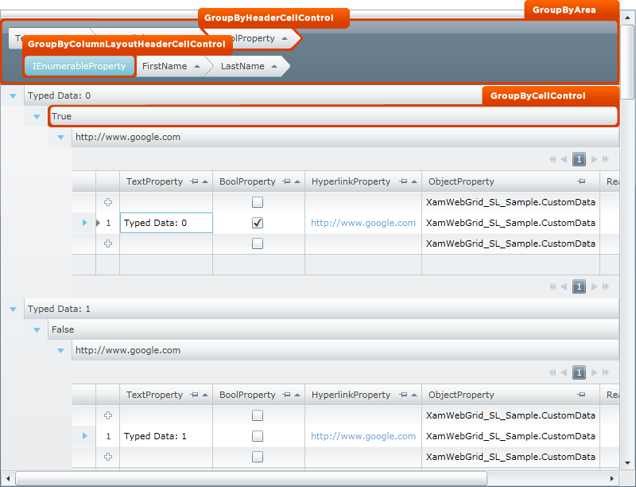
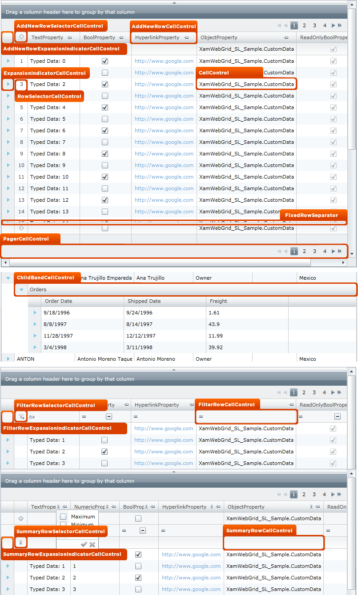
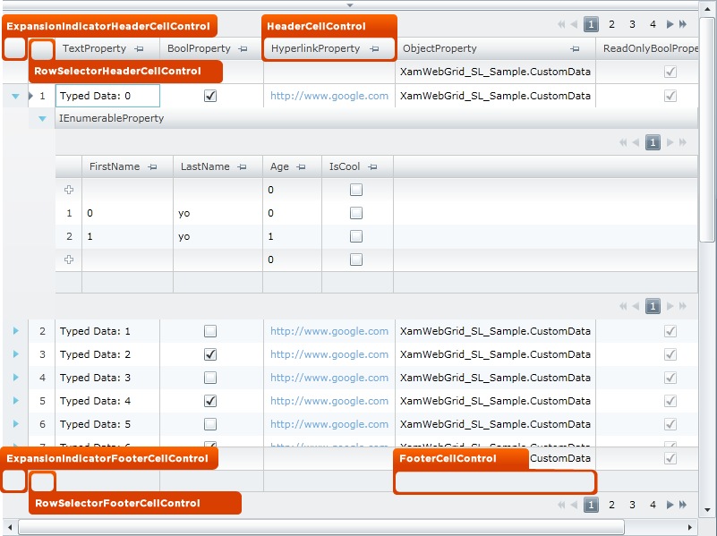
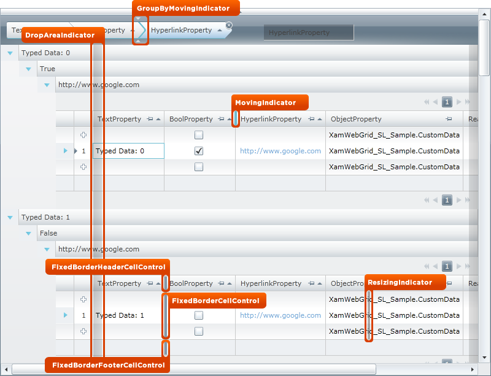

////

|metadata|
{
    "name": "designers-guide-styling-points-for-xamgrid",
    "controlName": [],
    "tags": [],
    "guid": "{B9FAF699-2E97-42CA-9A73-6F68B91BB65A}",  
    "buildFlags": ["sl","wpf","win-rt"],
    "createdOn": "2012-01-30T16:46:26.9618012Z"
}
|metadata|
////

= Styling Points for xamGrid

== xamGrid Properties

The following diagram highlights the different controls used by the xamGrid™ control. To re-style a particular item, first identify the TargetType in the diagram then identify the corresponding Style property/properties in the table that follows.

[options="header", cols="a,a,a"]
|====
|TargetType|Style Properties|Description

|GroupByHeaderCellControl
|xamGrid.GroupBySettings.GroupByHeaderStyle
|Styles the GroupByHeader for all Columns in the xamGrid

|
|xamGrid.ColumnLayouts[x].GroupBySettings.GroupByHeaderStyle
|Styles the GroupByHeader for all Columns on particular ColumnLayout

|GroupByColumnLayoutHeaderCellControl
|xamGrid.GroupBySettings.GroupByColumnLayoutHeaderStyle
|Styles the GroupByColumnLayoutHeader for all ColumnLayouts in the xamGrid

|
|xamGrid.ColumnLayouts[x].GroupBySettings. GroupByColumnLayoutHeaderStyle
|Styles the GroupByColumnLayoutHeader for a particular ColumnLayout

|GroupByCellControl
|xamGrid.GroupBySettings.GroupByRowStyle
|Styles the GroupByRow for all ColumnLayouts in the xamGrid.

|
|xamGrid.ColumnLayouts[x].GroupBySettings.GroupByRowStyle
|Styles the GroupByRow for a particular ColumnLayout.

|GroupByAreaCellControl
|xamGrid.GroupBySettings.GroupByAreaStyle
|Styles the GroupByArea for the xamGrid.

|====

[options="header", cols="a,a,a"]
|====
|TargetType|Style Properties|Description

|AddNewRowExpansionIndicatorCellControl
|xamGrid.AddNewRowSettings.ExpansionIndicatorStyle
|Styles the ExpansionIndicator in the AddNewRow for all ColumnLayouts in the xamGrid

|
|xamGrid.ColumnLayouts[x].AddNewRowSettings.ExpansionIndicatorStyle
|Styles the ExpansionIndicator in the AddNewRow for a particular ColumnLayout in the xamGrid

|AddNewRowSelectorCellControl
|xamGrid.AddNewRowSettings.RowSelectorStyle
|Styles the RowSelector in the AddNewRow for all ColumnLayouts in the xamGrid

|
|xamGrid.ColumnLayouts[x].AddNewRowSettings.RowSelectorStyle
|Styles the RowSelector in the AddNewRow for a particular ColumnLayout in the xamGrid

|AddNewRowCellControl
|xamGrid.AddNewRowSettings.Style
|Styles all Standard Cell objects in an AddNewRow for all ColumnLayouts in the xamGrid

|
|xamGrid.ColumnLayouts[x].AddNewRowSettings.Style
|Styles all Standard Cell objects in an AddNewRow for a particular ColumnLayout in the xamGrid

|ExpansionIndicatorCellControl
|xamGrid.ExpansionIndicatorSettings.Style
|Styles the ExpansionIndicator in all Rows for all ColumnLayouts in the xamGrid

|
|xamGrid.ColumnLayouts[x].ExpansionIndicatorSettings.Style
|Styles the ExpansionIndicator in all Rows for a particular ColumnLayout in the xamGrid

|RowSelectorCellControl
|xamGrid.RowSelectorSettings.Style
|Styles the RowSelector in all Rows for all ColumnLayouts in the xamGrid

|
|xamGrid.ColumnLayouts[x]. RowSelectorSettings.Style
|Styles the RowSelector in all Rows for a particular ColumnLayout in the xamGrid

|CellControl
|xamGrid.CellStyle
|Styles all Standard Cells in all ColumnLayouts in the xamGrid

|
|xamGrid.Columns[x].CellStyle
|Styles all Standard Cells in a particular Column in the xamGrid

|
|xamGrid.ColumnLayouts[x].CellStyle
|Styles all Standard Cells in a particular ColumnLayout in the xamGrid

|
|xamGrid.Rows[x].CellStyle
|Styles all Standard Cells in a particular Row in the xamGrid

|
|xamGrid.Rows[x].Cells[x].Style
|Styles a specific Cell

|FixedRowSeparator
|xamGrid.FixedRowSeparatorStyle
|Styles the Separator that separates fixed rows in the xamGrid

|PagerCellControl
|xamGrid.PagerSettings.Style
|Styles the Cell that makes up the PagerRow for all ColumnLayouts in the xamGrid

|
|xamGrid.ColumnLayout[x].PagerSettings.Style
|Styles the Cell that makes up the PagerRow for a particular ColumnLayout in the xamGrid

|ChildBandCellControl
|xamGrid.ChildBandHeaderStyle
|Styles the Cell that makes up the ChildBand Header for all ColumnLayouts in the xamGrid

|
|xamGrid.ColumnLayouts[x].ChildBandHeaderStyle
|Styles the Cell that makes up the ChildBand Header for a particular ColumnLayout in the xamGrid

|FilterRowExpansionIndicatorCellControl
|XambWebGrid.FilteringSettings.ExpansionIndicatorStyle
|Styles the ExpansionIndicator in the FilterRow for all ColumnLayouts in the xamGrid

|
|xamGrid.ColumnLayouts[x].FilteringSettings.ExpansionIndicatorStyle
|Styles the ExpansionIndicator in the FilterRow for a particular ColumnLayout in the xamGrid

|FilterRowSelectorCellControl
|XambWebGrid.FilteringSettings.RowSelectorStyle
|Styles the RowSelector in the FilterRow for all ColumnLayouts in the xamGrid

|
|xamGrid.ColumnLayouts[x].FilteringSettings. RowSelectorStyle
|Styles the RowSelector in the FilterRow for a particular ColumnLayout in the xamGrid

|FilterRowCellControl
|XambWebGrid.FilteringSettings.Style
|Styles all Standard Cell objects in a FilterRow for all ColumnLayouts in the xamGrid

|
|xamGrid.ColumnLayouts[x].FilteringSettings.Style
|Styles all Standard Cell objects in a FilterRow for a particular ColumnLayout in the xamGrid

|SummaryRowExpansionIndicatorCellControl
|XambWebGrid.SummaryRowSettings.ExpansionIndicatorStyle
|Styles the ExpansionIndicator in the SummaryRow for all ColumnLayouts in the xamGrid

|
|xamGrid.ColumnLayouts[x].SummaryRowSettings.ExpansionIndicatorStyle
|Styles the ExpansionIndicator in the SummaryRow for a particular ColumnLayout in the xamGrid

|SummaryRowSelectorCellControl
|XambWebGrid.SummaryRowSettings.RowSelectorStyle
|Styles the RowSelector in the SummaryRow for all ColumnLayouts in the xamGrid

|
|xamGrid.ColumnLayouts[x].SummaryRowSettings.RowSelectorStyle
|Styles the RowSelector in the SummaryRow for a particular ColumnLayout in the xamGrid

|SummaryRowCellControl
|XambWebGrid.SummaryRowSettings.Style
|Styles all Standard Cell objects in a SummaryRow for all ColumnLayouts in the xamGrid

|
|xamGrid.ColumnLayouts[x].SummaryRowSettings.Style
|Styles all Standard Cell objects in a SummaryRow for a particular ColumnLayout in the xamGrid

|====

[options="header", cols="a,a,a"]
|====
|TargetType|Style Properties|Description

|ExpansionIndicatorHeaderCellControl
|xamGrid.ExpansionIndicatorSettings.HeaderStyle
|Styles the ExpansionIndicator in the HeaderRow for all ColumnLayouts in the xamGrid

|
|xamGrid.ColumnLayouts[x].ExpansionIndicatorSettings.HeaderStyle
|Styles the ExpansionIndicator in the HeaderRow for a particular ColumnLayout in the xamGrid

|RowSelectorHeaderCellControl
|xamGrid.RowSelectorSettings.HeaderStyle
|Styles the RowSelector in the HeaderRow for all ColumnLayouts in the xamGrid

|
|xamGrid.ColumnLayouts[x]. RowSelectorSettings.HeaderStyle
|Styles the RowSelector in the HeaderRow for a particular ColumnLayout in the xamGrid

|HeaderCellControl
|xamGrid.HeaderStyle
|Styles all Standard Cell objects in a HeaderRow for all ColumnLayouts in the xamGrid

|
|xamGrid.ColumnLayouts[x].HeaderStyle
|Styles all Standard Cell objects in a HeaderRow for a particular ColumnLayout in the xamGrid

|ExpansionIndicatorFooterCellControl
|xamGrid.ExpansionIndicatorSettings.FooterStyle
|Styles the ExpansionIndicator in the FooterRow for all ColumnLayouts in the xamGrid

|
|xamGrid.ColumnLayouts[x].ExpansionIndicatorSettings.FooterStyle
|Styles the ExpansionIndicator in the FooterRow for a particular ColumnLayout in the xamGrid

|RowSelectorFooterCellControl
|xamGrid.RowSelectorSettings.FooterStyle
|Styles the RowSelector in the FooterRow for all ColumnLayouts in the xamGrid

|
|xamGrid.ColumnLayouts[x]. RowSelectorSettings.FooterStyle
|Styles the RowSelector in the FooterRow for a particular ColumnLayout in the xamGrid

|FooterCellControl
|xamGrid.FooterStyle
|Styles all Standard Cell objects in a FooterRow for all ColumnLayouts in the xamGrid

|
|xamGrid.ColumnLayouts[x].FooterStyle
|Styles all Standard Cell objects in a FooterRow for a particular ColumnLayout in the xamGrid

|====

[options="header", cols="a,a,a"]
|====
|TargetType|Style Properties|Description

|GroupByMovingIndicator
|xamGrid.GroupBySettings.GroupByMovingIndicatorStyle
|Styles the indicator that is displayed when rearranging GroupByHeaderCellControls in the GroupByAreaPanel for all ColumnLayouts in the xamGrid.

|
|xamGrid.ColumnLayouts[x].GroupBySettings. GroupByMovingIndicatorStyle
|Styles the indicator that is displayed when rearranging GroupByHeaderCellControls in the GroupByAreaPanel for a particular ColumnLayout in the xamGrid.

|DropAreaIndicator
|xamGrid.FixedColumnSettings.FixedDropAreaLeftStyle
|Styles the Drop area that will be displayed when dragging a column to be fixed to the left side of the xamGrid for all ColumnLayouts in the xamGrid

|
|xamGrid.ColumnLayouts[x].FixedColumnSettings.FixedDropAreaLeftStyle
|Styles the Drop area that will be displayed when dragging a column to be fixed to the left side of the xamGrid for a particular ColumnLayout in the xamGrid

|
|xamGrid.FixedColumnSettings.FixedDropAreaRightStyle
|Styles the Drop area that will be displayed when dragging a column to be fixed to the right side of the xamGrid for all ColumnLayouts in the xamGrid

|
|xamGrid.ColumnLayouts[x].FixedColumnSettings. FixedDropAreaRightStyle
|Styles the Drop area that will be displayed when dragging a column to be fixed to the right side of the xamGrid for a particular ColumnLayout in the xamGrid

|MovingIndicator
|xamGrid.ColumnMovingSettings.IndicatorStyle
|Styles the indicator that is displayed when rearranging Columns in the HeaderRow for all ColumnLayouts in the xamGrid.

|
|xamGrid.ColumnLayouts[x].ColumnMovingSettings.IndicatorStyle
|Styles the indicator that is displayed when rearranging Columns in the HeaderRow for a particular ColumnLayout in the xamGrid.

|FixedBorderHeaderCellControl
|xamGrid.FixedColumnSettings.FixedBorderHeaderStyle
|Styles the separator, that separates FixedColumns from non fixed columns in the HeaderRow for all ColumnLayouts in the xamGrid

|
|xamGrid.ColumnLayouts[x].FixedColumnSettings. FixedBorderHeaderStyle
|Styles the separator, that separates FixedColumns from non fixed columns in the HeaderRow for a particular ColumnLayout in the xamGrid

|FixedBorderCellControl
|xamGrid.FixedColumnSettings.FixedBorderStyle
|Styles the separator, that separates FixedColumns from non fixed columns in a Row for all ColumnLayouts in the xamGrid

|
|xamGrid.ColumnLayouts[x].FixedColumnSettings. FixedBorderStyle
|Styles the separator, that separates FixedColumns from non fixed columns in a Row for a particular ColumnLayout in the xamGrid

|FixedBorderFooterCellControl
|xamGrid.FixedColumnSettings.FixedBorderFooterStyle
|Styles the separator, that separates FixedColumns from non fixed columns in the FooterRow for all ColumnLayouts in the xamGrid

|
|xamGrid.ColumnLayouts[x].FixedColumnSettings. FixedBorderFooterStyle
|Styles the separator, that separates FixedColumns from non fixed columns in the FooterRow for a particular ColumnLayout in the xamGrid

|ResizingIndicator
|xamGrid.ColumnResizeSettings.IndicatorStyle
|Styles the indicator that is displayed when resizing Columns for all ColumnLayouts in the xamGrid.

|
|xamGrid.ColumnLayouts[x]. ColumnResizeSettings.IndicatorStyle
|Styles the indicator that is displayed when resizing Columns for a particular ColumnLayout in the xamGrid.

|====