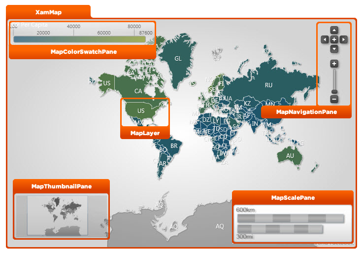

////

|metadata|
{
    "name": "designers-guide-styling-points-for-xammap",
    "controlName": [],
    "tags": ["Styling","Templating"],
    "guid": "7a19a01c-fb2a-4fb0-b1f5-6bb6ee45abb0",  
    "buildFlags": ["wpf","sl"],
    "createdOn": "2012-04-05T16:16:38.6042759Z"
}
|metadata|
////

= Styling Points for xamMap

== Topic Overview

=== Purpose

This topic provides designers styling points for the link:{ApiPlatform}controls.maps.xammap.v{ProductVersion}~infragistics.controls.maps.xammap.html[xamMap]™ control.

[[_Ref320651776]]
== Styling Points

=== xamMap properties

The following diagram highlights the different controls used by the  _xamMap_   control. To re-style a particular item, first identify the TargetType in the diagram then identify the corresponding Style property/properties in the table that follows.

The following table summarized properties for elements in the  _xamMap_   control:

[options="header", cols="a,a,a"]
|====
|TargetType|Style Property|Description

| link:{ApiPlatform}controls.maps.xammap.v{ProductVersion}~infragistics.controls.maps.xammap.html[XamMap]
| link:{ApiPlatform}controls.maps.xammap.v{ProductVersion}~infragistics.controls.maps.xammap.html[XamMap]. link:http://msdn.microsoft.com/en-us/library/system.windows.frameworkelement.style.aspx[Style]
|Specifies a style for the _xamMap_ control.

| link:{ApiPlatform}controls.maps.xammap.v{ProductVersion}~infragistics.controls.maps.maplayer_members.html[MapLayer]
| link:{ApiPlatform}controls.maps.xammap.v{ProductVersion}~infragistics.controls.maps.xammap.html[XamMap]. link:{ApiPlatform}controls.maps.xammap.v{ProductVersion}~infragistics.controls.maps.xammap~layers.html[Layers][x]. link:http://msdn.microsoft.com/en-us/library/system.windows.frameworkelement.style.aspx[Style]
|Specifies a style for a series in the _xamMap_ control’s link:{ApiPlatform}controls.maps.xammap.v{ProductVersion}~infragistics.controls.maps.xammap~layers.html[Layers] collection.

| link:{ApiPlatform}controls.maps.xammap.v{ProductVersion}~infragistics.controls.maps.mapthumbnailpane_members.html[MapThumbnailPane]
| link:{ApiPlatform}controls.maps.xammap.v{ProductVersion}~infragistics.controls.maps.mapthumbnailpane_members.html[MapThumbnailPane]. link:http://msdn.microsoft.com/en-us/library/system.windows.frameworkelement.style.aspx[Style]
|Specifies a style for a series in the _xamMap_ control’s thumbnail pane.

| link:{ApiPlatform}controls.maps.xammap.v{ProductVersion}~infragistics.controls.maps.mapcolorswatchpane_members.html[MapColorSwatchPane]
| link:{ApiPlatform}controls.maps.xammap.v{ProductVersion}~infragistics.controls.maps.mapcolorswatchpane_members.html[MapColorSwatchPane]. link:http://msdn.microsoft.com/en-us/library/system.windows.frameworkelement.style.aspx[Style]
|Specifies a style for a series in the _xamMap_ control’s color swatch pane.

| link:{ApiPlatform}controls.maps.xammap.v{ProductVersion}~infragistics.controls.maps.mapscalepane_members.html[MapScalePane]
| link:{ApiPlatform}controls.maps.xammap.v{ProductVersion}~infragistics.controls.maps.mapscalepane_members.html[MapScalePane]. link:http://msdn.microsoft.com/en-us/library/system.windows.frameworkelement.style.aspx[Style]
|Specifies a style for a series in the _xamMap_ control’s scale pane.

| link:{ApiPlatform}controls.maps.xammap.v{ProductVersion}~infragistics.controls.maps.mapnavigationpane_members.html[MapNavigationPane]
| link:{ApiPlatform}controls.maps.xammap.v{ProductVersion}~infragistics.controls.maps.mapnavigationpane_members.html[MapNavigationPane]. link:http://msdn.microsoft.com/en-us/library/system.windows.frameworkelement.style.aspx[Style]
|Specifies a style for a series in the _xamMap_ control’s navigation pane.

|====

[[_Ref320185294]]
== Related Content

=== Topics

The following topics provide additional information related to this topic.

[options="header", cols="a,a"]
|====
|Topic|Purpose

| link:xamwebmap-understanding-xamwebmap.html[Understanding xamMap]
|This topic provides information about visual elements of the _xamMap_ control.

| link:xamwebmap-using-multiple-layers.html[Using Multiple Layers]
|This topic provides information about using multiple map layers in the _xamMap_ control.

|====