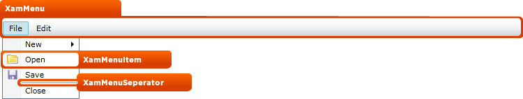

////

|metadata|
{
    "name": "designers-guide-styling-points-for-xammenu",
    "controlName": [],
    "tags": ["Styling","Templating"],
    "guid": "{8FA1676A-3C67-4BB0-9E3A-B36238713AA2}",  
    "buildFlags": ["sl","wpf"],
    "createdOn": "2012-01-30T16:46:26.9658012Z"
}
|metadata|
////

= Styling Points for xamMenu

== xamMenu Properties

The following diagram highlights the different controls used by the xamMenu™ control. To re-style a particular item, first identify the TargetType in the diagram then identify the corresponding Style property/properties in the table that follows.

== xamMenu Style Properties and TargetTypes

The following table lists the various controls used by xamMenu and identifies the properties that can be used to set a custom style.

[options="header", cols="a,a,a"]
|====
|TargetType|Style Properties|Description

|xamMenuSeparator
|xamMenuSeparator.Style
|Style menu separator control.

|xamMenu
|xamMenu.Style
|Styles the menu control

|XamMenuItem
|XamMenuItem.Style
|Styles the menu item control.

|
|xamMenu.ItemContainerStyle
|Styles all item controls in the menu control.

|====