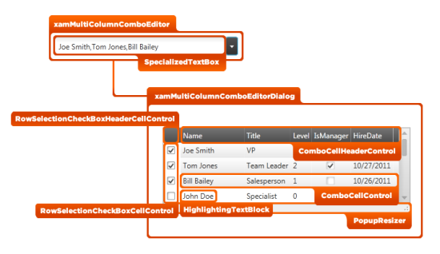

////

|metadata|
{
    "name": "designers-guide-styling-points-for-xammulticolumncomboeditor",
    "controlName": [],
    "tags": ["Styling","Templating"],
    "guid": "7752490f-7ed0-4f85-a8d0-6cd8010b9bcb",  
    "buildFlags": ["sl","wpf"],
    "createdOn": "2012-01-30T16:46:26.9688012Z"
}
|metadata|
////

= Styling Points for xamMultiColumnComboEditor

=== Introduction

Using  _xamMultiColumnComboEditor_™ control to customize the default look and feel of target types via control properties.

=== Preview

The following picture identifies the various target types, which are configurable using  _xamMultiColumnComboEditor_  ’ _s_  control properties. This allows you to customize those target types associated with this control using your desired style.

== xamMultiColumnComboEditor Styling Properties

The following table lists the styling properties of the  _xamMultiColumnComboEditor_   _™_   control.

[options="header", cols="a,a,a"]
|====
|Target Type|Style Properties|Description

|`XamMultiColumnComboEditor`
|XamMultiColumnComboEditor.Style
|Styles the xamMultiColumnComboEditor control.

|`SpecializedTextBox`
|SpecializedTextBox.Style
|Styles the text box in xamMultiColumnComboEditor control.

|`xamMultiColumnComboEditorDialog`
|xamMultiColumnComboEditorDialog.Style
|Styles the xamMultiColumnComboEditorDialog control.

|`RowSelectionCheckBoxHeaderCellControl`
|RowSelectionCheckBoxHeaderCellControl.Style
|Styles the check box header cell of the row selector area.

|`RowSelectionCheckBoxCellControl`
|RowSelectionCheckBoxCellControl.Style
|Styles the check box controls on the row selector area.

|`ComboCellHeaderControl`
|ComboCellHeaderControl.Style
|Styles the header cells of the columns.

|`ComboCellControl`
|ComboCellControl.Style
|Styles the cells of xamMultiColumnComboEditor control.

|`HighlightingTextBlock`
|HighlightingTextBlock.Style
|Styles the text block of cells in xamMultiColumnComboEditor control.

|`PopupResizer`
|PopupResizer.Style
|Styles the resizer control, the lower section of the popup dialog window, which allows resizing the dialog with the mouse.

|====

== Related Content

=== Topics

The following topics provide additional information related to this topic.

[options="header", cols="a,a"]
|====
|Topic|Purpose

| link:xammulticolumncomboeditor.html[xamMultiColumnComboEditor]
|This section contains information about _xamMultiColumnComboEditor_™ control, ranging from what the control does and step-by-step procedures on using it in your application.

|====