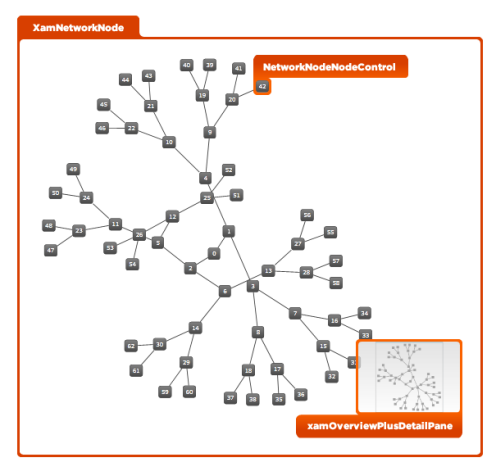

////

|metadata|
{
    "name": "designers-guide-styling-points-for-xamnetworknode",
    "controlName": [],
    "tags": ["Styling","Templating"],
    "guid": "01417e12-014d-4ab9-bec0-8234f60de25e",  
    "buildFlags": ["sl","wpf"],
    "createdOn": "2012-04-05T14:24:10.7135042Z"
}
|metadata|
////

= Styling Points for xamNetworkNode

=== Introduction

Using  _xamNetworkNode_  control to customize the default look and feel of target types via control properties.

=== Preview

The following picture identifies the various target types, which are configurable using  _xamNetworkNode_  _’s_  control properties. This allows you to customize those target types associated with this control using your desired style.

The xamOverviewDetailPlusPane control, illustrated below, enables panning and zooming on the xamNetworkNode in layout view.

== xamNetworkNode Styling Properties

The styling properties of the  _xamNetworkNode_   _™_   control.

[options="header", cols="a,a,a"]
|====
|Target Type|Style Properties|Description

|XamNetworkNode
|XamNetworkNode.Style
|Styles the xamNetworkNode control.

|NetworkNodeNodeControl
|NetworkNodeNodeControl.Style
|Styles the nodes in xamNetworkNode control.

|XamOverviewPlusDetailPane
|XamOverviewPlusDetailPane.Style
|Styles the xamOverviewPlusDetailPane control, which allows panning and zooming on the control in layout view.

|====

== Related Content

=== Topics

The following topics provide additional information related to this topic.

[options="header", cols="a,a"]
|====
|Topic|Purpose

| link:xamnetworknode.html[xamNetworkNode]
|The Network Node control is a ready-to-use, data-bound control for rendering undirected graphs.

|====