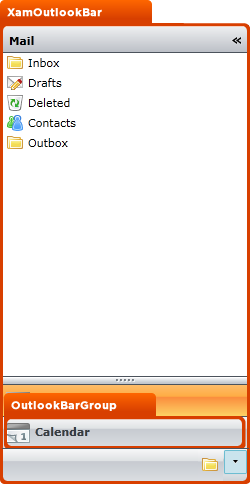

////

|metadata|
{
    "name": "designers-guide-styling-points-for-xamoutlookbar",
    "controlName": [],
    "tags": ["Styling","Templating"],
    "guid": "{AC8B869D-76B7-4670-BDBD-7E3F5E87AC87}",  
    "buildFlags": ["sl"],
    "createdOn": "2012-01-30T16:46:26.9718012Z"
}
|metadata|
////

= Styling Points for xamOutlookBar

== xamOutlookBar Properties

The following diagram highlights the different controls used by the xamOutlookBar™ control. To re-style a particular item, first identify the TargetType in the diagram then identify the corresponding Style property/properties in the table that follows.

== xamOutlookBar Style Properties and TargetTypes

The following table lists the various cell controls used by xamOutlookBar and identifies the properties that can be used to set a custom style.

[options="header", cols="a,a,a"]
|====
|TargetType|Style Properties|Description

|xamOutlookBar
|xamOutlookBar.Style
|Styles the xamOutlookBar control.

|OutlookBarGroup
|OutlookBarGroup.Style
|Styles a OutlookBarGroup

|
|xamOutlookBar.GroupContainerStyle
|Styles all OutlookBarGroups in the xamOutlookBar

|====