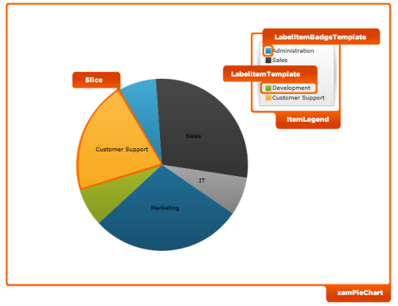

////

|metadata|
{
    "name": "designers-guide-styling-points-for-xampiechart",
    "controlName": [],
    "tags": ["Styling"],
    "guid": "e6489d64-84f9-40a3-a577-92f2c5a53349",  
    "buildFlags": ["sl","wpf","win-phone"],
    "createdOn": "2012-04-05T14:24:53.8945042Z"
}
|metadata|
////

= Styling Points for xamPieChart

=== Introduction

Using xamPieChart control to customize the default look and feel of target types via control properties.

=== Preview

The following picture identifies the various target types, which are configurable using xamPieChart’s control properties. This allows you to customize those target types associated with this control using your desired style. _._

== xamPieChart Styling Properties

The styling properties of the  _xamPieChart_   _™_   control.

[options="header", cols="a,a,a"]
|====
|Target Type|Style Properties|Description

|`XamPieChart`
|XamPieChart.Style
|Styles the XamPieChart control.

|`Slice`
|Slice.Style
|Styles the slices on the PieChart.

|`ItemLegend`
|ItemLegend.Style
|Styles the Legend control.

|`LegendItemBadgeTemplate`
|LegendItemBadgeTemplate
|Styles the items’ badges of the Legend.

|`LegendItemTemplate`
|LegendItemTemplate
|Styles the items of the Legend.

|====

== Related Content

=== Topics

The following topics provide additional information related to this topic.

[options="header", cols="a,a"]
|====
|Topic|Purpose

| link:piechart.html[xamPieChart]
|Introduces the _xamPieChart_ _,_ a specialized control that renders a pie chart. The pie chart consists of a circular area divided into sections with each section’s arc length proportional to its underlying data value.

|====