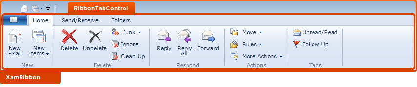

////

|metadata|
{
    "name": "designers-guide-styling-points-for-xamribbon",
    "controlName": [],
    "tags": ["Styling"],
    "guid": "{772A2C4C-925E-436B-89DB-009FC04108B5}",  
    "buildFlags": ["sl"],
    "createdOn": "2012-01-30T16:46:26.9748012Z"
}
|metadata|
////

= Styling Points for xamRibbon

== xamRibbon Properties

The following diagram highlights the different controls used by the xamRibbon™ control. To re-style a particular item, first identify the TargetType in the diagram then identify the corresponding Style property/properties in the table that follows.

== image::images/DesignersGuide_xamRibbon_01.png[]

== image::images/DesignersGuide_xamRibbon_02.png[]

== image::images/DesignersGuide_xamRibbon_03.png[]

== image::images/DesignersGuide_xamRibbon_04.png[]

== xamRibbon Style Properties and TargetTypes

The following table lists the various cell controls used by xamRibbon and identifies the properties that can be used to set a custom style.

[options="header", cols="a,a,a"]
|====
|TargetType|Style Properties|Description

|ButtonToolControl
|ButtonTool.Style
|Styles the button tool

|CheckBoxToolControl
|CheckBoxTool.Style
|Styles the check box

|GalleryItemControl
|GalleryItem.Style
|Styles the Gallery Items

|GalleryItemGroupControl
|GalleryItemGroup.Style
|Styles the Gallery Groups

|GalleryToolControl
|GalleryTool.Style
|Styles the Gallery Tool

|KeyTip
|KeyTip.Style
|Styles the Key Tip

|MenuToolControl
|MenuTool.Style
|Styles the Menu

|QATMenu
|QATMenu.Style
|Styles the Quick Access Toolbar Menu

|QuickAccessToolbar
|QuickAccessToolbar.Style
|Styles the Quick Access Toolbar

|RadioButtonToolControl
|RadioButtonTool.Style
|Styles the radio button

|RibbonGroupControl
|RibbonGroup.Style
|Styles the ribbon group

|RibbonTabControl
|RibbonTab.Style
|Styles the ribbon tab

|SegmentedStateMenuToolControl
|SegmentedStateMenuTool.Style
|Styles the Segmented State Menu

|SegmentedMenuToolControl
|SegmentedMenuTool.Style
|Styles the Segmented Menu Tool

|SeparatorToolControl
|SeparatorTool.Style
|Styles the Separator

|xamRibbon
|xamRibbon.Style
|Styles the xamRibbon control.

|xamRibbonApplicationMenu
|xamRibbonApplicationMenu.Style
|Styles the application menu

|xamRibbonContextualTab
|xamRibbonContextualTab.Style
|Styles the contextual tab

|xamRibbonTabItem
|xamRibbonTabItem.Style
|Styles the tab item

|====