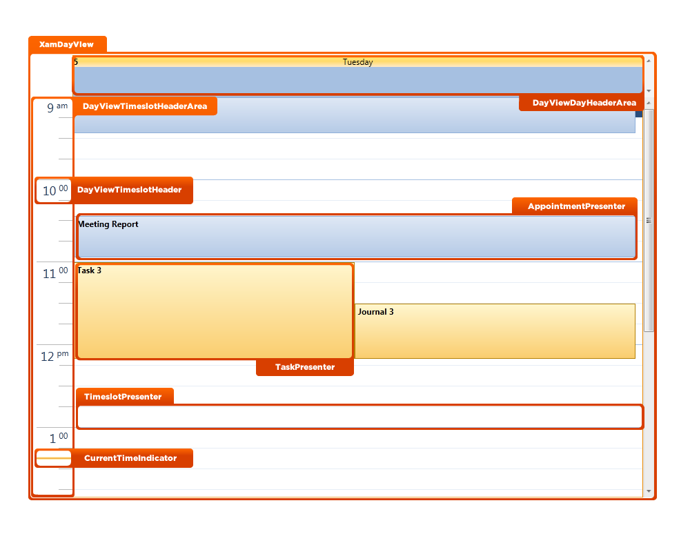
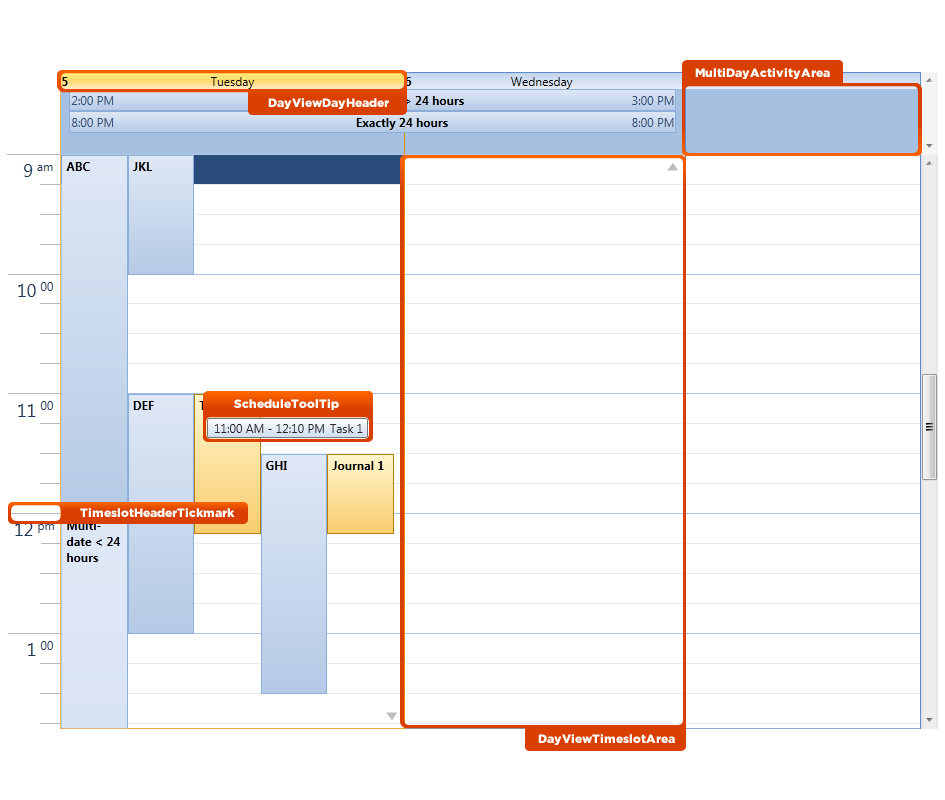
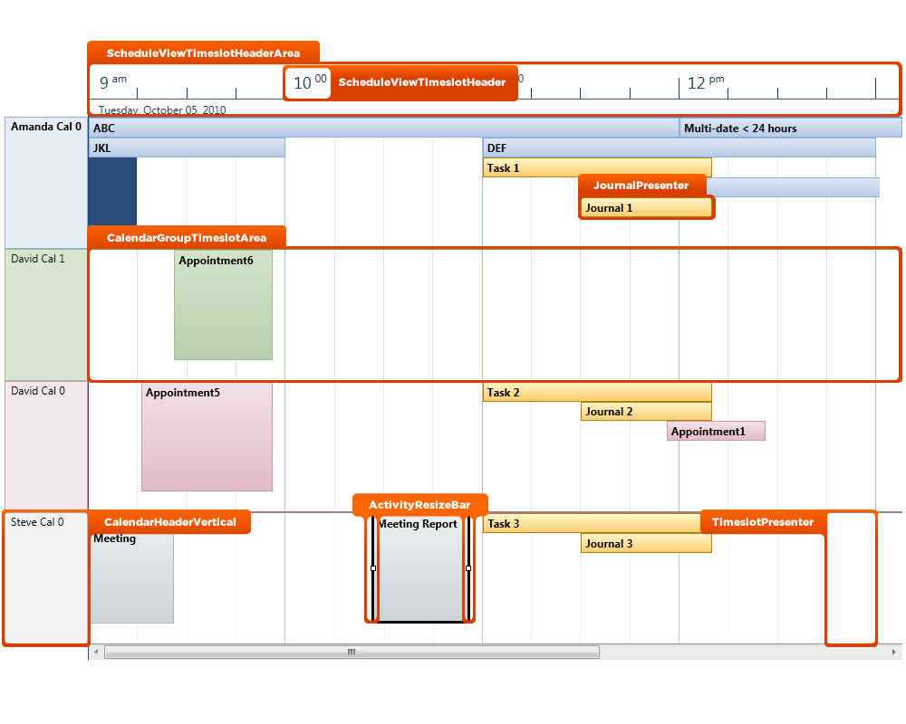
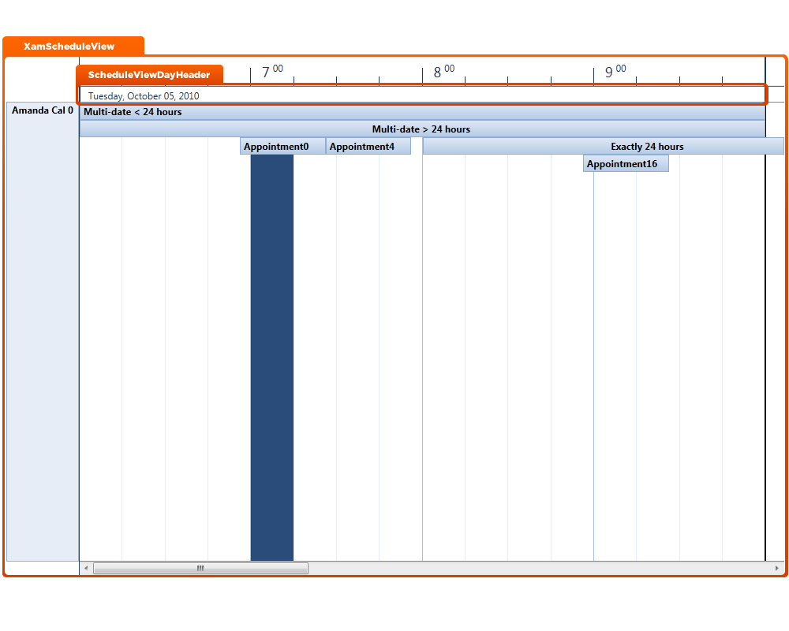
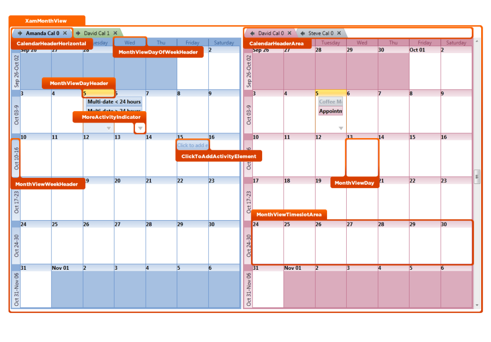

////

|metadata|
{
    "name": "designers-guide-styling-points-for-xamschedule",
    "controlName": [],
    "tags": ["Styling","Templating"],
    "guid": "14c4b55d-69db-4096-a2a9-a34ac710e7c1",  
    "buildFlags": ["sl","wpf"],
    "createdOn": "2012-01-30T16:46:26.9768012Z"
}
|metadata|
////

= Styling Points for xamSchedule

== xamSchedule views Properties

The following diagram highlights the different controls used by the xamSchedule™ control. To re-style a particular item, first identify the TargetType in the diagram then identify the corresponding Style property/properties in the table that follows.

== xamSchedule Style Properties and TargetTypes

The following table lists the various cell controls used by xamSchedule and identifies the properties that can be used to set a custom style.

[options="header", cols="a,a,a"]
|====
|TargetType|Style Properties|Description

|ActivityResizeBar
|ActivityResizeBar.Style
|Styles the activity resize bar

|AppointmentPresenter
|AppointmentPresenter.Style
|Styles the appointment activity presenter

|CalendarGroupTimeslotArea
|CalendarGroupTimeslotArea.Style
|Styles the calendar group timeslot area

|CalendarHeaderArea
|CalendarHeaderArea.Style
|Styles the calendar header area

|CalendarHeaderHorizontal
|CalendarHeaderHorizontal.Style
|Styles the horizontal calendar header

|CalendarHeaderVertical
|CalendarHeaderVertical.Style
|Styles the vertical calendar header

|ClickToAddActivityElement
|ClickToAddActivityElement.Style
|Styles the button used to add activities

|CurrentTimeIndicator
|CurrentTimeIndicator.Style
|Styles the current time indicator

|DayViewDayHeader
|DayViewDayHeader.Style
|Styles the xamDayView day header

|DayViewDayHeaderArea
|DayViewDayHeaderArea.Style
|Styles the xamDayView day header area

|DayViewTimeslotArea
|DayViewTimeslotArea.Style
|Styles the xamDayView timeslots area

|DayViewTimeslotHeader
|DayViewTimeslotHeader.Style
|Styles the xamDayView timeslots header

|DayViewTimeslotHeaderArea
|DayViewTimeslotHeaderArea.Style
|Styles the xamDayView timeslots header area

|JournalPresenter
|JournalPresenter.Style
|Styles the journal activity presenter

|MonthViewDay
|MonthViewDay.Style
|Styles the xamMonthView day

|MonthViewDayHeader
|MonthViewDayHeader.Style
|Styles the xamMonthView day header

|MonthViewDayOfWeekHeader
|MonthViewDayOfWeekHeader.Style
|Styles the xamMonthView day of week header

|MonthViewTimeslotArea
|MonthViewTimeslotArea.Style
|Styles the xamMonthView timeslot area

|MonthViewWeekHeader
|MonthViewWeekHeader.Style
|Styles the xamMonthView week header

|MoreActivityIndicator
|MoreActivityIndicator.Style
|Styles the indicator used to show more activities

|MultiDayActivityArea
|MultiDayActivityArea.Style
|Styles the multi-day activity area

|TaskPresenter
|TaskPresenter.Style
|Styles the task activity presenter

|TimeslotHeaderTickmark
|TimeslotHeaderTickmark.Style
|Styles the timeslot header tickmark

|TimeslotPresenter
|TimeslotPresenter.Style
|Styles the timeslot

|ScheduleToolTip
|ScheduleToolTip.Style
|Styles the tooltips shown by the xamSchedule views

|ScheduleViewDayHeader
|ScheduleViewDayHeader.Style
|Styles the xamScheduleView day header

|ScheduleViewTimeslotHeader
|ScheduleViewTimeslotHeader.Style
|Styles the xamScheduleView timeslot header

|ScheduleViewTimeslotHeaderArea
|ScheduleViewTimeslotHeaderArea.Style
|Styles the xamScheduleView timeslot header area

|XamDayView
|XamDayView.Style
|Styles the xamDayView control

|XamMonthView
|XamMonthView.Style
|Styles the xamMonthView control

|XamScheduleView
|XamScheduleView.Style
|Styles the xamScheduleView control

|====