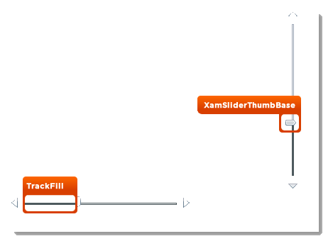

////

|metadata|
{
    "name": "designers-guide-styling-points-for-xamslider",
    "controlName": [],
    "tags": ["Styling"],
    "guid": "{66F5758A-E4B7-4751-876F-5B70F35697E4}",  
    "buildFlags": ["sl","win-phone"],
    "createdOn": "2012-01-30T16:46:26.9798012Z"
}
|metadata|
////

= Styling Points for xamSlider

== xamSlider Properties

The following diagram highlights the different controls used by xamSlider™. To re-style a particular item, first identify the TargetType in the diagram then identify the corresponding Style property/properties in the table that follows.

== xamSlider Style Properties and TargetTypes

The following table lists the various cell controls used by the xamSlider controls and identifies the properties that can be used to set a custom style.

[options="header", cols="a,a,a"]
|====
|TargetType|Style Properties|Description

|xamSlider
|xamSlider.Style
|Styles the xamSlider control.

|TrackFill
|xamSlider.TrackFillStyle
|Styles all TrackFills in the xamSlider

|
|Thumb.TrackfillStyle
|Styles the TrackFill for a particular Thumb

|xamSliderThumbBase
|xamSlider.ThumbStyle
|Styles all Thumbs in the xamSlider

|
|xamSliderThumbBase.Style
|Styles the Thumb

|====