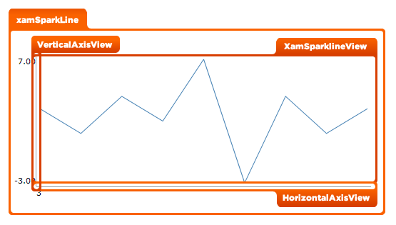

////

|metadata|
{
    "name": "designers-guide-styling-points-for-xamsparkline",
    "controlName": [],
    "tags": ["Styling","Templating"],
    "guid": "37be908b-72ac-48ba-9585-1df07cb9931d",  
    "buildFlags": ["sl","wpf"],
    "createdOn": "2012-04-05T16:17:01.3712759Z"
}
|metadata|
////

= Styling Points for xamSparkline

=== Introduction

This topic provides designer’s styling points for the  _xamSparkline_™ control.

=== Preview

The following diagram identifies the various regions of the control that can be styled in the  _xamSparkline_   control. To style a particular item, you need to first identify the Target Type in the diagram then identify the corresponding Style property/properties in the table that follows.

== xamSparkline Styling Properties

The styling properties of the  _xamSparkline_™control.

[options="header", cols="a,a,a"]
|====
|Target Type|Style Properties|Description

|`XamSparkline`
|XamSparkline.Style
|Styles the _XamSparkline_ control layout.

|`XamSparklineView`
|XamSparklineView.Style
|Styles the _XamSpakline_ view, the rectangle inside X and Y axis.

|`VerticalAxisView`
|VerticalAxisView.Style
|Styles the vertical axis (Y Axis) appearance.

|`HorizontalAxisView`
|HorizontalAxisView.Style
|Styles the Horizontal axis (X Axis) appearance.

|====

== Related Content

=== Topics

The following topics provide additional information related to this topic.

[options="header", cols="a,a"]
|====
|Topic|Purpose

| link:xamsparkline.html[xamSparkline]
|The xamSparkline™ is a lightweight charting control that can render the following chart types - Line, Area, Column, Win/Loss

|====