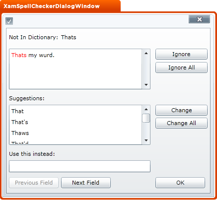

////

|metadata|
{
    "name": "designers-guide-styling-points-for-xamspellchecker",
    "controlName": [],
    "tags": ["Styling"],
    "guid": "{11F9343C-4EB7-44C2-835B-D8F1B607A5FB}",  
    "buildFlags": ["sl","wpf"],
    "createdOn": "2012-01-30T16:46:26.9828012Z"
}
|metadata|
////

= Styling Points for xamSpellChecker

== xamSpellCheckerDialogWindow Properties

The following diagram highlights the different controls used by the xamSpellCheckerDialogWindow control. To re-style a particular item, first identify the TargetType in the diagram then identify the corresponding Style property/properties in the table that follows.

== xamSpellCheckerDialogWindow Style Properties and TargetTypes

The following table lists the various controls used by the xamSpellCheckerDialogWindow control and identifies the properties that can be used to set a custom style.

[options="header", cols="a,a,a"]
|====
|TargetType|Style Properties|Description

|xamSpellCheckerDialogWindow
|xamSpellChecker.DialogSettings.SpellCheckDialogStyle
|Styles the spellchecker dialog window.

|====