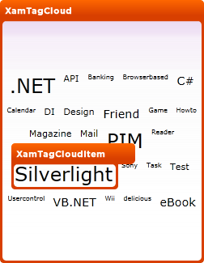

////

|metadata|
{
    "name": "designers-guide-styling-points-for-xamtagcloud",
    "controlName": [],
    "tags": ["Styling","Templating"],
    "guid": "{71C3ED4A-13B1-41EE-BE1A-B335A31336CF}",  
    "buildFlags": ["sl","wpf"],
    "createdOn": "2012-01-30T16:46:26.9858012Z"
}
|metadata|
////

= Styling Points for xamTagCloud

== xamTagCloud Properties

The following diagram highlights the different controls used by the xamTagCloud™ control. To re-style a particular item, first identify the TargetType in the diagram then identify the corresponding Style property/properties in the table that follows.

== xamTagCloud Style Properties and TargetTypes

The following table lists the various cell controls used by xamTagCloud and identifies the properties that can be used to set a custom style.

[options="header", cols="a,a,a"]
|====
|TargetType|Style Properties|Description

|xamTagCloud
|xamTagCloud.Style
|Styles the TagCloud control.

|XamTagCloudItem
|XamTagCloudItem.Style
|Styles the TagCloud item control

|
|xamTagCloud.ItemContainerStyle
|Styles all item controls in the TagCloud control.

|====