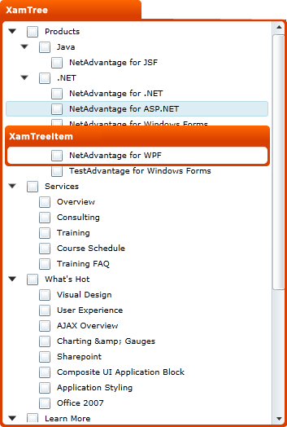

////

|metadata|
{
    "name": "designers-guide-styling-points-for-xamtree",
    "controlName": [],
    "tags": ["Styling","Templating"],
    "guid": "{A13EE67D-ABB9-4483-A9A7-9A068FE635CD}",  
    "buildFlags": ["sl"],
    "createdOn": "2012-01-30T16:46:26.9958012Z"
}
|metadata|
////

= Styling Points for xamTree

== xamTree Properties

The following diagram highlights the different controls used by the xamTree™ control. To re-style a particular item, first identify the TargetType in the diagram then identify the corresponding Style property/properties in the table that follows.

== xamTree Style Properties and TargetTypes

The following table lists the various controls used by xamTree and identifies the properties that can be used to set a custom style.

[options="header", cols="a,a,a"]
|====
|TargetType|Style Properties|Description

|xamTree
|xamTree.Style
|Styles the tree control.

|xamTreeItem
|xamTreeItem.Style
|Styles the tree item control.

|
|xamTree.ItemContainerStyle
|Styles all item controls in the tree control.

|====