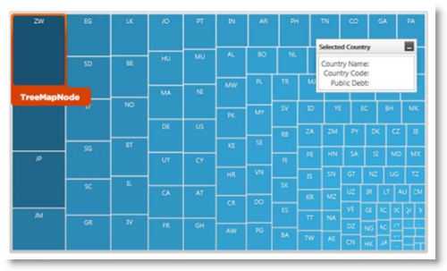

////

|metadata|
{
    "name": "designers-guide-styling-points-for-xamtreemap",
    "controlName": [],
    "tags": ["Styling","Templating"],
    "guid": "6aafe9e6-b2cf-4347-8dc8-482b809a4e53",  
    "buildFlags": ["sl","wpf","win-phone"],
    "createdOn": "2012-04-05T14:23:22.5295042Z"
}
|metadata|
////

= Styling Points for xamTreeMap

=== Introduction

Customizing the default style of a control using control properties and target types of styling points.

=== Preview

The following picture illustrates the styling points, the various elements of the featured properties and/or control properties, which allows customizing those sections of the control with the desired appearance.

== xamTreemap Styling Properties

The styling properties of the xamTreeMap control.

[options="header", cols="a,a,a"]
|====
|Target Type|Style Properties|Description

|`XamTreemap`
|XamTreemap.Style
|Styles the _XamTreemap_ control.

|`TreemapNode`
|TreemapNode.Style
|Styles the nodes in _xamTreemap_ control.

|====

== Related Content

=== Topic

The following topic provide additional information related to this topic.

[options="header", cols="a,a"]
|====
|Topic|Purpose

| link:xamtreemap.html[xamTreeMap]
|Treemaps display hierarchical (tree-structured) data as a set of nested nodes.

|====