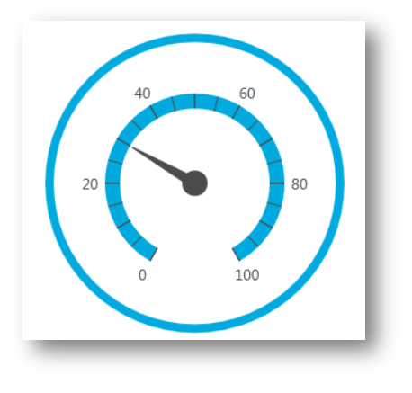

////

|metadata|
{
    "name": "designers-guide-using-themes",
    "controlName": [],
    "tags": ["How Do I","Styling"],
    "guid": "4c1bb5d7-ed56-49aa-9247-86721f57cc57",  
    "buildFlags": ["sl","wpf"],
    "createdOn": "2012-01-30T16:50:12.2138012Z"
}
|metadata|
////

= Using Themes

In addition to the default theme, Infragistics provides custom themes for all {ProductName} controls. This topic introduces these custom themes and explains how to apply them to all or individual controls in the {PlatformName} application.

== Available Themes

The {ProductName} suite of controls is shipped with the following professionally created themes:

* Office 2010 Blue Theme - Applies a new colorful look to your {ProductName} controls. The style is inspired by the Microsoft Office® 2010 suite of applications interface.

* Office 2013 Theme - nice and clean MS Office 2013 inspired look and feel.

* Royal Dark Theme - consistent and simplified theme enriched with more visual states, featuring more depth and improved UX.

* IG Theme - Predominantly monochromatic with the use of blacks, whites, and some grays, and uses blue as the highlight and accent color.

* Metro Theme - Touch friendly theme. It is using white, light gray and blue colors. The controls have larger touch area for easier use.

* Metro Dark Theme - Touch friendly theme. It is using dark gray, blue and black colors. The controls have larger touch area for easier use.

== Theme Implementation

Infragistics themes are resource dictionaries wrapped into a set of physical files. Every control has its own theme resource files, which are shipped as external files. Each resource dictionary contains a collection of Styles that target all components of {ProductName} control (e.g. link:{ApiPlatform}controls.maps.xammap{ApiVersion}~infragistics.controls.maps.mapnavigationpane.html[MapNavigationPane] element of the link:{ApiPlatform}controls.maps.xammap{ApiVersion}~infragistics.controls.maps.xammap.html[xamMap] control). You can interact with the theme resources in both XAML and in code-behind.

== Theme Location

After successful installation of the {ProductName} product, the Windows start menu will be modified and it will include groups of items. There should be a folder named “Themes” and a shortcut link “Open Themes Folder” that will navigate you to the location of the theme resource files on your hard drive.

{InstallPath}\Themes

The themes packs and resource files are placed in the corresponding folders. +
The theme resource dictionaries files are named as follows:

[options="header", cols="a,a"]
|====
|Theme Name|Naming Convention for Theme Resource Files

|Office 2010 Blue Theme
|Office2010Blue.[NAME OF THE CONTROL].xaml

|Office 2013 Theme
|Office2013.[NAME OF THE CONTROL].xaml

|Royal Dark Theme
|RoyalDark.[NAME OF THE CONTROL].xaml

|IG Theme
|IG.[NAME OF THE CONTROL].xaml

|Metro Theme
|Metro.[NAME OF THE CONTROL].xaml

|Metro Dark Theme
|MetroDark.[NAME OF THE CONTROL].xaml

|====

== Applying Themes

This example will show you how to apply Metro Theme to the xamRadialGauge control. However, you can follow the same steps to apply themes to other controls in the {ProductName} product. In the same way, you can apply the IG or Office 2010 Blue Theme to the xamRadialGauge or other controls.

.Note
[NOTE]
====
The following example assumes that you have already added assembly references for the xamRadialGauge control in your project. Also, you will have to remove implicit or explicit styles and appearance properties that you might have previously set on the xamRadialGauge control in your application; otherwise the Metro Theme will not be applied correctly.
====

[start=1]
. Add a new folder to your project and name it "Themes".
[start=2]
. Drag-and-drop the IG Theme folder from the following location to your Themes folder. This will add all theme resource files for the Metro Theme to your project; but you can remove the resource dictionaries that you will not be using in your application.

.Note
[NOTE]
====
There are three shared files that you should always keep next to your theme resource files - *Theme.Colors.xaml*, *Styles.Shared.xaml* and *Styles.WPF.xaml*. Some or all of these files are referenced in the control's theme. 
====

{InstallPath}\Themes

.Note
[NOTE]
====
The theme resource file can be embedded in the project as Content or Resource. This is specified in the FileProperties window in the Visual Studio – Build Action property.
====

** If the theme resource file is embedded as Content, it will be included in the application package, and you have to set the relative path to the Theme folder.
** If the theme resource file is embedded as Resource into the application assembly, the Source property will need to be prepended with assembly name of your application.

The following table shows examples of a source path based on different build actions selected for embedding the theme resource file.

[options="header", cols="a,a"]
|====
|Build Action|Source Path for Theme Resource File

|Content
|/Themes/MetroTheme/Metro.xamGauge.xaml

|Resource
|/AppAssemblyName;component/Themes/MetroTheme/Metro.xamGauge.xaml

|====

.Note
[NOTE]
====
You can merge the theme resource file for a control at the Application level to apply the theme to all instances of the control in your project or you can merge it at the Page, Window, or Control level to apply the theme to a single instance of the control in your project.
====

[start=3]
. Apply the Metro theme for the xamRadialGauge control in your application:

*In XAML:*

----
<Application.Resources>
    <ResourceDictionary>
        <ResourceDictionary.MergedDictionaries>
            <ResourceDictionary Source="/Themes/MetroTheme/Metro.xamGauge.xaml"/>
        </ResourceDictionary.MergedDictionaries>
    </ResourceDictionary>
</Application.Resources>
----

*In Visual Basic:*

----
Dim resource As New ResourceDictionary()
resource.Source = New Uri("/Themes/MetroTheme/Metro.xamGauge.xaml", UriKind.Relative)
Application.Current.Resources.MergedDictionaries.Add(resource)
----

*In C#:*

----
ResourceDictionary resource = new ResourceDictionary();
resource.Source = new Uri("/Themes/MetroTheme/Metro.xamGauge.xaml", UriKind.Relative);
Application.Current.Resources.MergedDictionaries.Add(resource);
----

[start=4]
. Save and run your project. The following image shows the xamRadialGauge control with applied Metro Theme.

== Applying Themes in Composite Controls

The xamGeographicMap control is a composite control. In order to apply themes, you have to include the following files in your application and in the MergedDictionaries collection:

* [NAME OF THEME].xamGeographicMap.xaml

* [NAME OF THEME].DataVisualization.xaml"

*In XAML:*
----
<Application.Resources>
    <ResourceDictionary>
        <ResourceDictionary.MergedDictionaries>
            <ResourceDictionary Source="/Themes/IgTheme/IG.DataVisualization.xaml"/>
            <ResourceDictionary Source="/Themes/IgTheme/IG.xamGeographicMap.xaml"/>
        </ResourceDictionary.MergedDictionaries>
    </ResourceDictionary>
</Application.Resources>
----

The xamDataChart control is also a composite control and it requires the following theme resource files to be included and merged in your application:

* [NAME OF THEME].xamDataChart.xaml

* [NAME OF THEME].DataVisualization.xaml

*In XAML:*
----
<Application.Resources>
    <ResourceDictionary>
        <ResourceDictionary.MergedDictionaries>
            <ResourceDictionary Source="/Themes/IgTheme/IG.DataVisualization.xaml"/>
            <ResourceDictionary Source="/Themes/IgTheme/IG.xamDataChart.xaml"/>
        </ResourceDictionary.MergedDictionaries>
    </ResourceDictionary>
</Application.Resources>
----

== Related Topics:

link:designers-guide-what-is-a-theme.html[What is a Theme?] +
link:designersguide-styling-ig-controls.html[Styling Infragistics Controls]