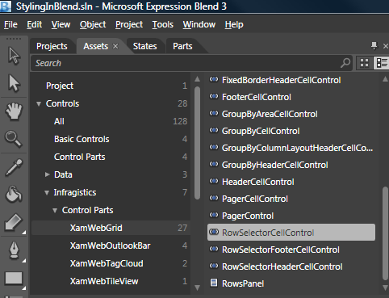

////

|metadata|
{
    "name": "designersguide-editing-style-properties-using-expression-blend",
    "controlName": [],
    "tags": [],
    "guid": "{8EB7EDB2-1F7D-439C-9800-270A0C439A12}",  
    "buildFlags": ["sl","wpf","win-rt"],
    "createdOn": "2012-01-30T16:46:26.9378012Z"
}
|metadata|
////

= Editing Style Properties Using Expression Blend

== Before You Begin

You can use Microsoft® Expression® Blend quickly and easily to modify copies of existing control styles so that you can create your own custom styles that can be assigned to the various {ProductName} controls.

A control's composition determines the procedure you use to modify its styles. For example, the xamGrid™ control exposes style properties for commonly used controls such as the link:{ApiPlatform}controls.grids.xamgrid.v{ProductVersion}~infragistics.controls.grids.cellcontrol.html[CellControl] object. However, other nested controls such as the link:{ApiPlatform}controls.grids.xamgrid.v{ProductVersion}~infragistics.controls.grids.primitives.rowselectorcellcontrol.html[RowSelectorCellControl] object do not have corresponding style properties exposed directly by the xamGrid control. Instead, nested objects within the xamGrid control expose the appropriate style properties. In this particular case, the link:{ApiPlatform}controls.grids.xamgrid.v{ProductVersion}~infragistics.controls.grids.rowselectorsettings.html[RowSelectorSettings] object exposes a style property for the RowSelectorCellControl object.

This topic assumes you already have a xamGrid control on your page.

== What You Will Accomplish

You will learn several techniques to edit a copy of the xamGrid™ control in order to create your own custom styles. You can apply the techniques to the other {ProductName} controls to create your own custom styles. The first technique show you how to create a style for properties exposed directly by the xamGrid control. The second technique show you how to create a style for nested controls that do not have a corresponding style property exposed directly by the xamGrid control.

== Follow These Steps

== Editing xamGrid's CellStyle Property

[start=1]
. Using Expression Blend, find the xamGrid control’s link:{ApiPlatform}controls.grids.xamgrid.v{ProductVersion}~infragistics.controls.grids.xamgrid~cellstyle.html[CellStyle] property in the Properties panel.

You will notice that you cannot edit the CellStyle property directly in the Properties panel. Fortunately, Expression Blend offers the ability to style these properties by navigating to the following menu item:

Object $$->$$ Edit Additional Styles $$->$$ Edit Cell Style - > Edit a Copy.

[start=2]
. Create a copy of the cell style. When you create a copy of a style, Expression Blend automatically copies the entire style, including brushes and any other objects from the generic.xaml file.

.. Open the Object menu.
.. Expand the "Edit Additional Styles" menu item. In order to enable the "Edit Additional Styles" menu item, you must select the xamGrid control on Expression Blend's Visual design surface. The style properties exposed directly by the xamGrid control will have a corresponding menu item in the sub-menu.
.. Expand the "Edit Cell Style" menu item.
.. Select "Edit a Copy..."

[start=3]
. Select the Application option and click the OK button to add a copy of the style to the application's resource dictionary.

Adding the style to the application's resource dictionary keeps the page clean and allows you to reuse this style in other pages within your application.

[start=4]
. At this point, Expression Blend will load a Visual design surface that contains the CellControl object by itself.

[start=5]
. You now have the opportunity to modify the existing control template of the CellControl object.

.. Right-click the CellControl object.
.. Expand the "Edit Template" menu item.
.. Select "Edit Current".

[start=6]
. At this point, you should see a tree that displays the elements that the CellControl object is composed of. You can edit this template to get the style that you are looking for. As an added bonus, once you’re done editing the template, you can just run your application and see the result because Expression Blend automatically sets the CellStyle property for you.

== Editing the Style of a Nested Control

[start=1]
. Drag an instance of a nested control that you want to style onto your page.

This example uses the RowSelectorCellControl object to edit the link:{ApiPlatform}controls.grids.xamgrid.v{ProductVersion}~infragistics.controls.grids.stylesettingsbase~style.html[xamGrid.RowSelectorSettings.Style] property. You can find this control in the Assets panel under Controls $$->$$ Infragistics $$->$$ Control Parts - > xamGrid.

[start=2]
. Create a copy of the RowSelectorCellControl object's style.

.. Open the Object menu.
.. Expand the "Edit Style" menu item.
.. Select "Edit a Copy...".

[start=3]
. You will see the same dialog that you saw when created a style for the CellControl object; use this dialog to name the style as well as placing it in the application's resource dictionary.

[start=4]
. You can edit the control's template using the same technique you used previously to edit the CellControl object's template.

.. Right-click the RowSelectorCellControl object.
.. Expand the "Edit Template" menu item.
.. Select "Edit Current".

[start=5]
. You will now be able to modify the specific elements of the control.

[start=6]
. There is one additional step needed now to apply your newly created style to the row selector. You must set the RowSelectorSettings object’s Style property to the style that you just created.

*In XAML:*

----
<ig:XamGrid>
    <ig:XamGrid.RowSelectorSettings>
        <ig:RowSelectorSettings Style="{StaticResource RowSelectorCellontrolStyle1}" />
    </ig:XamGrid.RowSelectorSettings>
</ig:XamGrid>
----