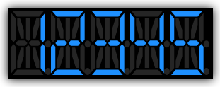

////

|metadata|
{
    "name": "designersguide-styling-ig-controls",
    "controlName": [],
    "tags": ["FAQ","Getting Started","How Do I","Styling","Templating"],
    "guid": "{F955029C-52C1-4C58-88A4-040C8C1241E6}",  
    "buildFlags": ["sl","wpf","win-phone"],
    "createdOn": "2012-01-30T16:46:26.9418012Z"
}
|metadata|
////

= Styling Infragistics Controls

== Before You Begin

Every aspect of the {ProductName} controls can be styled and customized to maintain consistency throughout your applications. Each and every control contains styling properties and target types. Styling the controls follows the same pattern. As an example, this topic will describe how to style the text foreground of the xamSegmentedDisplay™ control by setting the Style property.

== What You Will Accomplish

After completing the steps in this walkthrough, you will have created a Style resource used to style the xamSegmentedDisplay control’s text foreground.

== Follow these Steps

[start=1]
. Add tags for the user control's resource dictionary.

*In XAML:*

----
<UserControl.Resources>
   <!-- TODO: Create style here -->
</UserControl.Resources>
----

[start=2]
. Add a Style object to the resource dictionary with the following properties

*In XAML:*

----

----

[start=3]
. Add a Setter element to the Style. Set the following properties

** Property TextForeground
** Value DodgerBlue

*In XAML:*

----
<Setter Property="TextForeground" Value="DodgerBlue" />
----

[start=4]
. Within the xamSegmentedDisplay control, set the Style property to the Style you created

*In XAML:*

----
<Grid x:Name="LayoutRoot" Background="Black" >
    <ig:XamSegmentedDisplay Name="XamSegmentedDisplay1" Margin="5"
                          Text="12345"  
                          Style="{StaticResource DisplayCustomStyle}" >
    </ig:XamSegmentedDisplay>
</Grid>
----

[start=5]
. Save and run your application. The following image show how the xamSegmentedDisplaycontrol might look with custom style.

ifdef::sl,wpf[]
== Related Topic:
endif::sl,wpf[]

ifdef::sl,wpf[]
link:designers-guide-using-themes.html[Using Themes]

endif::sl,wpf[]