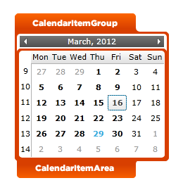
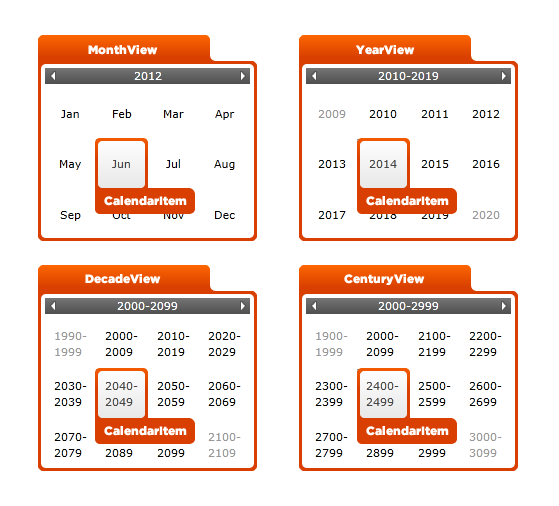
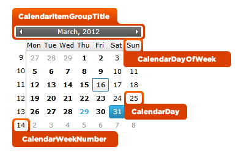

////

|metadata|
{
    "name": "designersguide-styling-points-for-xamcalendar",
    "controlName": [],
    "tags": ["Styling"],
    "guid": "f5757588-9090-46b8-9cfc-c08e24fbd5c2",  
    "buildFlags": ["sl","wpf","win-rt"],
    "createdOn": "2012-04-05T20:05:23.912337Z"
}
|metadata|
////

= Styling Points for xamCalendar

=== Introduction

Using  _xamCalendar_   _™_   control to customize the default look and feel of target types via control properties.

=== Preview

The following pictures identify the various target types, which are configurable using  _xamCalendar’s_   control properties. This allows you to render those target types associated with this control as you want them to appear.

== xamCalendar Styling Properties

The styling properties of the  _xamCalendar_   control.

[options="header", cols="a,a,a"]
|====
|Target Type|Style Properties|Description

|`CalendarItemGroup`
|CalendarItemGroup.Style
|Allows you to customize the appearance of the items contained within the _xamCalendar_ control.

|`CalendarItemarea`
|CalendarItemArea.Style
|Allows you to customize the appearance of the rectangle area of the items in _xamCalendar_ control.

|`CalendarItem`
|CalendarItem.Style
|Allows you to customize the appearance of the items (month, year, decade or century) in calendar view.

|`CalendarItemGroupTitle`
|CalendarItemGroupTitle.Style
|Allows you to customize the appearance of the title of the _xamCalendar_ control.

|`CalendarDayOfWeek`
|CalendarDayOfWeek.Style
|Allows you to customize the appearance of the days of the week on the _xamCalendar_ control.

|`CalendarDay`
|CalendarDay.Style
|Allows you to customize appearance of the days of the month on the _xamCalendar_ control.

|`CalendarWeekNumber`
|CalendarWeekNumber.Style
|Allows you to customize the appearance of the numbers of the weeks in a year on _xamCalendar_ control.

|====

== Related Content

=== Topics

The following topics provide additional information related to this topic.

[options="header", cols="a,a"]
|====
|Topic|Purpose

| link:xamcalendar.html[xamCalendar]
|An introduction to _xamCalendar_ control.

|====