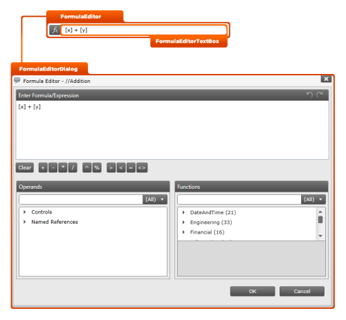

////

|metadata|
{
    "name": "designersguide-styling-points-for-xamformulaeditor",
    "controlName": [],
    "tags": ["Styling","Templating"],
    "guid": "4a18bc78-d8fd-493c-98fd-3fd056074035",  
    "buildFlags": ["sl","wpf"],
    "createdOn": "2012-04-05T20:04:36.883337Z"
}
|metadata|
////

= Styling Points for xamFormulaEditor

=== Introduction

Using  _xamFormulaEditor_™ control to customize the default look and feel of target types via control properties

=== Preview

The following picture identifies the various target types, which are configurable using xamFormulaEditor’s control properties. This allows you to customize those target types associated with this control using your desired style.

== xamFormulaEditor Styling Properties

The following table lists the styling properties of the  _xamFormulaEditor_   control.

[options="header", cols="a,a,a"]
|====
|Target Type|Style Properties|Description

|`FormulaEditor`
|FormulaEditor.Style
|Styles the FormulaEditor control.

|`FormulaEditorTextBox`
|FormlaEditorTextBox.Style
|Styles the text box in _xamFormulaEditor_ control.

|`FormulaEditorDialog`
|FormulaEditorDialog.Style
|Styles the drop-down dialog window of _xamFormulaEditor_ control.

|====

== Related Content

=== Topics

The following topics provide additional information related to this topic.

[options="header", cols="a,a"]
|====
|Topic|Purpose

| link:xamformulaeditor.html[xamFormulaEditor]
|Provides extensive information on the _xamFormulaEditor_ control. The topic starts with an introduction to what the control is capable of doing and progresses into why you might want to implement this in your application. Step by step instructions illustrate how to accomplish common tasks using this control

|====