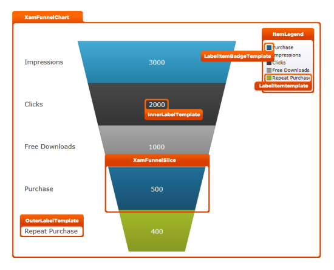

////

|metadata|
{
    "name": "designersguide-styling-points-for-xamfunnelchart",
    "controlName": [],
    "tags": ["Styling","Templating"],
    "guid": "d7e12328-2aa3-4e7a-b642-d57adb9b597b",  
    "buildFlags": ["sl","wpf","win-phone"],
    "createdOn": "2012-04-06T19:15:07.1173746Z"
}
|metadata|
////

= Styling Points for xamFunnelChart

=== Introduction

Using  _xamFunnelChart_   control to customize the default look and feel of target types via control properties.

=== Preview

The following picture identifies the various target types, which are configurable using  _xamFunnelChart_  ’ _s_  control properties. This allows you to customize those target types associated with this control using your desired style.

== xamFunnelChart Styling Properties

The following table lists the styling properties of the  _xamFunnelChart_   _™_   control.

[options="header", cols="a,a,a"]
|====
|Target Type|Style Properties|Description

|`XamFunnelChart`
|XamFunnelChart.Style
|Styles the XamFunnelChart control.

|`XamFunnelSlice`
|XamFunnelSlice.Style
|Styles the slices in the xamFunnelChart control.

|`InnerLabelTemplate`
|InnerLabelTemplate
|Styles the labels inside of the slices with control template.

|`OuterLabelTemplate`
|OuterLabelTemplate
|Styles the label located outside of the slices with control template.

|`ItemLegend`
|ItemLegend.Style
|Styles the Legend control.

|`LegendItemBadgeTemplate`
|LegendItemBadgeTemplate
|Styles the item badge of the Legend with control template.

|`LegendItemTemplate`
|LegendItemTemplate
|Styles the item of the Legend with control template.

|====

== Related Content

=== Topics

The following topics provide additional information related to this topic.

[options="header", cols="a,a"]
|====
|Topic|Purpose

| link:funnelchart.html[xamFunnelChart]
|A funnel chart is a type of chart that displays quantities as percentages of a whole, much like a pie chart.

|====