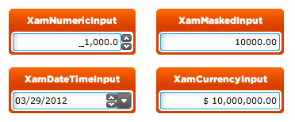

////

|metadata|
{
    "name": "designersguide-styling-points-for-xaminputs",
    "controlName": [],
    "tags": ["Editing","Styling","Templating"],
    "guid": "55052c03-c011-4573-b36b-cf1bb1a8379c",  
    "buildFlags": [],
    "createdOn": "2012-04-06T19:17:13.6670295Z"
}
|metadata|
////

= Styling Points for xamInputs

=== Introduction

Using  _xamInputs_   controls to customize the default look and feel of target types via control properties.

=== Preview

The following picture identifies the various target types, which are configurable using  _xamInputs_  ’ controls properties. This allows you to customize those target types associated with these controls using your desired style.

== xamInputs Styling Properties

The following table lists the styling properties of the  _xamInputs_   _™_   controls.

[options="header", cols="a,a,a"]
|====
|Target Type|Style Properties|Description

|`XamNumericInput`
|XamNumericInput.Style
|Styles the XamNumericInput control.

|`XamMaskedInput`
|XamMaskedInput.Style
|Styles the XamMaskedInput control.

|`XamDateTimeInput`
|XamDateTimeInput.Style
|Styles the XamDateTimeInput control.

|`XamCurrencyInput`
|XamCurrencyInput.Style
|Styles the XamCurrencyInput control.

|====

== Related Content

=== Topics

The following topics provide additional information related to this topic.

[options="header", cols="a,a"]
|====
|Topic|Purpose

| link:xaminputs.html[xamInputs]
|This topic will introduce you to the controls in the xamInputs group.

|====