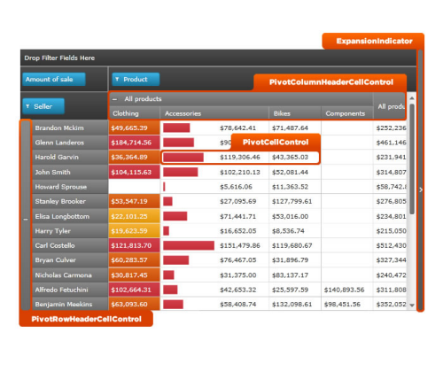
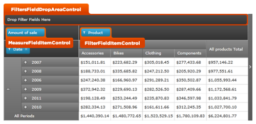
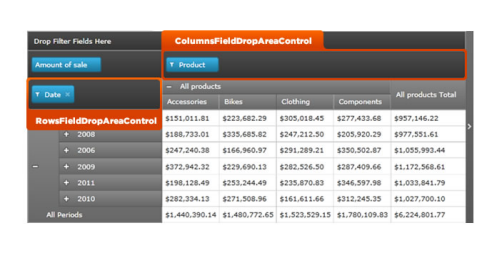

////

|metadata|
{
    "name": "designersguide-styling-points-for-xampivotgrid",
    "controlName": [],
    "tags": ["Styling","Templating"],
    "guid": "ce6963f4-fde1-431d-b6ba-e24c555b73d3",  
    "buildFlags": ["sl","wpf"],
    "createdOn": "2012-04-05T20:01:50.686337Z"
}
|metadata|
////

= Styling Points for xamPivotGrid

=== Introduction

Using the  _xamPivo_  _t_  _Grid_  control to Customize the default look and feel of target types via control properties.

=== Preview

The following picture identifies the various target types, which are configurable using  _xamPivotGrid_  _’s_  control properties. This allows you to customize those target types associated with this control using your desired style.

== xamPivotGrid Styling Properties

The styling properties of the  _xamPivotGrid_   _™_   control.

[options="header", cols="a,a,a"]
|====
|Target Type|Style Properties|Description

|`PivotRowHeaderCellControl`
|PivotRowHeaderCellControl.Style
|Styles the row header cells in XamPivotGrid control.

|`PivotColumnHeaderCellControl`
|PivotColumnHeaderCellControl.Style
|Styles the column headers in XamPivotGrid control.

|`PivotCellControl`
|PivotCellControl.Style
|Styles the cells in XamPivotGrid control.

|`FiltersFieldDropAreaControl`
|FiltersFieldDropAreaControl.Style
|Styles the area for filtered fields dropped to this area from data selector area or set up in code to display in this area.

|`ColumnFieldDropAreaControl`
|ColumnFieldDropAreaControl.Style
|Styles the field area for columns dropped to this area from data selector area or set up in code to display in this area.

|`RowFieldDropAreaControl`
|RowFieldDropAreaControl.Style
|Styles the field area for rows dropped to this area from data selector area or set up in code to display in this area.

|`MeasureFieldItemControl`
|MeasureFieldItemControl.Style
|Styles the area for measures dropped to this area from data selector area or set up in code to display in this area.

|`FilterFieldItemControl`
|FilterFieldItemControl.Style
|Styles the area for fields such as: rows or columns dropped to this area from data selector area, or set up in code to display in this area.

|====

== Related Content

=== Topics

The following topics provide additional information related to this topic.

[options="header", cols="a,a"]
|====
|Topic|Purpose

| link:xampivotgrid.html[xamPivotGrid]
|An overview of using the _xamPivotGrid_ control.

|====