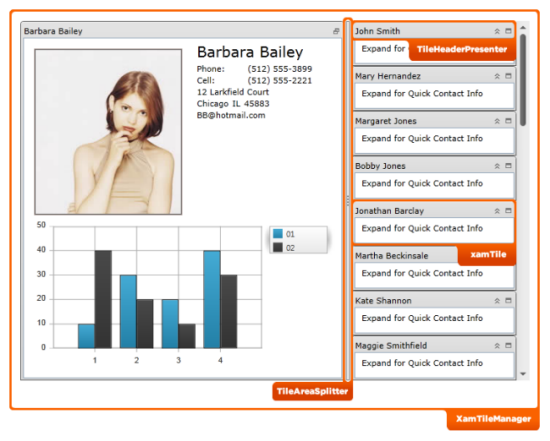

////

|metadata|
{
    "name": "designersguide-styling-points-for-xamtilemanager",
    "controlName": [],
    "tags": ["Styling","Templating"],
    "guid": "68dbe742-8df8-4298-8106-422f3f21db6c",  
    "buildFlags": ["sl","wpf"],
    "createdOn": "2012-04-05T19:59:41.172337Z"
}
|metadata|
////

= Styling Points for xamTileManager

=== Introduction

This topic introduces designers’ styling points for the  _xamTileManager_™ control.

=== Preview

The following picture identifies the various target types, which are configurable using  _xamTileManager’s_   control properties. This allows you to customize those target types associated with this control using your desired style.

== xamTileManager Styling Properties

Styling properties of the  _xamTileManager_   _™_   control.

[options="header", cols="a,a,a"]
|====
|Target Type|Style Properties|Description

|`XamTileManager`
|XamTileManager.Style
|Styles the _XamTileManager_ control.

|`XamTile`
|XamTile.Style
|Styles the XamTile control

|`TileAreaSplitter`
|TileAreaSplitter.Style
|Styles the area of the tile splitter (between tiles).

|`TileHeaderPresenter`
|TileHeaderPresenter.Style
|Styles the header area of the tiles.

|====

== Related Content

=== Topics

For additional information related to this topic.

[options="header", cols="a,a"]
|====
|Topic|Purpose

| link:xamtilemanager.html[xamTileManager]
|This section contains information about _xamTileManager_ . This extensive coverage ranges from what the control does to providing step-by-step instructions on using this control in your application.

|====