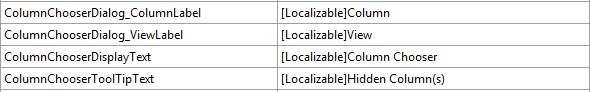

////

|metadata|
{
    "name": "developers-guide-customizing-resource-strings",
    "controlName": [],
    "tags": ["How Do I","Localization","Resource Strings"],
    "guid": "ee8c34fc-f216-4cca-91b1-29c5d97464fd",  
    "buildFlags": [],
    "createdOn": "2012-01-30T15:17:19.5896008Z"
}
|metadata|
////

= Customizing Resource Strings

This topic explains how to customize the resource strings of an {ProductName} control.

The topic is organized as follows:

* <<Introduction,Introduction>>
* <<SupportControl,Supported String Customization per Control>>
* <<Modifying,Modifying the Resource Files>>

** <<Register,Registering the Customized Resource Files>>
** <<Reset,Resetting the Default Resource Strings>>

[[Introduction]]

== Introduction

You can customize the string values that an {ProductName} control displays to the end user.  pick:[wpf,sl="These strings include items such as dialog box captions, warning messages, filter options and alerts. This makes localizing your application a very easy and straight forward process."]

In the following picture, the xamGrid control has the resource strings of the link:xamgrid-groupby.html[GroupBy] and link:xamgrid-filtering.html[Filtering] features customized:

image::images/Customize_Resource_Strings_01.png[]

Figure 1: The xamGrid control with GroupBy and filtering resource strings customized

[[SupportControl]]
== Supported String Customization per Control

Customization of UI strings is supported for the following controls:

* xamCalendar
* xamColorPicker
* xamDockManager
* xamGrid
* xamMap
* xamOutlookBar
* xamPivotGrid
* xamRibbon
* xamSchedule (on ScheduleControlBase class)
* xamScheduleDialogs (on ScheduleDialogFactory)
* xamSpellChecker (on xamSpellChecker class)

Customization of error messages is supported for the following controls:

* xamBarcode
* xamComboEditor
* xamDataTree
* xamNetworkNode
* xamTimeline
* xamTreemap
* xamMenu
* xamMaskedInput

[[Modifying]]
== Modifying the Resource Files

The resource files of a control follow the same naming convention as the assemblies. For example, xamBarcode control's resource file is named {ApiPlatform}Controls.Barcodes.xamBarcode.resx.

The installer places the control’s resource files in the following location:

{InstallPath}\bin

.Note
[NOTE]
====
When using resource strings within a {PlatformName} project, you have to manually edit the .csproj/.vbproj file to add the locales in the SupportedCultures node of the .proj file.
====

[[Register]]
== Registering the Customized Resource Files

Each control has a RegisterResources() method which is used to register the resource file. This method accepts two parameters:

* The first parameter is the name of the embedded resource file that contains the resources to be used. Generally it follows the format of:

Default namespace + path + filename

.Note
[NOTE]
====
You must exclude the extension (.resx or .resouce) of the filename.
====

* The second parameter is the assembly in which the resource file is embedded.

To register your customized resource files:

[start=1]
. Add a new Resources File (.resx) file to your project, ensuring that it is embedded.
[start=2]
. Add customized strings with keys of those strings corresponding to the controls actual key. For example, using the xamBarcode control’s actual keys, you can change the strings associated with the loading of data, as demonstrated in the following screenshot.

*In Visual Basic:*

[source,vb]
----
XamBarcode.RegisterResources("BarcodeResourceStringsSample",GetType(MainWindow).Assembly)
----

*In C#:*

[source,csharp]
----
XamBarcode.RegisterResources("BarcodeResourceStringsSample", typeof(MainWindow).Assembly);
----

.Note
[NOTE]
====
Resource strings must be applied before InitializeComponent() is called. They won’t update after the control is initialized.
====

You do not need to supply a string value for every available string in the control: you can choose which strings you want to customize. If you register more than one resource file and they contain the same strings, the resource file that is registered last will have priority with that resource file string value displayed to the end user.

[[Reset]]
== Resetting the Default Resource Strings

You can also reset the default resource strings of a control by unregistering a customized resource string. This can be done by calling the control’s UnregisterResources() method.

This method takes one parameter:

* The name of the embedded resource file that was previously registered

*In Visual Basic:*

[source,vb]
----
XamBarcode.UnregisterResources("BarcodeResourceStringsSample")
----

*In C#:*

[source,csharp]
----
XamBarcode.UnregisterResources("BarcodeResourceStringsSample");
----