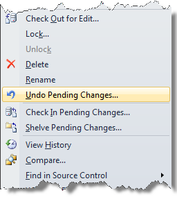
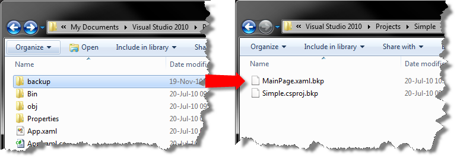

////

|metadata|
{
    "name": "developers-guide-restoring-version-upgrade-utility-backup-undoing-upgrade",
    "controlName": [],
    "tags": ["How Do I"],
    "guid": "955b597e-bd23-4088-939c-640ef264ba6b",  
    "buildFlags": ["wpf","sl"],
    "createdOn": "2012-01-30T15:17:19.5866005Z"
}
|metadata|
////

= Restoring Version Upgrade Utility Backup Undoing Upgrade

The Infragistics Version Upgrade Utility will create a backup of each file that is targeted for upgrading before any changes are made. This feature can be disabled through a configuration setting. There may be situations where you wish to restore your application to the state that it was in before it was upgraded with the utility.

*Using Source Control*

If you work in an environment where your application source code is managed by a source control system (E.g., Microsoft® Team Foundation Server®, Microsoft® Visual Source Safe®), the best way to restore your application source code is to undo the changes that were made when the upgrade was performed. For steps on how to restore your application source code and undo any changes by using your source control system, please refer to the source control system’s documentation, or see your source control administrator.

*Using the Infragistics Version Utility*

If your application is not managed by a source control system, you must use the following guidance to restore your application and undo the changes made by the Version Utility. Restoring your Version Utility upgraded application is as simple as copying the files that are located in the \Backup folder and overwriting the files that exist in your project. This process should be performed on the file system level and not within Microsoft® Visual Studio®. Once you replace your application’s files with the files that were backed up by the Version Utility, you can open your project in Microsoft Visual Studio and ensure that everything is in working order.

