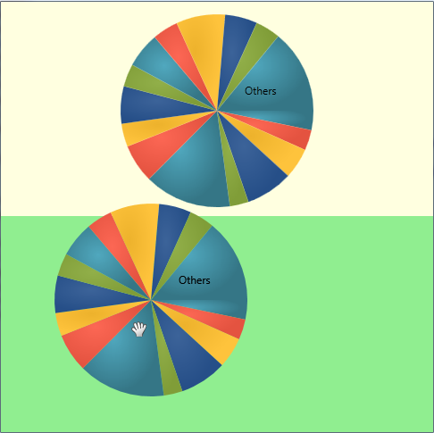

////

|metadata|
{
    "name": "drag-and-drop-framework-getting-started-with-ig-drag-and-drop-framework",
    "controlName": ["IG Drag and Drop Framework"],
    "tags": ["Application Scenarios","Getting Started","How Do I"],
    "guid": "{EB7C8284-F312-4B8D-A754-062CA8B308C0}",  
    "buildFlags": [],
    "createdOn": "2016-05-25T18:21:53.6930373Z"
}
|metadata|
////

= Getting Started with Infragistics Drag and Drop Framework

== Before You Begin

This topic is designed to get you up and running with the link:{ApiPlatform}dragdrop{ApiVersion}.html[Infragistics Drag and Drop Framework]™ library as quickly as possible by describing the basic steps required for implementing the drag and drop functionality within your {PlatformName} application.

== What You Will Accomplish

You will drag a xamPieChart control from a source panel and drop it into a target panel.

== Follow these Steps

[start=1]
. Create a Microsoft® {PlatformName}™ project
[start=2]
. In the Solution Explorer, add the following references to your project:

** {ApiPlatform}v{ProductVersion}.dll
** {ApiPlatform}DragDrop.v{ProductVersion}.dll
** {ApiPlatform}Controls.Charts.XamDataChart.v{ProductVersion}.dll
** {ApiPlatform}DataVisualization.v{ProductVersion}.dll

[start=3]
. Add a namespace declaration for the drag and drop framework to the opening UserControl tag.

*In XAML:*

----
xmlns:ig="http://schemas.infragistics.com/xaml"
----

[start=4]
. Provide sample data that will be visualized by the XamPieChart control. The example uses the link:resources-datautil.html[DataUtil] class provided for you.

*In XAML:*

----
<UserControl.DataContext>
    <local:DataUtil x:Name="Data"/>
</UserControl.DataContext>
----

[start=5]
. Add two row definitions to a Grid container named "LayoutRoot".

*In XAML:*

----
<Grid x:Name="LayoutRoot">    <Grid.RowDefinitions>
        <RowDefinition Height="400" />
        <RowDefinition Height="*" />
    </Grid.RowDefinitions>
    <!-- TODO: Add the source and target StackPanels here. -->
</Grid>
----

[start=6]
. Add the first StackPanel container that holds the XamPieChart control that will be dragged.

*Note:* It is necessary to add a background color to the StackPanel in order any mouse events to be handled.

*In XAML:*

----
<StackPanel Grid.Row="0" x:Name="sourcePanel"             Background="LightYellow"  
    <!-- TODO: Add the xamWebChart control that will be dragged. -->
</StackPanel>
----

[start=7]
. Add a XamPieChart control to the sourcePanel container.

*In XAML:*

[source,xaml]
----
<ig:XamPieChart Width="480" Height="240" HorizontalAlignment="Left"
                ItemsSource="{Binding Products}" LabelMemberPath="ProductName" ValueMemberPath="UnitPrice" ToolTip="{}{ProductName}">
    <!--TODO: Mark the XamPieChart control as draggable element and allow drag action -->
</ig:XamPieChart>
----

[start=8]
. Add drag and drop functionality to the chart. This is done by adding the link:{ApiPlatform}dragdrop{ApiVersion}~infragistics.dragdrop.dragsource.html[DragSource] object and setting the following properties:

** link:{ApiPlatform}dragdrop{ApiVersion}~infragistics.dragdrop.dragsource~isdraggable.html[IsDraggable] – True
** link:{ApiPlatform}dragdrop{ApiVersion}~infragistics.dragdrop.dragsource~dragchannels.html[DragChannels] – ChannelA (this specifies the areas where this control can be dropped to. For more information, see link:drag-and-drop-framework-set-drag-and-drop-channels.html[Set Drag and Drop Channels].)
** link:{ApiPlatform}dragdrop{ApiVersion}~infragistics.dragdrop.dragsource~drop_ev.html[Drop] – DragSource_Drop

*In XAML:*

----
<ig:DragDropManager.DragSource>
   <ig:DragSource IsDraggable="True"
              DragChannels="ChannelA" Drop="DragSource_Drop">
   </ig:DragSource>
</ig:DragDropManager.DragSource>
----

[start=9]
. Add the target StackPanel container and indicate it will be the area that the dragged control can be dropped into. This is done by adding the link:{ApiPlatform}dragdrop{ApiVersion}~infragistics.dragdrop.droptarget.html[DropTarget] object and setting the following properties:

** link:{ApiPlatform}dragdrop{ApiVersion}~infragistics.dragdrop.droptarget~isdroptarget.html[IsDropTarget] – True
** link:{ApiPlatform}dragdrop{ApiVersion}~infragistics.dragdrop.droptarget~dropchannels.html[DropChannels] – ChannelA (this specifies that items with DragChannels set to ChannelA can be dropped here. For more information, see link:drag-and-drop-framework-set-drag-and-drop-channels.html[Set Drag and Drop Channels].)

*In XAML:*

----
<StackPanel x:Name="targetPanel" Grid.Row="1" Background="LightGreen">
    <ig:DragDropManager.DropTarget>
        <ig:DropTarget IsDropTarget="True"  DropChannels="ChannelA"/>
    </ig:DragDropManager.DropTarget>
</StackPanel>
----

[start=10]
. In the code-behind, handle the Drop event. In this example, the XamPieChart control is placed in the target panel and removed from the source panel.

*In Visual Basic:*

[source,vb]
----
Private targetChart As XamPieChart = Nothing
…
Private Sub DragSource_Drop(sender As Object, e As Infragistics.DragDrop.DropEventArgs)
      Dim originalChart As XamPieChart = TryCast(e.DragSource, XamPieChart)
      If targetChart Is Nothing Then
            targetChart = New XamPieChart()
            targetChart = originalChart
            targetChart.AllowSliceExplosion = True
            sourcePanel.Children.Remove(originalChart)
            targetPanel.Children.Add(targetChart)
      End If
End Sub
----

*In C#:*

[source,csharp]
----
private XamPieChart targetChart = null;
…
private void DragSource_Drop(object sender, Infragistics.DragDrop.DropEventArgs e)
{
    XamPieChart originalChart = (e.DragSource as XamPieChart);
    if (targetChart == null)
    {
        targetChart = new XamPieChart();
        targetChart = originalChart;
        targetChart.AllowSliceExplosion = true;
        sourcePanel.Children.Remove(originalChart);
        targetPanel.Children.Add(targetChart);
    }
}
----

[start=11]
. Run your application. You should be able to drag the XamPieChart control from the top stack panel over into the bottom stack panel.

== Related Topics

link:drag-and-drop-framework-about-ig-drag-and-drop-framework.html[About Infragistics Drag and Drop Framework]

link:drag-and-drop-framework-using-ig-drag-and-drop-framework.html[Using Infragistics Drag and Drop Framework]