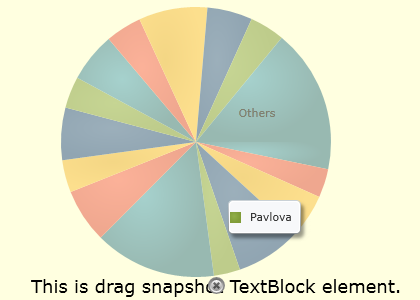
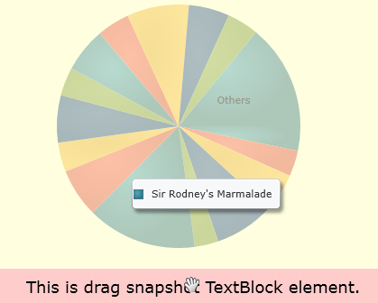
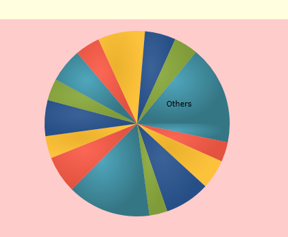

////

|metadata|
{
    "name": "drag-and-drop-framework-ig-drag-and-drop-framework-events",
    "controlName": ["IG Drag and Drop Framework"],
    "tags": ["Events"],
    "guid": "0f103a2a-69c5-4268-be92-c01b2d65d58e",  
    "buildFlags": [],
    "createdOn": "2016-05-25T18:21:53.659034Z"
}
|metadata|
////

= Infragistics Drag and Drop Framework Events and Event Arguments

There are many events associated with the drag and drop framework. You can modify various aspects of the process with the drag and drop events arguments.

== Base Events Arguments

The base class for all events arguments related to the link:{ApiPlatform}dragdrop{ApiVersion}~infragistics.dragdrop.dragsource.html[DragSource] object is the link:{ApiPlatform}dragdrop{ApiVersion}~infragistics.dragdrop.dragdropeventargs.html[Infragistics.DragDrop.DragDropEventArgs] class. It exposes the following properties that you may find useful:

* link:{ApiPlatform}dragdrop{ApiVersion}~infragistics.dragdrop.dragdropeventargs~copycursortemplate.html[CopyCursorTemplate] - You can get or set a data template that will be used as a cursor when copying operation is performed.
* link:{ApiPlatform}dragdrop{ApiVersion}~infragistics.dragdrop.dragdropeventargs~data.html[Data] - This property gets or sets the instance of the object that represents the dragged data.
* link:{ApiPlatform}dragdrop{ApiVersion}~infragistics.dragdrop.dragdropeventargs~dragsource.html[DragSource] - This is the UIElement that initiates the drag operation.
* link:{ApiPlatform}dragdrop{ApiVersion}~infragistics.dragdrop.dragdropeventargs~dragtemplate.html[DragTemplate] - You can get or set a data template that will be applied to the dragged element representation.
* link:{ApiPlatform}dragdrop{ApiVersion}~infragistics.dragdrop.dragdropeventargs~dropnotallowedcursortemplate.html[DropNotAllowedCursorTemplate] - You can get or set a data template that will be used as a cursor when the drag operation occurs but is not over the drop target.
* link:{ApiPlatform}dragdrop{ApiVersion}~infragistics.dragdrop.dragdropeventargs~droptarget.html[DropTarget] - This property holds an instance of the object marked as a drop target.
* link:{ApiPlatform}dragdrop{ApiVersion}~infragistics.dragdrop.dragdropeventargs~movecursortemplate.html[MoveCursorTemplate] - You can get or set a data template that will be used as a cursor when a drag operation is performed over the drop target.
* link:{ApiPlatform}dragdrop{ApiVersion}~infragistics.dragdrop.dragdropeventargs~operationtype.html[OperationType] - You can get or set the type of the intended action during drag and drop operation. It determines which cursor will be applied.
* link:{ApiPlatform}dragdrop{ApiVersion}~infragistics.dragdrop.dragdropeventargs~originaldragsource.html[OriginalDragSource] - This property holds the original reporting source.

== Events

The following is a list of the events, in the order they are raised.

If you have already created the drag and drop sample application as the one that was described in the link:drag-and-drop-framework-getting-started-with-ig-drag-and-drop-framework.html[Getting Started with Infragistics Drag and Drop Framework] topic, you can further improve it and add some visual effects to the dragged element.

link:{ApiPlatform}dragdrop{ApiVersion}~infragistics.dragdrop.dragsource~dragstart_ev.html[DragStart] – This event is fired when your end user begins dragging a UI element. The event can be cancelled and the next raised event will be the DragCancel event.

A link:{ApiPlatform}dragdrop{ApiVersion}~infragistics.dragdrop.dragdropstarteventargs.html[DragDropStartEventArgs] object is passed to the DragStart event handler. This object offers a property named link:{ApiPlatform}dragdrop{ApiVersion}~infragistics.dragdrop.dragdropstarteventargs~dragsnapshotelement.html[DragSnapshotElement] in addition. You can set or get a snapshot of the element that is dragged. By default, the value of this property is null so the content displayed in the dragged popup is the snapshot of the drag source element.

*In XAML:*

----
<ig:DragSource IsDraggable="True" ... DragStart="DragSource_DragStart" ... />
----

*In Visual Basic:*

----
Private Sub DragSource_DragStart(ByVal sender As Object,             ByVal e As Infragistics.DragDrop.DragDropStartEventArgs)
    ' Dim a little the drag source
    e.DragSource.Opacity = 0.7
    Dim txtBlock As New TextBlock()
    txtBlock.Text = "This is drag snapshot TextBlock element."
    txtBlock.FontSize = 18
    ' Set a TextBlock element as drag snapshot.
    e.DragSnapshotElement = txtBlock
End Sub
----

*In C#:*

----
private void DragSource_DragStart(object sender,              Infragistics.DragDrop.DragDropStartEventArgs e)
{
    // Dim a little the drag source
    e.DragSource.Opacity = 0.7;
    TextBlock txtBlock = new TextBlock();
    txtBlock.Text = "This is drag snapshot TextBlock element.";
    txtBlock.FontSize = 18;
    // Set a TextBlock element as drag snapshot.
    e.DragSnapshotElement = txtBlock;
}
----

link:{ApiPlatform}dragdrop{ApiVersion}~infragistics.dragdrop.dragsource~dragenter_ev.html[DragEnter] – This event is fired when your end user enters the drop target area while the drag and drop operation is still in progress. This event can be cancelled.

link:{ApiPlatform}dragdrop{ApiVersion}~infragistics.dragdrop.dragsource~dragover_ev.html[DragOver] – This event is fired only when your end user drags an object over a drop target area.

A link:{ApiPlatform}dragdrop{ApiVersion}~infragistics.dragdrop.dragdropmoveeventargs.html[DragDropMoveEventArgs] object is passed to the DragOver event handler. A method named link:{ApiPlatform}dragdrop{ApiVersion}~infragistics.dragdrop.dragdropmoveeventargs~getposition.html[GetPosition] is implemented in addition. It provides information about the mouse position relative to the UIElement method argument.

*In XAML:*

----
<ig:DragSource IsDraggable="True"... DragOver="DragSource_DragOver" ... />
----

*In Visual Basic:*

----
Private Sub DragSource_DragOver(ByVal sender As Object,             ByVal e As Infragistics.DragDrop.DragDropMoveEventArgs)
    ' Dim the drag source object
    e.DragSource.Opacity = 0.4
    Dim lightRedBrush As New SolidColorBrush(Colors.Red)
    lightRedBrush.Opacity = 0.2
    ' Change the background color of the target StackPanel     ' when dragged element moves over it.
    TryCast(e.DropTarget, StackPanel).Background = lightRedBrush
    ' Gets the mouse position relative to the main Grid container.
    System.Diagnostics.Debug.WriteLine("Position: " & e.GetPosition(LayoutRoot).ToString())
 End Sub
----

*In C#:*

----
private void DragSource_DragOver(object sender,              Infragistics.DragDrop.DragDropMoveEventArgs e)
{
    // Dim the drag source object
    e.DragSource.Opacity = 0.4;
    SolidColorBrush lightRedBrush = new SolidColorBrush(Colors.Red);
    lightRedBrush.Opacity = 0.2;
    // Change the background color of the target StackPanel     // when dragged element moves over it.
    (e.DropTarget as StackPanel).Background = lightRedBrush;
    // Gets the mouse position relative to the main Grid container.
    System.Diagnostics.Debug.WriteLine("Position:"+e.GetPosition(LayoutRoot).ToString());
}
----

link:{ApiPlatform}dragdrop{ApiVersion}~infragistics.dragdrop.dragsource~dragleave_ev.html[DragLeave] – This event is fired when your end user leaves the drop target area while the drag and drop operation is still in progress.

*In XAML:*

----
<ig:DragSource IsDraggable="True" ... DragLeave="DragSource_DragLeave" ... />
----

*In Visual Basic:*

----
Private targetPanelBrush As SolidColorBrush
...
Private Sub DragSource_DragLeave(sender As Object,             e As DragDropEventArgs)
    ' Restore the original target panel background color     ' when the dragged element moves out of it.
    TryCast(e.DropTarget, StackPanel).Background = originalTargetPanelBrush
    ' Restore the dragged element opacity
    e.DragSource.Opacity = 1
 End Sub
----

*In C#:*

----
private SolidColorBrush originalTargetPanelBrush;
...
private void DragSource_DragLeave(object sender,              DragDropEventArgs e)
{
    // Restore the original target panel background color 
    // when the dragged element moves out of it.
    (e.DropTarget as StackPanel).Background = originalTargetPanelBrush;
    // Restore the dragged element opacity
    e.DragSource.Opacity = 1;
}
----

link:{ApiPlatform}dragdrop{ApiVersion}~infragistics.dragdrop.dragsource~drop_ev.html[Drop] – This event is fired when your end user completes the drag and drop operation by dropping the UI element into the drop area.

A link:{ApiPlatform}dragdrop{ApiVersion}~infragistics.dragdrop.dropeventargs.html[DropEventArgs] object is passed to the Drop event handler. The DropEventArgs class derives from link:{ApiPlatform}dragdrop{ApiVersion}~infragistics.dragdrop.dragdropmoveeventargs.html[DragDropMoveEventArgs] class and exposes one additional property. This is the link:{ApiPlatform}dragdrop{ApiVersion}~infragistics.dragdrop.dropeventargs~droptargetelements.html[DropTargetElements] property which contains a list of the drop target visual children.

*In XAML:*

----
<ig:DragSource IsDraggable="True" ... Drop="DragSource_Drop" ... />
----

*In Visual Basic:*

----
Private Sub DragSource_Drop(ByVal sender As Object, ByVal e As Infragistics.DragDrop.DropEventArgs)
    Dim originalChart As XamPieChart = TryCast(e.DragSource, XamPieChart)
    If targetChart Is Nothing Then
        targetChart = New XamPieChart()
        targetChart = originalChart
        sourcePanel.Children.Remove(originalChart)
        targetPanel.Children.Add(targetChart)
    End If
End Sub
----

*In C#:*

----
private void DragSource_Drop(object sender, Infragistics.DragDrop.DropEventArgs e)
{
    XamPieChart originalChart = (e.DragSource as XamPieChart);
    if (targetChart == null)
    {
        targetChart = new XamPieChart();
        targetChart = originalChart;
        sourcePanel.Children.Remove(originalChart);
        targetPanel.Children.Add(targetChart);
    }
}
----

link:{ApiPlatform}dragdrop{ApiVersion}~infragistics.dragdrop.dragsource~dragend_ev.html[DragEnd] - This event is fired at the end of the drag and drop operation. This is the last event that is fired during the drag and drop operation.

The following event can occur during different stages throughout the drag and drop operation.

link:{ApiPlatform}dragdrop{ApiVersion}~infragistics.dragdrop.dragsource~dragcancel_ev.html[DragCancel] – This event is fired when the link:{ApiPlatform}dragdrop{ApiVersion}~infragistics.dragdrop.dragdropcanceleventargs.html[DragDropCancelEventArgs] object’s Cancel property is set to True in one of the event handlers for the DragStart or DragEnter events, or when the DragDropManager.EndDrag(bool) static method is called with the parameter set to True.

== Related Topics

link:drag-and-drop-framework-set-custom-cursors-for-different-drag-and-drop-situations.html[Set Custom Cursors for Different Drag and Drop Situations]

link:drag-and-drop-framework-set-drag-and-drop-channels.html[Set Drag and Drop Channels]