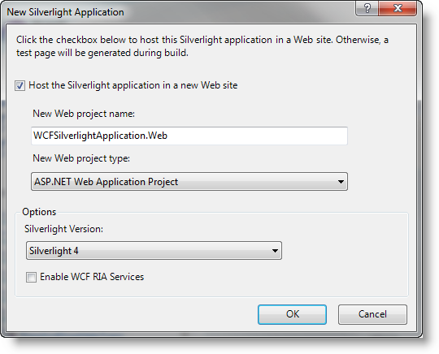
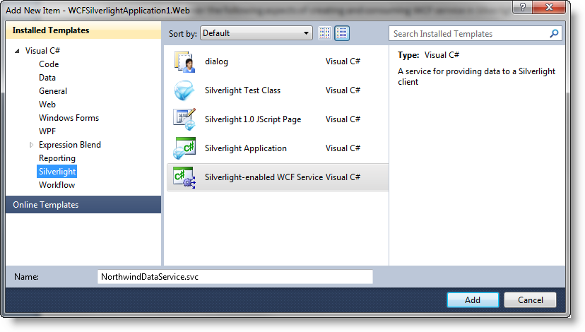
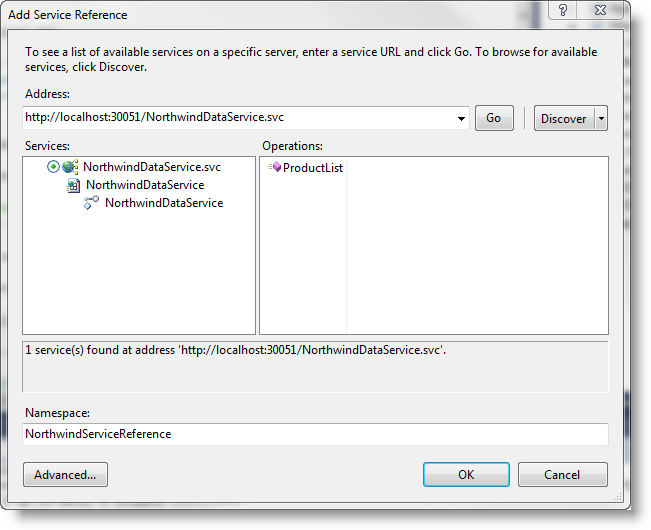
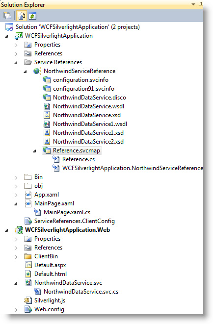
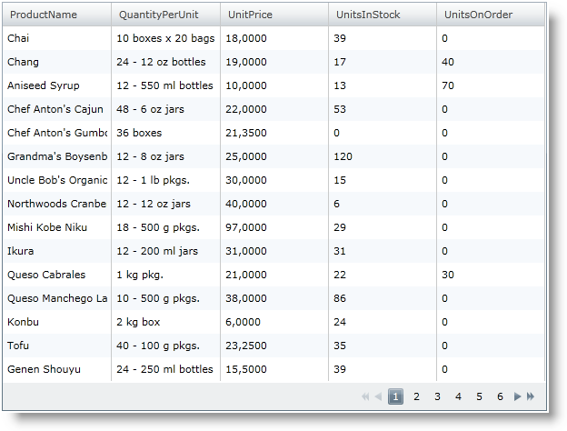

////

|metadata|
{
    "name": "generalprogrammingconcepts-creating-a-wcf-service-with-visual-studio-2010",
    "controlName": [],
    "tags": ["Application Scenarios"],
    "guid": "{98434E83-AC5C-492B-9969-B2AED68A6A48}",  
    "buildFlags": ["sl"],
    "createdOn": "2012-02-01T16:05:27.0095728Z"
}
|metadata|
////

= Creating a WCF Service with Visual Studio 2010

In this section, you'll find topics describing key programming concepts and principles.

== Creating a WCF Service with Visual Studio 2010 and populating xamGrid control with the extracted data.

== Before You Begin

For data-driven Microsoft® Silverlight™ applications, you must expose your data through a web service. Since Silverlight does not support cross-domain calls to a web service, you must either use a link:http://msdn.microsoft.com/en-us/library/cc197955(VS.95).aspx[cross-domain policy] or add the web service to the Web site or Web application project that is hosting your Silverlight application.

== What You Will Accomplish

This example will cover the following aspects of creating and consuming WCF service in Silverlight:

* Creating a Silverlight-enabled WCF Service in Visual Studio 2010\.
* Connecting to database (in this case - to Northwind sample database).
* Consuming the returned data from the service and populating a xamGrid control to visualize the result.

== Follow these Steps

== Creating Silverlight-enabled WCF Service in Visual Studio 2010

[start=1]
. Create a new Silverlight application (name it WCFSilverlightApplication).

Make sure you select the option to host the Silverlight application in a new Web site.

[start=2]
. Right click on the WCFSilverlightApplication.Web project to open the context menu and choose “Add New Item”. From the “Installed Templates” for Silverlight, choose “Silverlight-enabled WCF Service” template.

== Connecting to the Northwind sample database

[start=3]
. Add a connection string in the Web.config file located in your Web project. The connectionStrings element is a direct child of the configuration node.

*In Web.config:*

----
<connectionStrings>
    <add name="NorthwindConnectionString"          connectionString="Data Source=<Server Name>;         Initial Catalog=Northwind;         Integrated Security=True" />
</connectionStrings>
----

== Consuming the returned data from the service and populating a xamGrid control to visualize the result.

[start=4]
. If you have named your service "NorthwindDataService", Visual Studio will create two files with this name: NorthwindDataService.svc and NorthwindDataService.svc.cs. The NorthwindDataService.svc.cs file contains the service code.
[start=5]
. Change the NorthwindDataService.svc.cs file and add the following code:

*In Visual Basic:*

----
Imports System.ServiceModel
Imports System.ServiceModel.Activation
Imports System.Collections.Generic
Imports System.Data.SqlClient
Imports System.Data
Imports System.Configuration
Namespace WCFSilverlightApplication.Web
<ServiceContract([Namespace] := "")> _
<AspNetCompatibilityRequirements(RequirementsMode := AspNetCompatibilityRequirementsMode.Allowed)> _
Public Class NorthwindDataService
  <OperationContract> _
  Public Function ProductList() As List(Of Product)
    Dim products As New List(Of Product)()
    ' Get ConnectionStrings property from the application configuration
    Dim connectionStr As String = ConfigurationManager.ConnectionStrings("NorthwindConnectionString").ConnectionString
    Using connection As New SqlConnection(connectionStr)
      Const queryString As String = "SELECT ProductName, QuantityPerUnit, UnitPrice, UnitsInStock, UnitsOnOrder FROM Products"
      connection.Open()
      Using sqlCommand As New SqlCommand(queryString, connection)
        Dim reader As SqlDataReader = sqlCommand.ExecuteReader(CommandBehavior.CloseConnection)
        If reader IsNot Nothing Then
          While reader.Read()
            Dim product As New Product()
            product.ProductName = reader.GetString(0)
            product.QuantityPerUnit = reader.GetString(1)
            product.UnitPrice = reader.GetDecimal(2)
            product.UnitsInStock = reader.GetInt16(3)
            product.UnitsOnOrder = reader.GetInt16(4)
            products.Add(product)
          End While
        End If
      End Using
    End Using
    Return products
  End Function
  ' Add more operations here and mark them with <OperationContract>
End Class
Public Class Product
  Public Property ProductName() As String
    Get
      Return m_ProductName
    End Get
    Set(ByVal value As String)
      m_ProductName = Value
    End Set
  End Property
  Private m_ProductName As String
  Public Property QuantityPerUnit() As String
    Get
      Return m_QuantityPerUnit
    End Get
    Set(ByVal value As String)
      m_QuantityPerUnit = Value
    End Set
  End Property
  Private m_QuantityPerUnit As String
  Public Property UnitPrice() As Decimal
    Get
      Return m_UnitPrice
    End Get
    Set(ByVal value As Decimal)
      m_UnitPrice = Value
    End Set
  End Property
  Private m_UnitPrice As Decimal
  Public Property UnitsInStock() As Short
    Get
      Return m_UnitsInStock
    End Get
    Set(ByVal value As Short)
      m_UnitsInStock = Value
    End Set
  End Property
  Private m_UnitsInStock As Short
  Public Property UnitsOnOrder() As Short
    Get
      Return m_UnitsOnOrder
    End Get
    Set(ByVal value As Short)
      m_UnitsOnOrder = Value
    End Set
  End Property
  Private m_UnitsOnOrder As Short
    End Class
End Namespace
----

*In C#:*

----
using System.ServiceModel;
using System.ServiceModel.Activation;
using System.Collections.Generic;
using System.Data.SqlClient;
using System.Data;
using System.Configuration;
namespace WCFSilverlightApplication.Web
{
  [ServiceContract(Namespace = "")]
  [AspNetCompatibilityRequirements(RequirementsMode = AspNetCompatibilityRequirementsMode.Allowed)]
  public class NorthwindDataService
  {
    [OperationContract]
    public List<Product> ProductList()
    {
      List<Product> products = new List<Product>();
      // Get ConnectionStrings property from the application configuration
      string connectionStr = ConfigurationManager.ConnectionStrings["NorthwindConnectionString"].ConnectionString;
      using(SqlConnection connection = new SqlConnection(connectionStr))
      {
        // Create SQL query to select several columns from Product table
        const string queryString = "SELECT ProductName, QuantityPerUnit, UnitPrice, UnitsInStock, UnitsOnOrder FROM Products";
        connection.Open();
        using(SqlCommand sqlCommand = new SqlCommand(queryString, connection))            
        { 
          SqlDataReader reader = sqlCommand.ExecuteReader(CommandBehavior.CloseConnection);
          if(reader != null)
          {
            while(reader.Read())
            {
              Product product = new Product();
              product.ProductName = reader.GetString(0);
              product.QuantityPerUnit = reader.GetString(1);
              product.UnitPrice = reader.GetDecimal(2);
              product.UnitsInStock = reader.GetInt16(3);
              product.UnitsOnOrder = reader.GetInt16(4);
              products.Add(product);
             }
           }
         }
       }
       return products;
     }
     // Add more operations here and mark them with [OperationContract]
  }
  public class Product 
  {
    public string ProductName {get;set;}
    public string QuantityPerUnit {get;set;}
    public decimal UnitPrice {get;set;}
    public short UnitsInStock {get;set;}
    public short UnitsOnOrder {get;set;}
  }
}
----

[start=6]
. After you have completed the previous steps, right click on your client Silverlight project "WCFSilverlightApplication". From the context menu, choose "Add Service Reference ..." item. Click "Discover" in the "Add Service Reference" dialog box and select the NorthwindDataService.svc.

*Note:* If you change the service code implementation, you must update the service reference in the client Silverlight application. Right click on the service reference "NorthwindServiceReference" and select "Update service reference".
[start=7]
. In the Solution Explorer, add the following references to your project:

** {ApiPlatform}Controls.Grids.XamGrid.v{ProductVersion}.dll
** {ApiPlatform}v{ProductVersion}.dll

[start=8]
. Add an XML namespace declaration.

*In XAML:*

----
xmlns:ig="http://schemas.infragistics.com/xaml"
----

[start=9]
. Add a xamGrid control to visualize the data from the Product table in your Silverlight page.

*In XAML:*

----
<Grid x:Name="LayoutRoot">
  <ig:XamGrid Width="600" Height="450" x:Name="igGrid"               ColumnWidth="*" AutoGenerateColumns="True" >
    <ig:XamGrid.PagerSettings>
      <ig:PagerSettings AllowPaging="Bottom" PageSize="15" />
    </ig:XamGrid.PagerSettings>
  </ig:XamGrid>
</Grid>
----

[start=10]
. Add the following code in the page constructor after the InitializeComponent method:

*In Visual Basic:*

----
Dim client As New NorthwindDataServiceClient()
client.ProductListCompleted += New EventHandler(Of ProductListCompletedEventArgs)(serviceRef_ProductListCompleted)
client.ProductListAsync()
----

*In C#:*

----
NorthwindDataServiceClient client = new NorthwindDataServiceClient();
client.ProductListCompleted += new EventHandler<ProductListCompletedEventArgs>(serviceRef_ProductListCompleted);
client.ProductListAsync();
----

[start=11]
. Implement the ProductListCompleted's event handler named serviceRef_ProductListCompleted.

*In Visual Basic:*

----
Private Sub serviceRef_ProductListCompleted(ByVal sender As Object,                                             ByVal e As ProductListCompletedEventArgs)
Try
    igGrid.ItemsSource = e.Result
  Catch err As Exception
    MessageBox.Show("Web service error.")
End Try
End Sub
----

*In C#:*

----
void serviceRef_ProductListCompleted(object sender, ProductListCompletedEventArgs e)
{
  try
  {
    igGrid.ItemsSource = e.Result;
  }
  catch (Exception err)
  {
    MessageBox.Show("Web service error.");  
  }
}
----

[start=12]
. Save and build your application.

.Note
[NOTE]
====
You may receive an error when adding the service reference to your Silverlight project if you do not build your application first.
====

Your project structure should look similar to the screen shot below.

[start=13]
. Run the application and you will see a xamGrid control populated with data from the Northwind Product table.

