////

|metadata|
{
    "name": "generalprogrammingconcepts-using-wcf-ria-and-xamgrid",
    "controlName": [],
    "tags": ["Data Binding","Data Presentation","How Do I"],
    "guid": "72e52452-d1fc-412a-a119-2e0c20d6fc3f",  
    "buildFlags": ["sl"],
    "createdOn": "2012-02-06T14:16:14.6909709Z"
}
|metadata|
////

= Using WCF RIA and xamGrid

By following the provided steps you will bind the xamGrid to a database using link:http://go.microsoft.com/fwlink/?LinkID=169231[WCF RIA] and obtain and visualize data from it without writing a single line of code.

You will need to following pieces of software installed:

* Microsoft Visual Studio 2010/2012
* link:http://go.microsoft.com/fwlink/?LinkId=229318[Silverlight 5 Tools] (which includes WCF RIA Services)

First you will have to create a Silverlight 5 project and name it "IGRiaServicesDemo".

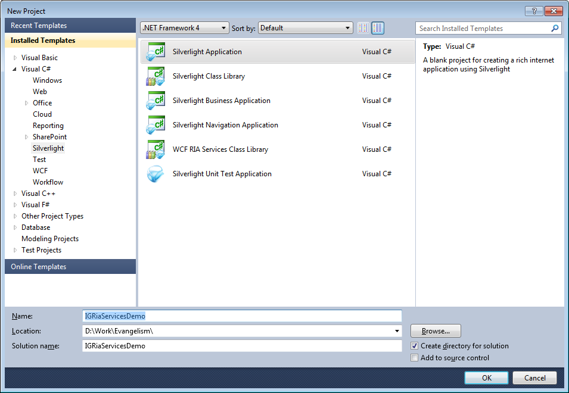

Enable the WCF RIA Services checkbox and press the OK button.

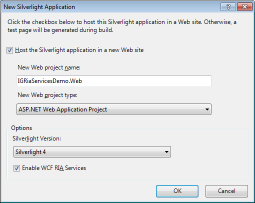

Next is to create the ADO.NET Entity classes that represent data from the Chinook database, which can be downloaded from link:http://chinookdatabase.codeplex.com/releases/view/21111[here]. In the "Solution Explorer" window, right click on the server project (IGRiaServicesDemo.Web), select "Add" and then select "New Item". The Add New Item dialog box will appear. In the categories list select "Data" and then "ADO.NET Entity Data Model". Name the new file "ChinookModel.edmx".

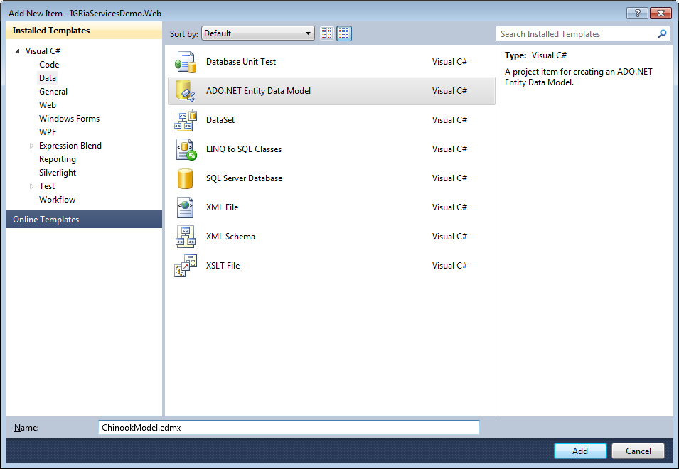

Confirm generation of the Entity Data Model from a database as shown on the screenshot below:

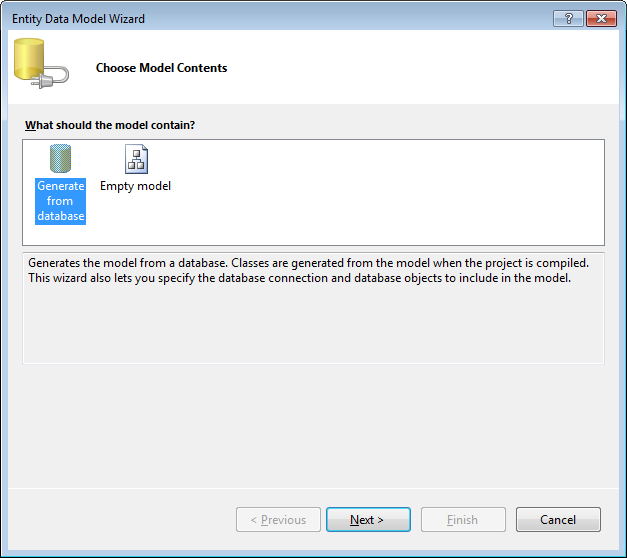

In the Choose Your Data Connection screen, create a data connection to the database:

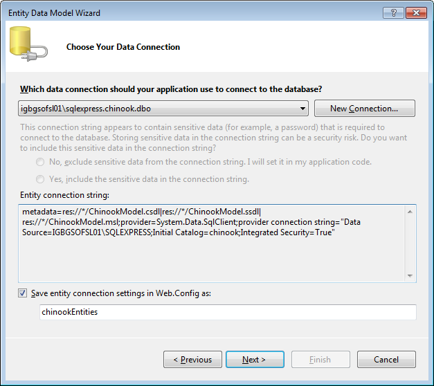

Click on the "New Connection..." button and configure as follows:

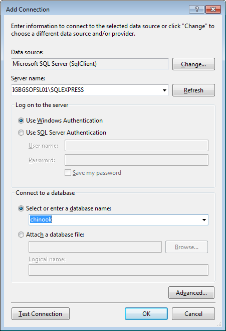

Close the dialog with "OK" and then "Next >" on the next screen.

In the "Choose Your Database Objects" screen expand the "Tables" node and then select the Customer and Employee tables. Entity models are created for the tables.

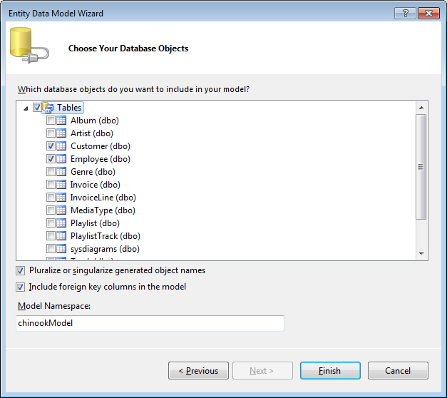

Click finish, then save and build your solution.

Add a domain service to the middle-tier project. A domain service exposes the data entities and operations in the server project to the client project. You can add business logic to the domain service to manage how the client interacts with the data.

Right-click the server project, select "Add" and then "New Item". In the list of categories, select "Web" and then select the "Domain Service Class" template. Name the class "ChinookDomainService.cs" and click "Add".

image::images/ria_09.png[]

Select the "Customer" and "Employee" entities and confirm "Enable editing" option for both tables, then press the "OK" button.

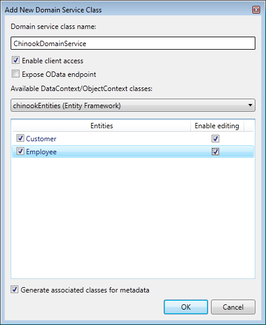

The domain service class is generated. You have to save and rebuild your solution again.

Because a RIA Services link exists between the client project and the server project, client proxy classes are generated when you build the solution. These proxy classes enable you to access the data from the client.

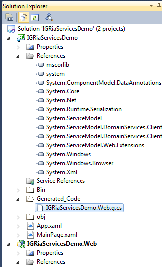

There is a hidden folder "Generated_Code", which contains a generated code file. Several classes can be found there: "WebContext", "ChinookDomainContext", "Employee" and "Customer".

Next is to set the Infragistics xamGrid as default control, bound to our Customer and Employee classes. Double click on a XAML page in the client project and a "Data Sources" dialog will appear. If it is not visible open it from the "Data" menu. In the "Data Sources" window for each table right click and select the Customize option.

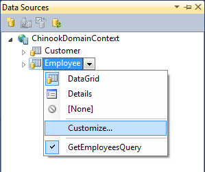

Select xamGrid and set it as a default control.

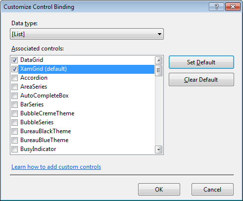

The result is the "ChinookDomainContext" instance created in the "DataSources" node in the "Solution Explorer" and now the xamGrid is the default control for Customer and Employee classes.

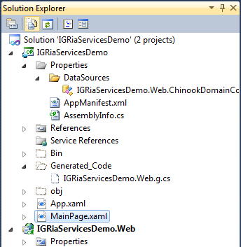

Drag the Employee class from "Data Sources" window to the layout of the Silverlight client application.

In the XAML will be added a DomainDataSource instance and xamGrid object with ItemsSource bound to this DomainDataSource.

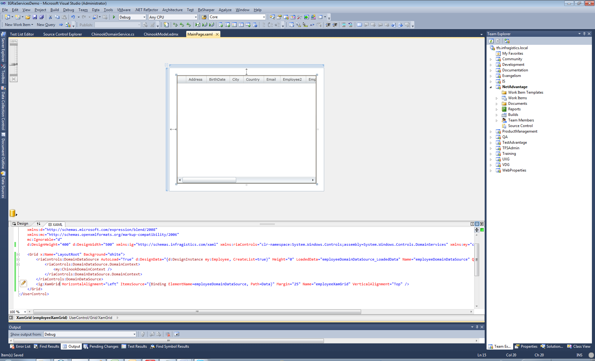

Now save and run the application:

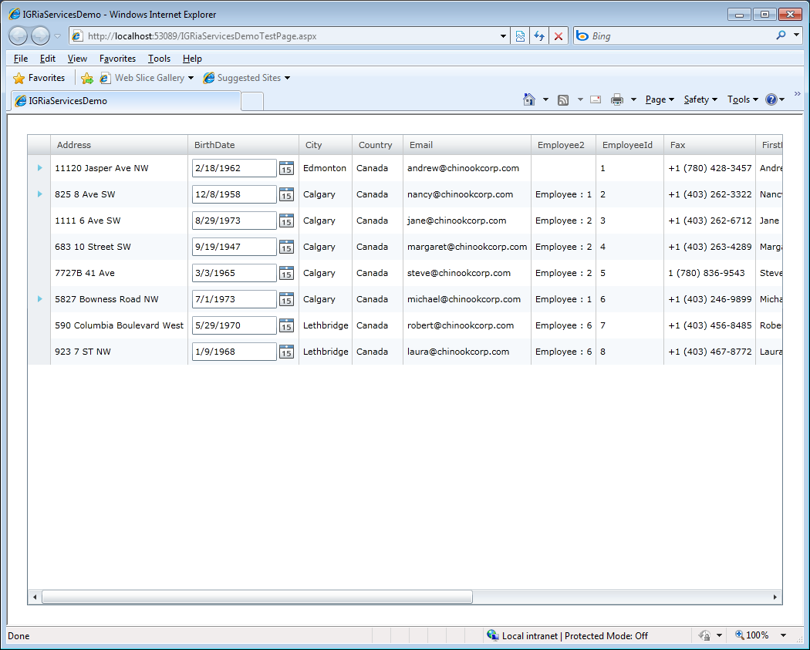