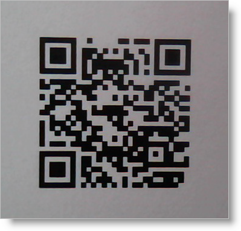
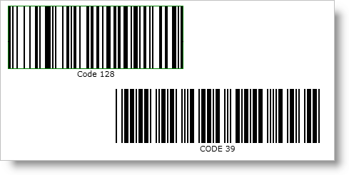
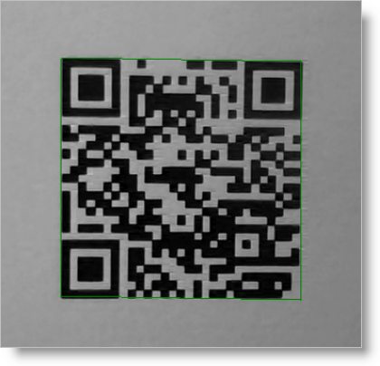

////
|metadata|
{
    "name": "ig-barcode-reader",
    "controlName": ["IG BarcodeReader","xamBarcodeReader"],
    "tags": [],
    "guid": "7a286aca-f320-4a20-8bf3-b015aa2d1caa",
	"buildFlags": [],
    "createdOn": "2016-05-25T18:21:53.6520337Z"
}
|metadata|
////

= Infragistics Barcode Reader

This topic introduces you to the Infragistics Barcode Reader™ library and explains how to work with it in C# and VB. Its properties, classes and methods are explained too, as well as the optional use of the Symbology enumeration. At the end, full code samples are provided in a separate section. The content of the topic is organized in sections as follows:

* <<introduction,Introduction>>
* <<supported_symbologies,Supported Symbologies>>
+
List of the supported symbologies.
* <<implementing_decoding,Implementing the Image Decoding Functionality>>
+
Step-by-step instructions.

** <<overview,Overview>>
** <<steps,Steps>>

* <<using_barcode_reader,Using the Infragistics Barcode Reader>>
+
Properties, classes, methods, enumeration.

** <<properties,Properties of the Barcode Reader>>

*** <<descriptions,Descriptions of the Barcode Reader Properties>>
*** <<example_settings,Example Settings of the Barcode Reader Properties>>

** <<decode_async,Multi-Threaded Image Decoding (Method DecodeAsync)>>
** <<decode_args,DecodeComplete Arguments (Class ReaderDecodeArgs)>>
** <<symbology_types,Using Enumeration for the Symbology Types>>

* <<code_samples,Code Samples>>
+
Instantiating a new Barcode Reader object and configuring its properties.

[[introduction]]
== Introduction

Infragistics Barcode Reader is a library for decoding barcodes from an image.

[[supported_symbologies]]
== Supported Symbologies

The Infragistics Barcode Reader supports the following barcode symbologies:

* link:http://en.wikipedia.org/wiki/Code_39[Code 39]
* link:http://en.wikipedia.org/wiki/Code_128[Code 128]
* link:http://en.wikipedia.org/wiki/European_Article_Number[EAN]/ link:http://en.wikipedia.org/wiki/Universal_Product_Code[UPC]:

** EAN-13
** EAN-8
** UPC-A
** UPC-E

* link:http://en.wikipedia.org/wiki/Interleaved_2_of_5[Interleaved 2 of 5]
* link:http://en.wikipedia.org/wiki/Qr_code[QR Code]

Figure 1: An example of an image containing a barcode

[[implementing_decoding]]
== Implementing the Image Decoding Functionality

[[overview]]
== Overview

[start=1]
. <<step_1,Adding the required assemblies.>>
[start=2]
. <<step_2,Adding the required namespace.>>
[start=3]
. <<step_3,Creating a new Barcode Reader instance, attaching an event handler, and starting the decoding process.>>
[start=4]
. <<step_4,Processing the decoded data.>>

[[steps]]
== Steps

The following procedure implements the image decoding functionality, that is, the capability to scan an image for a barcode(s).

[[step_1]]
[start=1]
. Add the required assemblies.
+
Add the following references to your application:

* {ApiPlatform}v{ProductVersion}.dll
* {ApiPlatform}DataVisualization.v{ProductVersion}.dll
* {ApiPlatform}Controls.Barcodes.BarcodeReader.v{ProductVersion} – Barcode Reader logic

[[step_2]]
[start=2]
. Add the required namespaces.
+
Place using/Imports in your code-behind:
+
*In Visual Basic:*
+
[source,vb]
----
Imports Infragistics.Controls.Barcodes
----
+
*In C#:*
+
[source,csharp]
----
using Infragistics.Controls.Barcodes;
----

[[step_3]]
[start=3]
. Create a new link:{ApiPlatform}controls.barcodes.barcodereader.v{ProductVersion}~infragistics.controls.barcodes.barcodereader.html[Barcode Reader instance], attach an event handler, and start the decoding process.
+
Add a new instance of the Barcode Reader in your code-behind. When the Barcode Reader decodes a barcode or finishes scanning an image, the link:{ApiPlatform}controls.barcodes.barcodereader.v{ProductVersion}~infragistics.controls.barcodes.barcodereader~decodecomplete_ev.html[DecodeComplete] event is raised as many times as barcode symbols are recognized in the image. Attach an event handler for the DecodeComplete event and then start the decoding process using either the link:{ApiPlatform}controls.barcodes.barcodereader.v{ProductVersion}~infragistics.controls.barcodes.barcodereader~decode.html[Decode] or link:{ApiPlatform}controls.barcodes.barcodereader.v{ProductVersion}~infragistics.controls.barcodes.barcodereader~decodeasync.html[DecodeAsync] (thread-safe) method.
+
*In Visual Basic:*
+
[source,vb]
----
Dim barcodeReader As New BarcodeReader()
AddHandler barcodeReader.DecodeComplete, New EventHandler(Of ReaderDecodeArgs)(AddressOf BarcodeReader_DecodeComplete)
barcodeReader.Decode(aBitmapSourceObject)
----
+
*In C#:*
+
[source,csharp]
----
BarcodeReader barcodeReader = new BarcodeReader();
barcodeReader.DecodeComplete += new EventHandler<ReaderDecodeArgs>(BarcodeReader_DecodeComplete);
barcodeReader.Decode(aBitmapSourceObject);
----

[[step_4]]
[start=4]
. Process the decoded data.
+
Handle the decoded data in the DecodeComplete event handler. Note that the DecodeComplete event is raised for every barcode symbol found in the specified image after the Barcode Reader finishes scanning the image.
+
*In Visual Basic:*
+
[source,vb]
----
Private Sub BarcodeReader_DecodeComplete(sender As Object, e As ReaderDecodeArgs)
    If e.SymbolFound Then
        Dim result As String = e.Symbology & " " & e.Value
    End If
End Sub
----
+
*In C#:*
+
[source,csharp]
----
private void BarcodeReader_DecodeComplete(object sender, ReaderDecodeArgs e)
{ 
    if (e.SymbolFound)
    {
        string result = e.Symbology + " " + e.Value;
    }
}
----

[[using_barcode_reader]]
== Using the Infragistics Barcode Reader

[[properties]]
== Properties of the Barcode Reader

[[descriptions]]
=== Descriptions of the Barcode Reader Properties

The Barcode Reader library has the following properties:

* link:{ApiPlatform}controls.barcodes.barcodereader.v{ProductVersion}~infragistics.controls.barcodes.barcodereader~maxnumberofsymbolstoread.html[MaxNumberOfSymbolsToRead] – the maximum number of barcodes that are expected on the image (-1 for all, default: 1, recommended: 1÷5)
+
When this threshold is reached, the Barcode Reader stops the decoding. A low number of barcodes for recognition will increase the application’s performance. When -1 is assigned, the Barcode Reader will retrieve symbols until all of them are found.
+
.Note
[NOTE]
====
The link:{ApiPlatform}controls.barcodes.barcodereader.v{ProductVersion}~infragistics.controls.barcodes.barcodereader~decodecomplete_ev.html[DecodeComplete] event will be raised for each decoded barcode symbology after the scanning is complete.
====
+
The picture below demonstrates a scanned image (retrieved by the FilteredImage property) with the MaxNumberOfSymbolsToRead set to 1 – only one symbol is recognized (the one with the green rectangle over it – Code 128):
+

+
Figure 2: Effect of the MaxNumberOfSymbolsToRead setting on the barcodes retrieved

* link:{ApiPlatform}controls.barcodes.barcodereader.v{ProductVersion}~infragistics.controls.barcodes.barcodereader~minsymbolsize.html[MinSymbolSize] – minimum recognizable symbol size in pixels (width and height for linear barcodes only) –(default: -1, recommended: a value proportional to the image size, e.g. 50 for an image with 500px height) 
+
The default value of -1 means that the minimum recognizable symbol size is to be calculated internally depending proportionally on the scanned image size. The lower the MinSymbolSize value, the more zones the image will be divided into (this enables recognizing of small symbols but has a negative effect on performance), the higher is just the opposite (fewer zones, symbols should be bigger, better performance). Note that if a symbols’ size in pixels is less than the specified in MinSymbolSize, the image might not be decoded.

* link:{ApiPlatform}controls.barcodes.barcodereader.v{ProductVersion}~infragistics.controls.barcodes.barcodereader~barcodeorientation.html[BarcodeOrientation] – orientation of the scanned barcodes (linear barcodes only)
+
link:{ApiPlatform}controls.barcodes.barcodereader.v{ProductVersion}~infragistics.controls.barcodes.symbolorientation.html[Valid values]:
+
--
** Horizontal
** Vertical
** Unspecified (default)
--
+
Unspecified orientation means that a barcode is to be decoded regardless of its orientation.

* link:{ApiPlatform}controls.barcodes.barcodereader.v{ProductVersion}~infragistics.controls.barcodes.barcodereader~filteredimage.html[FilteredImage] - an image with the recognized barcode symbols. (Figure 3: A filtered barcode image) Used only with the Decode method.
+

+
Figure 3: A filtered barcode image

.Note:
[NOTE]
====
The more restrictive the properties’ values are, the better the performance of the Barcode Reader will be.
====

[[example_settings]]
=== Example Settings of the Barcode Reader Properties

The following code samples demonstrate configuring the Barcode Reader properties as follows:

* maximum number of symbols to read: 3
* minimum symbol size: 20 pixels
* horizontal orientation

*In Visual Basic:*
[source,vb]
----
Dim barcodeReader As New BarcodeReader()
barcodeReader.MaxNumberOfSymbolsToRead = 3
barcodeReader.MinSymbolSize = 20
barcodeReader.BarcodeOrientation = SymbolOrientation.Horizontal
----

*In C#:*
[source,csharp]
----
BarcodeReader barcodeReader = new BarcodeReader();
barcodeReader.MaxNumberOfSymbolsToRead = 3;
barcodeReader.MinSymbolSize = 20;
barcodeReader.BarcodeOrientation = SymbolOrientation.Horizontal;
----

[[decode_async]]
== Multi-Threaded Image Decoding (Method DecodeAsync)

The link:{ApiPlatform}controls.barcodes.barcodereader.v{ProductVersion}~infragistics.controls.barcodes.barcodereader~decodeasync.html[DecodeAsync] method allows an image to be decoded thread-safely – several images can be decoded simultaneously in different threads:

*In Visual Basic:*
[source,vb]
----
Deployment.Current.Dispatcher.BeginInvoke(
    Function()
        barcodeReader.DecodeAsync(inputImage)
    End Function)
----

*In C#:*
[source,csharp]
----
Deployment.Current.Dispatcher.BeginInvoke(() =>
{
    barcodeReader.DecodeAsync(aBitmapSourceObject);
});
----

[[decode_args]]
== DecodeComplete Arguments (Class ReaderDecodeArgs)

The link:{ApiPlatform}controls.barcodes.barcodereader.v{ProductVersion}~infragistics.controls.barcodes.readerdecodeargs.html[ReaderDecodeArgs] class is passed as a parameter in the DecodeComplete event. The class contains the following information:

* link:{ApiPlatform}controls.barcodes.barcodereader.v{ProductVersion}~infragistics.controls.barcodes.readerdecodeargs~filteredimage.html[FilteredImage] – an image with the recognized barcode symbols
* link:{ApiPlatform}controls.barcodes.barcodereader.v{ProductVersion}~infragistics.controls.barcodes.readerdecodeargs~symbolfound.html[SymbolFound] – a bool argument indicating whether a barcode is found
* link:{ApiPlatform}controls.barcodes.barcodereader.v{ProductVersion}~infragistics.controls.barcodes.readerdecodeargs~symbology.html[Symbology] – the symbology of the decoded barcode symbol
* link:{ApiPlatform}controls.barcodes.barcodereader.v{ProductVersion}~infragistics.controls.barcodes.readerdecodeargs~value.html[Value] – the encoded string information in the barcode symbol

[[symbology_types]]
== Using Enumeration for the Symbology Types

The types, for which the Barcode Reader will search, can be optionally specified using the link:{ApiPlatform}controls.barcodes.barcodereader.v{ProductVersion}~infragistics.controls.barcodes.symbology.html[Symbology enumeration].

.Note:
[NOTE]
====
The Symbology enumeration has the Flags attribute, which allows combinations of values. The enumeration contains some already combined flags: Linear and All.
====

* Unspecified – symbology is not specified, search for all
* Code39
* Code39Ext – Code 39 Extended.
* Code128
* Ean13
* Ean8
* UpcA
* UpcE
* EanUpc – family of UPC-A, UPC-E, EAN-8, EAN-13 symbologies.
* Interleaved2Of5
* QRCode
* Linear (Code39Ext | Code128 | EanUpc | Interleaved2Of5) – all supported linear symbologies.
* All (Linear | QRCode) – all supported symbologies.

The following example specifies the Code39 and Code128 enums:

*In Visual Basic:*
[source,vb]
----
Dim symbologyTypes As Symbology = Symbology.Code39 Or Symbology.Code128
barcodeReader.Decode(aBitmapSourceObject, symbologyTypes)
----

*In C#:*
[source,csharp]
----
Symbology symbologyTypes = Symbology.Code39 | Symbology.Code128;
barcodeReader.Decode(aBitmapSourceObject, symbologyTypes);
----

[[code_samples]]
== Code Samples

Below is the complete code used in the examples. The sample demonstrates how to instantiate a new Barcode Reader object and configuring its properties. The Barcode Reader in the sample will scan up to three Code 39 or Code 128 symbols with a minimum size of 200 pixels, with horizontal orientation.

*In Visual Basic:*
[source,vb]
----
Private Sub ButtonDecode_Click(sender As Object, e As RoutedEventArgs)
    Dim barcodeReader As New BarcodeReader()
    barcodeReader.MaxNumberOfSymbolsToRead = 3
    barcodeReader.MinSymbolSize = 200
    barcodeReader.BarcodeOrientation = SymbolOrientation.Horizontal
    AddHandler barcodeReader.DecodeComplete, New EventHandler(Of ReaderDecodeArgs)(AddressOf BarcodeReader_DecodeComplete)
    Dim symbologyTypes As Symbology = Symbology.Code39 Or Symbology.Code128
    barcodeReader.Decode(aBitmapSourceObject, symbologyTypes)
End Sub
Private Sub BarcodeReader_DecodeComplete(sender As Object, e As ReaderDecodeArgs)
    If e.SymbolFound Then
        Dim result As String = e.Symbology & “ “ & e.Value
    End If
End Sub
----

*In C#:*
[source,csharp]
----
void ButtonDecode_Click(object sender, RoutedEventArgs e)
{
    BarcodeReader barcodeReader = new BarcodeReader();
    barcodeReader.MaxNumberOfSymbolsToRead = 3;
    barcodeReader.MinSymbolSize = 200;
    barcodeReader.BarcodeOrientation = SymbolOrientation.Horizontal;
    barcodeReader.DecodeComplete += new        EventHandler<ReaderDecodeArgs>(BarcodeReader_DecodeComplete);
    Symbology symbologyTypes = Symbology.Code39 | Symbology.Code128;
    barcodeReader.Decode(aBitmapSourceObject, symbologyTypes);
}
void BarcodeReader_DecodeComplete(object sender, ReaderDecodeArgs e)
{
    if(e.SymbolFound)
    {
        string result = e.Symbology + “ “ + e.Value;
    }
}
----

*Related Topic*

link:ig-barcodereader-api-overview.html[API Overview]