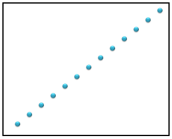

////

|metadata|
{
    "name": "ig-calculators-correlation-calculator",
    "controlName": ["IG Math Calculators"],
    "tags": ["Calculations"],
    "guid": "793d922f-6a63-4534-8095-e718597fc689",  
    "buildFlags": [],
    "createdOn": "2016-05-25T18:21:53.7190366Z"
}
|metadata|
////

= Infragistics Correlation Calculator

This topic introduces the link:{ApiPlatform}math.calculators.v{ProductVersion}~infragistics.math.calculators.correlationcalculator.html[CorrelationCalculator] which is part of the link:{ApiPlatform}math.calculators.v{ProductVersion}~infragistics.math.calculators_namespace.html[Infragistics Math Calculators]™ library and explains, with code examples, how to use it to calculate correlation between two variables in a data set.

== Overview

The topic is organized as follows:

* <<Introduction,Introduction>>
* <<CorrelationFormula,Correlation Formula>>
* <<TypesofDataCorrelation,Types of Data Correlation>>
* <<CorrelationCalculatorProperties,Correlation Calculator Properties>>
* <<Requirements,Requirements>>

** Assembly Requirements
** Data Requirements

* <<Example,Example>>
* <<RelatedTopics,Related Topics>>

== Introduction

In statistic, data correlation is often referred to as Pearson's product-moment correlation coefficient (PPMCC). Correlation is used to measure a linear association between two variables in a data set. Furthermore, it indicates the degree of linear relationship between these variables. The Correlation coefficient is calculated using the CorrelationCalculator class.

== Correlation Formula

Correlation coefficient is derived by dividing the covariance of the two variables by the product of their standard deviations:

image::images/IG_Math_Correlation_Calculators_01.png[]

where

Figure 1 – Formula for Data Correlation

[cols="a"]
|====
|Legend

|image::images/IG_Math_Correlation_Calculators_04.png[]
|- Represents the correlation between X and Y variable in a data set

|image::images/IG_Math_Correlation_Calculators_05.png[]
|- Represents the covariance of X and Y variables in a data set

|image::images/IG_Math_Correlation_Calculators_06.png[]
|- Represents the standard deviations of X variables in a data set

|image::images/IG_Math_Correlation_Calculators_07.png[]
|- Represents the standard deviations of Y variables in a data set

|image::images/IG_Math_Correlation_Calculators_08.png[]
|- Represents the mean of X variables in a data set

|image::images/IG_Math_Correlation_Calculators_09.png[]
|- Represents the mean of Y variables in a data set

|image::images/IG_Math_Correlation_Calculators_10.png[]
|- Represents the X variable at the i index in a data set

|image::images/IG_Math_Correlation_Calculators_11.png[]
|- Represents the Y variable at the i index in a data set

|image::images/IG_Math_Correlation_Calculators_12.png[]
|- Represents the total count of numbers in a data set

|====

== Types of Data Correlation

The correlation coefficient ranges between positive one and negative one. The closer the coefficient is to either −1 or 1, the stronger the relationship between the variables in a data set. In a perfect positive (increasing) relationship, the correlation is +1. It’s −1 with a perfect decreasing (negative) linear relationship and a value between −1 and 1 in all other cases. As the correlation approaches zero there is less of a relationship between the variables in a data set.

Table 1 – Types of Data Correlation

[options="header", cols="a,a,a"]
|====
|Correlation Type|Negative Correlation|Positive Correlation

|None
|Range: -0.1 to 0.0 

|Range: 0.0 to 0.1 

|Low
|Range: -0.3 to -0.1 

|Range: 0.1 to 0.3 

|Medium
|Range: -0.5 to -0.3 

|Range: 0.3 to 0.5 

|High
|Range: -1.0 to -0.5 

|Range: 0.5 to 1.0 

|====

== Correlation Calculator Properties

This section provides a list of properties of the CorrelationCalculator object.

[options="header", cols="a,a,a"]
|====
|Property Name|Property Type|Description

|ItemsSource
| link:http://msdn.microsoft.com/en-us/library/system.collections.ienumerable.aspx[IEnumerable]
|Gets or sets the data items source for the calculator.

|XMemberPath
|string
|Gets or sets the X member path of a data item.

|YMemberPath
|string
|Gets or sets the Y member path of a data item.

|Value
|double
|Gets the value of data correlation.

|====

== Requirements

== Assembly Requirements

In order to use the CorrelationCalculator, the following assemblies must to be added to a {PlatformName} project.

[options="header", cols="a,a"]
|====
|Assembly|Description

|{ApiPlatform}Math.Calculators.v{ProductVersion}.dll
|{ProductName} assembly containing mathematical calculators to compute correlation, mean, median, variance and many more mathematical values.

|{ApiPlatform}Math.v{ProductVersion}.dll
|{ProductName} assembly containing standard mathematical constants and all-purpose mathematical functions designed to act on a variety of mathematical objects.

|{ApiPlatform}v{ProductVersion}.dll
|{ProductName} assembly containing shared functionality used by the Infragistics assemblies.

|====

== Data Requirements

The CorrelationCalculator uses ItemsSource property for data binding and XMemberPath and YMemberPath properties for data mapping. Any object that meets the following requirements can be bound to this property:

* The data model must implement link:http://msdn.microsoft.com/en-us/library/system.collections.ienumerable.aspx[IEnumerable] interface (e.g. link:http://msdn.microsoft.com/en-us/library/6sh2ey19.aspx[List], link:http://msdn.microsoft.com/en-us/library/ms132397.aspx[Collection], link:http://msdn.microsoft.com/en-us/library/7977ey2c.aspx[Queue], link:http://msdn.microsoft.com/en-us/library/system.collections.stack.aspx[Stack])
* The data model must contain items that have at least two numeric data columns for calculating the correlation between them.

An example of object that meets above criteria is the CorrelationDataSample which you can download from the link:resources-correlationdatasample.html[Correlation Data Sample] resource and use it in your project.

== Example

This example demonstrates how to calculate correlation between two variables in a set of data using the CorrelationCalculator. The CorrelationCalculator is a non-visual element and it should be defined in resources section on application, page, or control level, the same way as you would define a data source. Refer also to the link:datachart-series-data-correlation.html[Series Data Correlation] topic for example on how to integrate the link:{ApiPlatform}math.calculators.v{ProductVersion}~infragistics.math.calculators.correlationcalculator.html[CorrelationCalculator] with the link:datachart-datachart.html[xamDataChart]™ control.

.Note:
[NOTE]
====
The following example assumes that you added all required assemblies for the link:{ApiPlatform}math.calculators.v{ProductVersion}~infragistics.math.calculators.correlationcalculator.html[CorrelationCalculator] and the link:resources-correlationdatasample.html[Correlation Data Sample] object as data source in your project.
====

ifdef::wpf[]

*In XAML:*

----
xmlns:ig="http://schemas.infragistics.com/xaml"
xmlns:local="clr-namespace:Infragistics.Samples.Data.Models.Series"
----

endif::wpf[]

*In XAML:*

----
<local:CorrelationDataSample x:Key="Data"/>
<ig:CorrelationCalculator x:Key="CorrelationCalc" 
                          XMemberPath="X" YMemberPath="Y" 
                          ItemsSource="{StaticResource Data}">
</ig:CorrelationCalculator>
----

*In Visual Basic:*

----
Imports Infragistics.Samples.Data.Models.Series
Imports Infragistics.Math.Calculators
'...
Dim data As New CorrelationDataSample()
Dim correlationCalc As New CorrelationCalculator()
correlationCalc.ItemsSource = data
correlationCalc.XMemberPath = "X"
correlationCalc.YMemberPath = "Y"
Dim correlation As Double = correlationCalc.Value
----

*In C#:*

----
using Infragistics.Samples.Data.Models.Series;
using Infragistics.Math.Calculators;
//...
CorrelationDataSample data = new CorrelationDataSample();
CorrelationCalculator correlationCalc = new CorrelationCalculator();
correlationCalc.ItemsSource = data;
correlationCalc.XMemberPath = "X";
correlationCalc.YMemberPath = "Y";
double correlation = correlationCalc.Value;
----

== Related Topics

* link:ig-math-calculators-api-overview.html[API Overview]
* link:datachart-series-data-correlation.html[Series Data Correlation]
* link:datachart-series-value-overlay.html[Value Overlay]