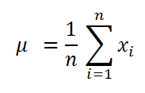

////

|metadata|
{
    "name": "ig-calculators-mean-calculator",
    "controlName": ["IG Math Calculators"],
    "tags": ["Calculations"],
    "guid": "9d36f23b-fb67-422a-b816-a9e834b54242",  
    "buildFlags": [],
    "createdOn": "2016-05-25T18:21:53.7400401Z"
}
|metadata|
////

= Infragistics Mean Calculator

This topic introduces the link:{ApiPlatform}math.calculators{ApiVersion}~infragistics.math.calculators.meancalculator.html[MeanCalculator] which is part of the link:{ApiPlatform}math.calculators{ApiVersion}~infragistics.math.calculators_namespace.html[Infragistics Math Calculators]™ library and explains, with code examples, how to use it to calculate mean for a set of numbers.

== Overview

The topic is organized as follows:

* <<Introduction,Introduction>>
* <<MeanFormula,Mean Formula>>
* <<Properties,Mean Calculator Properties>>
* <<Requirements,Requirements>>

** Assembly Requirements
** Data Requirements

* <<Example,Example>>
* <<RelatedTopics,Related Topics>>

== Introduction

Mean is a mathematical calculation used to determine the “typical” or “average” value of a set of numbers. Mean is one of the measures of central tendency; the others are mode and median (refer to the Infragistics Median Calculator topic).

== Mean Formula

Mean value is computed by taking the sum of the numbers in a set of data divided by the total count of numbers in the set.

Figure 1 – Formula for Mean Calculation

[cols="a"]
|====
|Legend

|image::images/IG_Math_Mean_Calculators_02.png[]
|- Represents the mean of a data set

|image::images/IG_Math_Mean_Calculators_03.png[]
|- Represents a variable at the i index of a data set

|image::images/IG_Math_Mean_Calculators_04.png[]
|- Represents the total count of numbers in a data set

|====

== Mean Calculator Properties

This section provides a list of properties of the link:{ApiPlatform}math.calculators{ApiVersion}~infragistics.math.calculators.meancalculator.html[MeanCalculator] class.

[options="header", cols="a,a,a"]
|====
|Property Name|Property Type|Description

|ItemsSource
| link:http://msdn.microsoft.com/en-us/library/system.collections.ienumerable.aspx[IEnumerable]
|Gets or sets the source of data items for the calculator.

|ValueMemberPath
|string
|Gets or sets the Value member path of a data item. This property must be mapped to a name of numeric property of a data item.

|Value
|double
|Gets the value of mean of a data items bound to the ItemsSource property of the calculator.

|====

== Requirements

== Assembly Requirements

In order to use the link:{ApiPlatform}math.calculators{ApiVersion}~infragistics.math.calculators.meancalculator.html[MeanCalculator], the following assemblies must be added to a {PlatformName} project.

[options="header", cols="a,a"]
|====
|Assembly|Description

|{ApiPlatform}Math.Calculators.v{ProductVersion}.dll
|{ProductName} assembly containing mathematical calculators to compute correlation, mean, median, variance and many more mathematical values.

|{ApiPlatform}Math.v{ProductVersion}.dll
|{ProductName} assembly containing standard mathematical constants and all-purpose mathematical functions designed to act on a variety of mathematical objects.

|{ApiPlatform}v{ProductVersion}.dll
|{ProductName} assembly containing shared functionality used by the Infragistics assemblies.

|====

== Data Requirements

The link:{ApiPlatform}math.calculators{ApiVersion}~infragistics.math.calculators.meancalculator.html[MeanCalculator] uses ItemsSource property for data binding and ValueMemberPath property for data mapping. Any object that meets the following requirements can be bound to this property:

* The data model must implement link:http://msdn.microsoft.com/en-us/library/system.collections.ienumerable.aspx[IEnumerable] interface (e.g. link:http://msdn.microsoft.com/en-us/library/6sh2ey19.aspx[List], link:http://msdn.microsoft.com/en-us/library/ms132397.aspx[Collection], link:http://msdn.microsoft.com/en-us/library/7977ey2c.aspx[Queue], link:http://msdn.microsoft.com/en-us/library/system.collections.stack.aspx[Stack])
* The data model must contain items that have at least one numeric data column for calculating the mean value.

An example of object that meets above criteria is presented in the following code snippet:

*In Visual Basic:*

----
Imports System.Collections.Generic
'...
Public Class DataPointList
    Inherits List(Of DataPoint)
    Public Sub New(dataValues As IEnumerable(Of Double))
        For Each value As Double In dataValues
            Me.Add(New DataPoint() With { Key .Value = value })
        Next
    End Sub
End Class
Public Class DataPoint
    Public Property Value() As Double
        Get
            Return _value
        End Get
        Set
            _value = Value
        End Set
    End Property
    Private _value As Double
End Class
----

*In C#:*

----
using System.Collections.Generic;
//...
public class DataPointList : List<DataPoint>
{
    public DataPointList(IEnumerable<double> dataValues)
    {
        foreach (double value in dataValues)
        {
            this.Add(new DataPoint { Value = value});
        }
    }
}
public class DataPoint
{
    public double Value { get; set; }
}
----

== Example

This example demonstrates how to calculate mean value for a set of numbers using the MeanCalculator. The MeanCalculator is a non-visual element and it should be defined in resources section on application, page, control level, or in code-behind, the same way as you would define a data source or a variable. Refer also to the link:datachart-series-value-overlay.html[Value Overlay] topic for examples on how to integrate the MeanCalculator with the link:datachart-datachart.html[xamDataChart]™ control.

.Note:
[NOTE]
====
The following example assumes that you added all required assemblies for the in your project.
====

*In Visual Basic:*

----
Imports Infragistics.Math.Calculators
'...
Dim data As New DataPointList(New List(Of Double)() From {     5.0, 1.0, 2.0, 3.0, 4.0 })
Dim calculator As New MeanCalculator()
calculator.ValueMemberPath = "Value"
calculator.ItemsSource = data
Dim mean As Double = calculator.Value ' mean equals 3
----

*In C#:*

----
using Infragistics.Math.Calculators;
//...
DataPointList data = new DataPointList(new List<double> { 5.0, 1.0, 2.0, 3.0, 4.0 });
MeanCalculator calculator = new MeanCalculator();
calculator.ValueMemberPath = "Value";
calculator.ItemsSource = data;
double mean = calculator.Value; // mean equals 3
----

== Related Topics

* link:ig-math-calculators-api-overview.html[API Overview]
* link:datachart-series-value-overlay.html[Value Overlay]