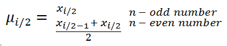

////

|metadata|
{
    "name": "ig-calculators-median-calculator",
    "controlName": ["IG Math Calculators"],
    "tags": ["Calculations"],
    "guid": "5eb9e307-86ae-4141-ae0b-2ed3e898ea2e",  
    "buildFlags": [],
    "createdOn": "2016-05-25T18:21:53.7510397Z"
}
|metadata|
////

= Infragistics Median Calculator

This topic introduces the link:{ApiPlatform}math.calculators{ApiVersion}~infragistics.math.calculators.mediancalculator.html[MedianCalculator] which is part of the link:{ApiPlatform}math.calculators{ApiVersion}~infragistics.math.calculators_namespace.html[Infragistics Math Calculators]™ library and explains, with code examples, how to use it to calculate median for a set of numbers.

== Overview

The topic is organized as follows:

* <<Introduction,Introduction>>
* <<MedianFormula,Median Formula>>
* <<Properties,Median Calculator Properties>>
* <<Requirements,Requirements>>

** Assembly Requirements
** Data Requirements

* <<Example,Example>>
* <<RelatedTopics,Related Topics>>

== Introduction

Median is a mathematical calculation used to determine the “midpoint” of the data set and is not as sensitive to outliers as the mean calculation. In other words, it is less affected by a few very high or very low values in the data set. Half of the values in the set of data fall above the median and half fall below it. Median is one the measures of central tendency where other calculations include Mode and Mean (refer to the Infragistics Mean Calculator topic).

== Median Formula

Median is computed by sorting a set of numbers and returning the middle number if there is an odd number of data points in the set. If there is an even number of data points in the set, the median is the average of the two middle data points when they are sorted (either in ascending or descending order).

Figure 1 – Formula for Median Calculation

[cols="a"]
|====
|Legend

|image::images/IG_Math_Median_Calculators_02.png[]
|- Represents the median of a data set

|image::images/IG_Math_Median_Calculators_03.png[]
|- Represents a variable at the i index of a sorted data set

|image::images/IG_Math_Median_Calculators_04.png[]
|- Represents a variable at the middle index of a sorted data set

|image::images/IG_Math_Median_Calculators_05.png[]
|- Represents the total count of numbers in a data set

|====

== Median Calculator Properties

This section provides a list of properties of the link:{ApiPlatform}math.calculators{ApiVersion}~infragistics.math.calculators.mediancalculator.html[MedianCalculator] class.

[options="header", cols="a,a,a"]
|====
|Property Name|Property Type|Description

|ItemsSource
| link:http://msdn.microsoft.com/en-us/library/system.collections.ienumerable.aspx[IEnumerable]
|Gets or sets the source of data items for the calculator.

|ValueMemberPath
|string
|Gets or sets the Value member path of a data item. This property must be mapped to a name of numeric property of a data item.

|Value
|double
|Gets the value of median of a data items bound to the ItemsSource property of the calculator.

|====

== Requirements

== Assembly Requirements

In order to use the link:{ApiPlatform}math.calculators{ApiVersion}~infragistics.math.calculators.mediancalculator.html[MedianCalculator], the following assemblies must to be added to a {PlatformName} project.

[options="header", cols="a,a"]
|====
|Assembly|Description

|{ApiPlatform}Math.Calculators.{DllVersion}dll
|{ProductName} assembly containing mathematical calculators to compute correlation, median, variance and many more mathematical values.

|{ApiPlatform}Math.{DllVersion}dll
|{ProductName} assembly containing standard mathematical constants and all-purpose mathematical functions designed to act on a variety of mathematical objects.

|{ApiPlatform}{DllVersion}dll
|{ProductName} assembly containing shared functionality used by the Infragistics assemblies.

|====

== Data Requirements

The MedianCalculator uses ItemsSource property for data binding and ValueMemberPath property for data mapping. Any object that meets the following requirements can be bound to this property:

* The data model must implement link:http://msdn.microsoft.com/en-us/library/system.collections.ienumerable.aspx[IEnumerable] interface (e.g. link:http://msdn.microsoft.com/en-us/library/6sh2ey19.aspx[List], link:http://msdn.microsoft.com/en-us/library/ms132397.aspx[Collection], link:http://msdn.microsoft.com/en-us/library/7977ey2c.aspx[Queue], link:http://msdn.microsoft.com/en-us/library/system.collections.stack.aspx[Stack])
* The data model must contain items that have at least one numeric data column for calculating the Median value.

An example of object that meets above criteria is presented in the following code snippet:

*In Visual Basic:*

----
Imports System.Collections.Generic
'...
Public Class DataPointList
    Inherits List(Of DataPoint)
    Public Sub New(dataValues As IEnumerable(Of Double))
        For Each value As Double In dataValues
            Me.Add(New DataPoint() With { Key .Value = value })
        Next
    End Sub
End Class
Public Class DataPoint
    Public Property Value() As Double
        Get
            Return _value
        End Get
        Set
            _value = Value
        End Set
    End Property
    Private _value As Double
End Class
----

*In C#:*

----
using System.Collections.Generic;
//...
public class DataPointList : List<DataPoint>
{
    public DataPointList(IEnumerable<double> dataValues)
    {
        foreach (double value in dataValues)
        {
            this.Add(new DataPoint { Value = value});
        }
    }
}
public class DataPoint
{
    public double Value { get; set; }
}
----

== Example

This example demonstrates how to calculate Median value for a set of numbers using the MedianCalculator. The MedianCalculator is a non-visual element and it should be defined in resources section on application, page, control level, or in code-behind, the same way as you would define a data source or a variable. Refer also to the link:datachart-series-value-overlay.html[Value Overlay] topic for examples on how to integrate the MedianCalculator with the link:datachart-datachart.html[xamDataChart]™ control.

.Note:
[NOTE]
====
The following example assumes that you added all required assemblies for the in your project.
====

*In Visual Basic:*

----
Imports Infragistics.Math.Calculators
'...
Dim data As New DataPointList(New List(Of Double)() From {     5.0, 1.0, 2.0, 3.0, 4.0 })
Dim calculator As New MedianCalculator()
calculator.ValueMemberPath = "Value"
calculator.ItemsSource = data
Dim median As Double = calculator.Value ' median equals 3
----

*In C#:*

----
using Infragistics.Math.Calculators;
//...
DataPointList data = new DataPointList(new List<double> { 5.0, 1.0, 2.0, 3.0, 4.0 });
MedianCalculator calculator = new MedianCalculator();
calculator.ValueMemberPath = "Value";
calculator.ItemsSource = data;
double median = calculator.Value; // median equals 3
----

== Related Topics

* link:ig-math-calculators-api-overview.html[API Overview]
* link:datachart-series-value-overlay.html[Value Overlay]