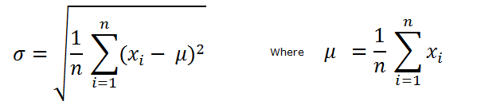

////

|metadata|
{
    "name": "ig-calculators-standard-deviation-calculator",
    "controlName": ["IG Math Calculators"],
    "tags": ["Calculations"],
    "guid": "597a2636-b8c2-4f49-a663-a3bd68542d1a",  
    "buildFlags": [],
    "createdOn": "2016-05-25T18:21:53.7640395Z"
}
|metadata|
////

= Infragistics Standard Deviation Calculator

This topic introduces the link:{ApiPlatform}math.calculators{ApiVersion}~infragistics.math.calculators.standarddeviationcalculator.html[StandardDeviationCalculator] which is part of the link:{ApiPlatform}math.calculators{ApiVersion}~infragistics.math.calculators_namespace.html[Infragistics Math Calculators]™ library and explains, with code examples, how to use it to calculate link:http://en.wikipedia.org/wiki/Standard_deviation#With_sample_standard_deviation[population standard deviation] for a set of numbers.

== Overview

The topic is organized as follows:

* <<Introduction,Introduction>>
* <<StandardDeviationFormula,Standard Deviation Formula>>
* <<StandardDeviationCalculatorProperties,Standard Deviation Calculator Properties>>
* <<Requirements,Requirements>>

** Assembly Requirements
** Data Requirements

* <<Example,Example>>
* <<RelatedTopics,Related Topics>>

== Introduction

link:http://en.wikipedia.org/wiki/Standard_deviation#With_sample_standard_deviation[Standard deviation] is a measure of dispersion of a data set around the mean. The standard deviation calculation is used to show how much difference there is from the average of values (mean). High value of standard deviation indicates the numbers in a data set are spread out over a large range of values while low standard deviation tells that the numbers tend to be near the mean of the data set.

== Standard Deviation Formula

Standard deviation is computed by taking square root of the sum of squared differences between the variables and the mean (refer to the link:ig-calculators-mean-calculator.html[Infragistics Mean Calculator] topic) divided by the total count of numbers in the data set. Also, standard deviation is equal to square root of the link:http://en.wikipedia.org/wiki/Variance[variance] (refer to the link:ig-calculators-variance-calculator.html[Infragistics Variance Calculator] topic) of the set of numbers.

Figure 1 – Formula for Standard Deviation Calculation

[cols="a,a"]
|====
|Legend
|Description

|image::images/IG_Math_Std_Deviation_Calculators_02.png[]
|Represents the standard deviation of a data set

|image::images/IG_Math_Std_Deviation_Calculators_03.png[]
|Represents the mean of a data set

|image::images/IG_Math_Std_Deviation_Calculators_04.png[]
|Represents a variable at the i index in a data set

|image::images/IG_Math_Std_Deviation_Calculators_05.png[]
|Represents the total count of numbers in a data set

|====

== Standard Deviation Calculator Properties

This section provides a list of properties of the link:{ApiPlatform}math.calculators{ApiVersion}~infragistics.math.calculators.standarddeviationcalculator.html[StandardDeviationCalculator] class.

[options="header", cols="a,a,a"]
|====
|Property Name|Property Type|Description

|ItemsSource
| link:http://msdn.microsoft.com/en-us/library/system.collections.ienumerable.aspx[IEnumerable]
|Gets or sets the source of data items for the calculator.

|ValueMemberPath
|string
|Gets or sets the Value member path of a data item. This property must be mapped to a name of numeric property of a data item.

|Value
|double
|Gets the value of standard deviation of a data items bound to the ItemsSource property of the calculator.

|====

== Requirements

== Assembly Requirements

In order to use the link:{ApiPlatform}math.calculators{ApiVersion}~infragistics.math.calculators.standarddeviationcalculator.html[StandardDeviationCalculator], the following assemblies must to be added to a {PlatformName} project.

[options="header", cols="a,a"]
|====
|Assembly|Description

|{ApiPlatform}Math.Calculators{ApiVersion}.dll
|{ProductName} assembly containing mathematical calculators to compute correlation, mean, median, standard deviation, standard deviation and many more mathematical values.

|{ApiPlatform}Math{ApiVersion}.dll
|{ProductName} assembly containing standard mathematical constants and all-purpose mathematical functions designed to act on a variety of mathematical objects.

|{ApiPlatform}{ApiVersion}dll
|{ProductName} assembly containing shared functionality used by the Infragistics assemblies.

|====

== Data Requirements

The link:{ApiPlatform}math.calculators{ApiVersion}~infragistics.math.calculators.standarddeviationcalculator.html[StandardDeviationCalculator] uses ItemsSource property for data binding and ValueMemberPath property for data mapping. Any object that meets the following requirements can be bound to this property:

* The data model must implement link:http://msdn.microsoft.com/en-us/library/system.collections.ienumerable.aspx[IEnumerable] interface (e.g. link:http://msdn.microsoft.com/en-us/library/6sh2ey19.aspx[List], link:http://msdn.microsoft.com/en-us/library/ms132397.aspx[Collection], link:http://msdn.microsoft.com/en-us/library/7977ey2c.aspx[Queue], link:http://msdn.microsoft.com/en-us/library/system.collections.stack.aspx[Stack])
* The data model must contain items that have at least one numeric data column for calculating the standard deviation.

An example of object that meets above criteria is presented in the following code snippet:

*In Visual Basic:*

----
Imports System.Collections.Generic
'...
Public Class DataPointList
    Inherits List(Of DataPoint)
    Public Sub New(dataValues As IEnumerable(Of Double))
        For Each value As Double In dataValues
            Me.Add(New DataPoint() With { Key .Value = value })
        Next
    End Sub
End Class
Public Class DataPoint
    Public Property Value() As Double
        Get
            Return _value
        End Get
        Set
            _value = Value
        End Set
    End Property
    Private _value As Double
End Class
----

*In C#:*

----
using System.Collections.Generic;
//...
public class DataPointList : List<DataPoint>
{
    public DataPointList(IEnumerable<double> dataValues)
    {
        foreach (double value in dataValues)
        {
            this.Add(new DataPoint { Value = value});
        }
    }
}
public class DataPoint
{
    public double Value { get; set; }
}
----

== Example

This example demonstrates how to calculate standard deviation for a set of numbers using the StandardDeviationCalculator. The StandardDeviationCalculator is a non-visual element and it should be defined in resources section on application, page, control level, or in code-behind, the same way as you would define a data source or a variable. Refer also to the link:datachart-series-error-bars.html[Series Error Bars] topic for examples on how to integrate the StandardDeviationCalculator with the link:datachart-datachart.html[xamDataChart]™ control in order to calculate error bars for Series objects.

.Note:
[NOTE]
====
The following example assumes that you added all required assemblies for the in your project.
====

*In Visual Basic:*

----
Imports Infragistics.Math.Calculators
'...
Dim data As New DataPointList(New List(Of Double)() From { 5.0, 1.0, 2.0, 3.0, 4.0 })
Dim calculator As New StandardDeviationCalculator()
calculator.ValueMemberPath = "Value"
calculator.ItemsSource = data
Dim standardDeviation As Double = calculator.Value
----

*In C#:*

----
using Infragistics.Math.Calculators;
//...
DataPointList data = new DataPointList(new List<double> { 5.0, 1.0, 2.0, 3.0, 4.0 });
StandardDeviationCalculator calculator = new StandardDeviationCalculator();
calculator.ValueMemberPath = "Value";
calculator.ItemsSource = data;
double standardDeviation = calculator.Value;
----

== Related Topics

* link:ig-math-calculators-api-overview.html[API Overview]
* link:ig-calculators-variance-calculator.html[Infragistics Variance Calculator]
* link:datachart-series-error-bars.html[Series Error Bars]
* link:datachart-series-value-overlay.html[Value Overlay]