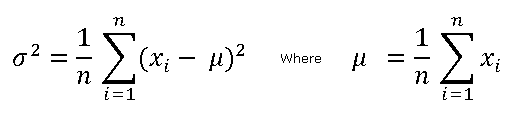

////

|metadata|
{
    "name": "ig-calculators-variance-calculator",
    "controlName": ["IG Math Calculators"],
    "tags": ["Calculations"],
    "guid": "029731c3-fc67-4fac-bebd-d124ca66e7f7",  
    "buildFlags": [],
    "createdOn": "2016-05-25T18:21:53.7840427Z"
}
|metadata|
////

= Infragistics Variance Calculator

This topic introduces the link:{ApiPlatform}math.calculators{ApiVersion}~infragistics.math.calculators.variancecalculator.html[VarianceCalculator] which is part of the link:{ApiPlatform}math.calculators{ApiVersion}~infragistics.math.calculators_namespace.html[Infragistics Math Calculators]™ library and explains, with code examples, how to use it to calculate variance for a set of numbers.

== Overview

The topic is organized as follows:

* <<Introduction,Introduction>>
* <<Formula,Variance Formula>>
* <<Properties,Mean Calculator Properties>>
* <<Requirements,Requirements>>

** Assembly Requirements
** Data Requirements

* <<Example,Example>>
* <<RelatedTopics,Related Topics>>

== Introduction

Variance is a measure of dispersion of a data set around the mean.

== Variance Formula

Variance is computed from the sum of squared differences between the variables and the mean (refer to the link:ig-calculators-mean-calculator.html[Infragistics Mean Calculator] topic) divided by the total count of numbers in the set. Also, variance is equal to square of the standard deviation (refer to the link:ig-calculators-standard-deviation-calculator.html[Infragistics Standard Deviation Calculator] topic).

Figure 1 – Formula for Variance Calculation

[cols="a"]
|====
|Legend

|image::images/IG_Math_Variance_Calculators_02.png[]
|- Represents the variance of a data set

|image::images/IG_Math_Variance_Calculators_03.png[]
|- Represents the standard deviation of a data set

|image::images/IG_Math_Variance_Calculators_04.png[]
|- Represents the mean of a data set

|image::images/IG_Math_Variance_Calculators_05.png[]
|- Represents a variable at the i index of a data set

|image::images/IG_Math_Variance_Calculators_06.png[]
|- Represents the total count of numbers in a data set

|====

== Variance Calculator Properties

This section provides a list of properties of the VarianceCalculator class.

[options="header", cols="a,a,a"]
|====
|Property Name|Property Type|Description

|ItemsSource
|<a href="">IEnumerable</a>
|Gets or sets the source of data items for the calculator.

|ValueMemberPath
|string
|Gets or sets the Value member path of a data item. This property must be mapped to a name of numeric property of a data item.

|Value
|double
|Gets the value of variance of a data items bound to the ItemsSource property of the calculator.

|====

== Requirements

== Assembly Requirements

In order to use the link:{ApiPlatform}math.calculators{ApiVersion}~infragistics.math.calculators.variancecalculator.html[VarianceCalculator], the following assemblies must to be added to a {PlatformName} project.

[options="header", cols="a,a"]
|====
|Assembly|Description

|{ApiPlatform}Math.Calculators{ApiVersion}.dll
|{ProductName} assembly containing mathematical calculators to compute correlation, variance, median, variance and many more mathematical values.

|{ApiPlatform}Math{ApiVersion}.dll
|{ProductName} assembly containing standard mathematical constants and all-purpose mathematical functions designed to act on a variety of mathematical objects.

|{ApiPlatform}{ApiVersion}dll
|{ProductName} assembly containing shared functionality used by the Infragistics assemblies.

|====

== Data Requirements

The VarianceCalculator uses ItemsSource property for data binding and ValueMemberPath property for data mapping. Any object that meets the following requirements can be bound to this property:

* The data model must implement <a href="">IEnumerable</a> interface (e.g. <a href="">List</a>, <a href="">Collection</a>, <a href="">Queue</a>, <a href="">Stack</a>)
* The data model must contain items that have at least one numeric data column for calculating the variance value.

An example of object that meets above criteria is presented in the following code snippet:

*In Visual Basic:*

----
Imports System.Collections.Generic
'...
Public Class DataPointList
    Inherits List(Of DataPoint)
    Public Sub New(dataValues As IEnumerable(Of Double))
        For Each value As Double In dataValues
            Me.Add(New DataPoint() With { Key .Value = value })
        Next
    End Sub
End Class
Public Class DataPoint
    Public Property Value() As Double
        Get
            Return _value
        End Get
        Set
            _value = Value
        End Set
    End Property
    Private _value As Double
End Class
----

*In C#:*

----
using System.Collections.Generic;
//...
public class DataPointList : List<DataPoint>
{
    public DataPointList(IEnumerable<double> dataValues)
    {
        foreach (double value in dataValues)
        {
            this.Add(new DataPoint { Value = value});
        }
    }
}
public class DataPoint
{
    public double Value { get; set; }
}
----

== Example

This example demonstrates how to calculate variance value for a set of numbers using the VarianceCalculator. The VarianceCalculator is a non-visual element and it should be defined in resources section on application, page, control level, or in code-behind, the same way as you would define a data source or a variable. Refer also to the link:datachart-series-value-overlay.html[Value Overlay] topic for examples on how to integrate the link:{ApiPlatform}math.calculators{ApiVersion}~infragistics.math.calculators.variancecalculator.html[VarianceCalculator] with the link:datachart-datachart.html[xamDataChart]™ control.

.Note:
[NOTE]
====
The following example assumes that you added all required assemblies for the in your project.
====

*In Visual Basic:*

----
Imports Infragistics.Math.Calculators
'...
Dim data As New DataPointList(New List(Of Double)() From { 5.0, 1.0, 2.0, 3.0, 4.0 })
Dim calculator As New VarianceCalculator()
calculator.ValueMemberPath = "Value"
calculator.ItemsSource = data
Dim variance As Double = calculator.Value
----

*In C#:*

----
using Infragistics.Math.Calculators;
//...
DataPointList data = new DataPointList(new List<double> { 5.0, 1.0, 2.0, 3.0, 4.0 });
VarianceCalculator calculator = new VarianceCalculator();
calculator.ValueMemberPath = "Value";
calculator.ItemsSource = data;
double variance = calculator.Value;
----

== Related Topics

* link:ig-math-calculators-api-overview.html[API Overview]
* link:datachart-series-value-overlay.html[Value Overlay]